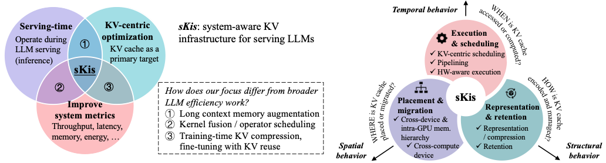
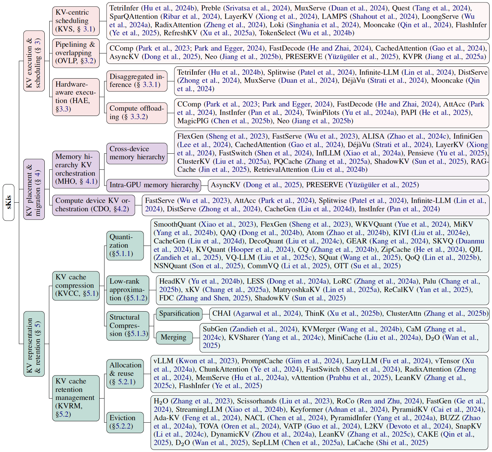
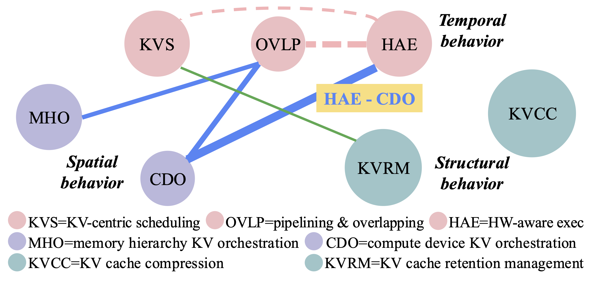
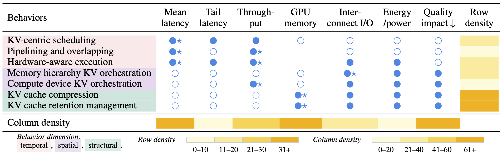

<h1 align="center">Awesome KV Cache Optimization</h1>

<div align="center">


[](https://doi.org/10.36227/techrxiv.176046306.66521015/v1)

</div>

<div align="center">

**[<a href="https://www.techrxiv.org/doi/10.36227/techrxiv.176046306.66521015">TechRxiv</a>]** **[<a href="https://www.linkedin.com/feed/update/urn:li:activity:7384388868407529472/">LinkedIn</a>]**

</div>


This repository is for our survey paper:

> **[Towards Efficient Large Language Model Serving: A Survey on System-Aware KV Cache Optimization](https://doi.org/10.36227/techrxiv.176046306.66521015/v1)**  
> *[Jiantong Jiang](https://jjiantong.github.io/)<sup>1</sup>, [Peiyu Yang](https://ypeiyu.github.io/)<sup>1</sup>, [Rui Zhang](https://www.ruizhang.info/)<sup>2</sup>, [Feng Liu](https://fengliu90.github.io/)<sup>1</sup>*  
> <sup>1</sup>The University of Melbourne, <sup>2</sup>Huazhong University of Science and Technology

<p align="center">
    
</p>


This repository aims to record papers of system-aware, serving-time, KV-centric optimization methods that improve system metrics without retraining or architecture modification (which we call this scope ***sKis***). We systematize recent advances through a distinct **system behavior-oriented taxonomy**, organizing existing efforts into three behavioral dimensions:\
🔷 **Temporal** — when is KV cache accessed or computed?\
🔷 **Spatial** — where is KV cache placed and migrated?\
🔷 **Structural** — how is KV cache represented and managed?

🧠 Grounded in this taxonomy, we analyze **cross-behavior synergies** and **behavior–objective effects**, revealing overlooked regions and concrete open challenges. 


### Contributing

The survey and the repository are **still under active development** and will be updated regularly. 

🙋 If you would like to include your paper in this survey and repository, please feel free to submit a pull request or open an issue with the paper's title and a brief summary highlighting its key techniques. You can also contact us via email. Please let us know if you find out a mistake or have any suggestions! We greatly appreciate your feedback regarding this repository or survey!

🌟 If you find this resource helpful for your work, please consider giving us a star and citing our [research](#citation).


---

<a name="readme-index"></a>

## Quick Index

- [Temporal — Execution \& Scheduling](#temporal--execution--scheduling)
  - [KV-Centric Scheduling](#kv-centric-scheduling)
  - [Pipelining \& Overlapping](#pipelining--overlapping)
  - [Hardware-Aware Execution](#hardware-aware-execution) 
- [Spatial — Placement \& Migration](#spatial--placement--migration)
  - [Memory Hierarchy KV Orchestration](#memory-hierarchy-kv-orchestration)
  - [Compute Device KV Orchestration](#compute-device-kv-orchestration)
- [Structural — Representation \& Retention](#structural--representation--retention)
  - [KV Cache Compression](#kv-cache-compression) (including quantization, low-rank approximation, and structural compression)
  - [KV Cache Retention Management](#kv-cache-retention-management) (including allocation, reuse, and eviction)
- [Cross-behavior Synergies](#cross-behavior-synergies)
- [Behavior-objective Effects](#behavior-objective-effects)


<p align="center">

</p>

---

## Temporal — Execution & Scheduling

These methods act on **when** KV data is executed, computed, or scheduled to improve latency and throughput. We divide these methods into three categories: KV-centric scheduling, pipelining & overlapping, and hardware-aware execution.

### KV-Centric Scheduling

KV-centric scheduling methods explicitly integrate KV characteristics into runtime scheduling decisions.

|Paper|Type|Code|
| -- | -- | -- |
| []() <br> TokenSelect: Efficient Long-Context Inference and Length Extrapolation for LLMs via Dynamic Token-Level KV Cache Selection [[Link](https://arxiv.org/pdf/2411.02886)] <br> *Wei Wu, Zhuoshi Pan, Chao Wang, Liyi Chen, Yunchu Bai, Tianfu Wang, Kun Fu, Zheng Wang, Hui Xiong* | Token-level attention compute scheduling |[](https://github.com/pzs19/TokenSelect) <br>  <br> [TokenSelect](https://github.com/pzs19/TokenSelect)|
| []() <br> RefreshKV: Updating Small KV Cache During Long-form Generation [[Link](https://aclanthology.org/2025.acl-long.1211.pdf)] <br> *Fangyuan Xu, Tanya Goyal,  Eunsol Choi*| Token-level attention compute scheduling |[](https://github.com/carriex/refreshkv) <br>  <br> [RefreshKV](https://github.com/carriex/refreshkv)|
| []()  <br> FlashInfer: Efficient and Customizable Attention Engine for LLM Inference Serving [[Link](https://openreview.net/pdf?id=RXPofAsL8F)] <br> *Zihao Ye, Lequn Chen, Ruihang Lai, Wuwei Lin, Yineng Zhang, Stephanie Wang, Tianqi Chen, Baris Kasikci, Vinod Grover, Arvind Krishnamurthy, Luis Ceze* | Kernel-level workload scheduling across CUDA thread blocks; Also belongs to allocation & reuse (structural) | [](https://github.com/flashinfer-ai/flashinfer) <br>  <br> [FlashInfer](https://github.com/flashinfer-ai/flashinfer) 🌟 |
| []()  <br> Mooncake: Trading More Storage for Less Computation — A KVCache-centric Architecture for Serving LLM Chatbot [[Link](https://www.usenix.org/system/files/fast25-qin.pdf)] <br> *Ruoyu Qin, Zheming Li, Weiran He, Jialei Cui, Feng Ren, Mingxing Zhang, Yongwei Wu, Weimin Zheng, Xinran Xu* | KV reuse-aware request-level scheduling; Also belongs to HW-aware execution | [](https://github.com/kvcache-ai/Mooncake) <br>  <br>[Mooncake](https://github.com/kvcache-ai/Mooncake) 🌟 |
| []() <br> Loki: Low-rank Keys for Efficient Sparse Attention [[Link](https://proceedings.neurips.cc/paper_files/paper/2024/file/1e027da6bec9ceb2ec37951ceeccae93-Paper-Conference.pdf)] <br> *Prajwal Singhania, Siddharth Singh, Shwai He, Soheil Feizi, Abhinav Bhatele* | Token-level attention compute scheduling |[](https://github.com/hpcgroup/loki) <br>  <br> [Loki](https://github.com/hpcgroup/loki)  |
| []() <br> SGLang: Efficient Execution of Structured Language Model Programs [[Link](https://proceedings.neurips.cc/paper_files/paper/2024/file/724be4472168f31ba1c9ac630f15dec8-Paper-Conference.pdf)] <br> *Lianmin Zheng, Liangsheng Yin, Zhiqiang Xie, Chuyue Sun, Jeff Huang, Cody Hao Yu, Shiyi Cao, Christos Kozyrakis, Ion Stoica, Joseph E. Gonzalez, Clark Barrett, Ying Sheng* | KV reuse-aware request-level scheduling; Also belongs to allocation & reuse (structural) |[](https://github.com/sgl-project/sglang) <br>  <br> [SGLang](https://github.com/sgl-project/sglang) 🌟 |
| []() <br> LoongServe: Efficiently Serving Long-Context Large Language Models with Elastic Sequence Parallelism [[Link](https://arxiv.org/pdf/2404.09526)] <br> *Bingyang Wu, Shengyu Liu, Yinmin Zhong, Peng Sun, Xuanzhe Liu, Xin Jin* | KV usage-aware request-level scheduling |[](https://github.com/LoongServe/LoongServe) <br>  <br> [LoongServe](https://github.com/LoongServe/LoongServe) |
| Fast Inference for Augmented Large Language Models [[Link](https://arxiv.org/pdf/2410.18248)] <br> *Rana Shahout, Cong Liang, Shiji Xin, Qianru Lao, Yong Cui, Minlan Yu, Michael Mitzenmacher*| KV usage-aware request-level scheduling | |
| LayerKV: Optimizing Large Language Model Serving with Layer-wise KV Cache Management [[Link](https://arxiv.org/pdf/2410.00428)] <br> *Yi Xiong, Hao Wu, Changxu Shao, Ziqing Wang, Rui Zhang, Yuhong Guo, Junping Zhao, Ke Zhang, Zhenxuan Pan*| KV usage-aware request-level scheduling; Also belongs to memory hierarchy KV orchestration (spatial) | |
| []() <br> SparQ Attention: Bandwidth-Efficient LLM Inference [[Link](https://openreview.net/pdf?id=OS5dqxmmtl)] <br> *Luka Ribar, Ivan Chelombiev, Luke Hudlass-Galley, Charlie Blake, Carlo Luschi, Douglas Orr* | Token-level attention compute scheduling | [](https://github.com/graphcore-research/llm-inference-research/tree/2024-05-sparq) <br>  <br> [SparQ Attention](https://github.com/graphcore-research/llm-inference-research/tree/2024-05-sparq)  |
| []() <br> QUEST: Query-Aware Sparsity for Efficient Long-Context LLM Inference [[Link](https://openreview.net/pdf?id=KzACYw0MTV)] <br> *Jiaming Tang, Yilong Zhao, Kan Zhu, Guangxuan Xiao, Baris Kasikci, Song Han*| Token-level attention compute scheduling |[](https://github.com/mit-han-lab/quest) <br>  <br> [Quest](https://github.com/mit-han-lab/quest)  |
| []() <br> MuxServe: Flexible Spatial-Temporal Multiplexing for Multiple LLM Serving [[Link](https://openreview.net/pdf?id=R0SoZvqXyQ)] <br> *Jiangfei Duan, Runyu Lu, Haojie Duanmu, Xiuhong Li, Xingcheng Zhang, Dahua Lin, Ion Stoica, Hao Zhang* | KV usage-aware request-level scheduling; Also belongs to HW-aware execution |[](https://github.com/hao-ai-lab/MuxServe) <br>  <br> [MuxServe](https://github.com/hao-ai-lab/MuxServe)  |
| []() <br> Preble: Efficient Distributed Prompt Scheduling for LLM Serving [[Link](https://openreview.net/pdf?id=meKEKDhdnx)] <br> *Vikranth Srivatsa, Zijian He, Reyna Abhyankar, Dongming Li, Yiying Zhang* | KV reuse-aware request-level scheduling |[](https://github.com/WukLab/preble) <br>  <br> [Preble](https://github.com/WukLab/preble) |
| Inference without interference: Disaggregate LLM inference for mixed downstream workloads [[Link](https://arxiv.org/pdf/2401.11181)] <br> *Cunchen Hu, Heyang Huang, Liangliang Xu, Xusheng Chen, Jiang Xu, Shuang Chen, Hao Feng, Chenxi Wang, Sa Wang, Yungang Bao, Ninghui Sun, Yizhou Shan* | KV usage-aware request-level scheduling; Also belongs to HW-aware execution | |


<p align="right" style="font-size: 14px; color: #555; margin-top: 20px;">
    <a href="#readme-index" style="text-decoration: none; color: #007bff; font-weight: bold;">
        ↑ Back to Index ↑
    </a>
</p>

### Pipelining & Overlapping

Pipelining and overlapping methods hide latency by concurrently executing KV-related compute, communication, and I/O. They often embedded in the broader systems.

|Paper|Type|Code|
| -- | -- | -- |
| []() <br> KVPR: Efficient LLM inference with i/o-aware KV cache partial recomputation [[Link](https://aclanthology.org/2025.findings-acl.997.pdf)] <br> *Chaoyi Jiang, Lei Gao, Hossein Entezari Zarch, Murali Annavaram* | GPU KV recompute ↔ KV transfer (CPU↔GPU) |[](https://github.com/chaoyij/KVPR) <br>  <br> [KVPR](https://github.com/chaoyij/KVPR)  |
| PRESERVE: Prefetching Model Weights and KV-Cache in Distributed LLM Serving [[Link](https://arxiv.org/pdf/2501.08192)] <br> *Ahmet Caner Yüzügüler, Jiawei Zhuang, Lukas Cavigelli* | GPU KV prefetch (HBM→L2) ↔ GPU collective communication; Also belongs to memory hierarchy KV orchestration (spatial) ||
| []() <br> NEO: Saving GPU Memory Crisis with CPU Offloading for Online LLM Inference [[Link](https://openreview.net/pdf?id=umgy9tWBLA)] <br> *Xuanlin Jiang, Yang Zhou, Shiyi Cao, Ion Stoica, Minlan Yu* | CPU attention compute ↔ GPU linear ops; Also belongs to HW-aware execution |[](https://github.com/NEO-MLSys25/NEO) <br>  <br> [NEO](https://github.com/NEO-MLSys25/NEO) |
| Accelerating LLM Inference Throughput via Asynchronous KV Cache Prefetching [[Link](https://arxiv.org/pdf/2504.06319)] <br> *Yanhao Dong, Yubo Miao, Weinan Li, Xiao Zheng, Chao Wang, Feng Lyu* | GPU KV prefetch (HBM→L2) ↔ GPU attention compute; Also belongs to memory hierarchy KV orchestration (spatial) ||
| []() <br> Cost-Efficient Large Language Model Serving for Multi-turn Conversations with CachedAttention [[Link](https://www.usenix.org/system/files/atc24-gao-bin-cost.pdf)] <br> *Bin Gao, Zhuomin He, Puru Sharma, Qingxuan Kang, Djordje Jevdjic, Junbo Deng, Xingkun Yang, Zhou Yu, Pengfei Zuo* | KV load/store (CPU↔GPU) ↔ GPU compute; Also belongs to memory hierarchy KV orchestration (spatial) ||
| FastDecode: High-Throughput GPU-Efficient LLM Serving using Heterogeneous Pipelines [[Link](https://arxiv.org/pdf/2403.11421)] <br> *Jiaao He, Jidong Zhai* | CPU R-part compute ↔ GPU S-part compute; Also belongs to HW-aware execution ||
| []() <br> Improving Throughput-Oriented LLM Inference with CPU Computations [[Link](https://dl.acm.org/doi/pdf/10.1145/3656019.3676949)] <br> *Daon Park, Bernhard Egger* | CPU MHSA compute ↔ FFN data transfer (CPU→GPU); Also belongs to HW-aware execution |[](https://gitlab.csap.snu.ac.kr/research/heterogen) <br> [Heterogen](https://gitlab.csap.snu.ac.kr/research/heterogen)|


<p align="right" style="font-size: 14px; color: #555; margin-top: 20px;">
    <a href="#readme-index" style="text-decoration: none; color: #007bff; font-weight: bold;">
        ↑ Back to Index ↑
    </a>
</p>

### Hardware-aware Execution

Hardware-aware execution methods adapt KV cache-related operations to the underlying heterogeneous hardware.

#### Disaggregated Inference

Disaggregated inference separates heterogeneous computation in LLM inference and maps them to distinct hardware resources to reduce interference and improve utilization. 

|Paper|Type|Code|
| -- | -- | -- |
| []()  <br> Mooncake: Trading More Storage for Less Computation — A KVCache-centric Architecture for Serving LLM Chatbot [[Link](https://www.usenix.org/system/files/fast25-qin.pdf)] <br> *Ruoyu Qin, Zheming Li, Weiran He, Jialei Cui, Feng Ren, Mingxing Zhang, Yongwei Wu, Weimin Zheng, Xinran Xu* | Also belongs to KV-centric scheduling | [](https://github.com/kvcache-ai/Mooncake) <br>  <br> [Mooncake](https://github.com/kvcache-ai/Mooncake) 🌟 |
| []() <br> DéjàVu: KV-cache Streaming for Fast, Fault-tolerant Generative LLM Serving [[Link](https://openreview.net/pdf?id=AbGbGZFYOD)] <br> *Foteini Strati, Sara Mcallister, Amar Phanishayee, Jakub Tarnawski, Ana Klimovic* | Decoupling prefill and decode to different GPUs; Also belongs to memory hierarchy KV orchestration (spatial) |[](https://github.com/msr-fiddle/dejavu) <br>  <br> [DéjàVu](https://github.com/msr-fiddle/dejavu) |
| []() <br> MuxServe: Flexible Spatial-Temporal Multiplexing for Multiple LLM Serving [[Link](https://openreview.net/pdf?id=R0SoZvqXyQ)] <br> *Jiangfei Duan, Runyu Lu, Haojie Duanmu, Xiuhong Li, Xingcheng Zhang, Dahua Lin, Ion Stoica, Hao Zhang* | Decoupling prefill and decode within a single GPU unit via SM partitioning; Also belongs to KV-centric scheduling |[](https://github.com/hao-ai-lab/MuxServe) <br>  <br> [MuxServe](https://github.com/hao-ai-lab/MuxServe)  |
| []() <br> DistServe: Decoupling Prefill and Decoding for Goodput-optimized Large Language Model Serving [[Link](https://www.usenix.org/system/files/osdi24-zhong-yinmin.pdf)] <br> *Yinmin Zhong, Shengyu Liu, Junda Chen, Jianbo Hu, Yibo Zhu, Xuanzhe Liu, Xin Jin, Hao Zhang* | Decoupling prefill and decode to different GPUs; Also belongs to compute device KV orchestration (spatial) |[](https://github.com/LLMServe/DistServe) <br>  <br> [DistServe](https://github.com/LLMServe/DistServe) |
| Infinite-LLM: Efficient LLM Service for Long Context with DistAttention and Distributed KVCache [[Link](https://arxiv.org/pdf/2401.02669)] <br> *Bin Lin, Chen Zhang, Tao Peng, Hanyu Zhao, Wencong Xiao, Minmin Sun, Anmin Liu, Zhipeng Zhang, Lanbo Li, Xiafei Qiu, Shen Li, Zhigang Ji, Tao Xie, Yong Li, Wei Lin* | Disaggregating at the operator level; Also belongs to compute device KV orchestration (spatial) ||
| []() <br> Splitwise: Efficient generative LLM inference using phase splitting [[Link](https://arxiv.org/pdf/2311.18677)] <br> *Pratyush Patel, Esha Choukse, Chaojie Zhang, Aashaka Shah, Íñigo Goiri, Saeed Maleki, Ricardo Bianchini* | Decoupling prefill and decode to different GPUs; Also belongs to compute device KV orchestration (spatial) |[Splitwise](https://github.com/vllm-project/vllm/pull/2809) (integrated into vLLM) |
| Inference without interference: Disaggregate LLM inference for mixed downstream workloads [[Link](https://arxiv.org/pdf/2401.11181)] <br> *Cunchen Hu, Heyang Huang, Liangliang Xu, Xusheng Chen, Jiang Xu, Shuang Chen, Hao Feng, Chenxi Wang, Sa Wang, Yungang Bao, Ninghui Sun, Yizhou Shan* | Decoupling prefill and decode to different GPUs; Also belongs to KV-centric scheduling | |


#### Compute Offloading

Compute offloading relocates partial compute to auxiliary devices to reduce GPU bottlenecks, utilizing hardware heterogeneity and workload features. 


|Paper|Type|Code|
| -- | -- | -- |
| []() <br> NEO: Saving GPU Memory Crisis with CPU Offloading for Online LLM Inference [[Link](https://openreview.net/pdf?id=umgy9tWBLA)] <br> *Xuanlin Jiang, Yang Zhou, Shiyi Cao, Ion Stoica, Minlan Yu* | CPU offloading (attention and KV caches); Also belongs to pipelining & overlapping |[](https://github.com/NEO-MLSys25/NEO) <br>  <br> [NEO](https://github.com/NEO-MLSys25/NEO) |
| []()  <br> MagicPIG: LSH Sampling for Efficient LLM Generation [[Link](https://openreview.net/pdf?id=ALzTQUgW8a)] <br> *Zhuoming Chen, Ranajoy Sadhukhan, Zihao Ye, Yang Zhou, Jianyu Zhang, Niklas Nolte, Yuandong Tian, Matthijs Douze, Leon Bottou, Zhihao Jia, Beidi Chen* | CPU offloading (attention and retrieval) |[](https://github.com/Infini-AI-Lab/MagicPIG) <br>  <br> [MagicPIG](https://github.com/Infini-AI-Lab/MagicPIG)|
| []() <br> PAPI: Exploiting Dynamic Parallelism in Large Language Model Decoding with a Processing-In-Memory-Enabled Computing System [[Link](https://dl.acm.org/doi/pdf/10.1145/3676641.3716009)] <br> *Yintao He, Haiyu Mao, Christina Giannoula, Mohammad Sadrosadati, Juan Gómez-Luna, Huawei Li, Xiaowei Li, Ying Wang, Onur Mutlu* | PIM-based offloading | ASPLOS | |
| []() <br> TwinPilots: A New Computing Paradigm for GPU-CPU Parallel LLM Inference [[Link](https://dl.acm.org/doi/pdf/10.1145/3688351.3689164)] <br> *Chengye Yu, Tianyu Wang, Zili Shao, Linjie Zhu, Xu Zhou, Song JiangAuthors Info & Claims* | CPU offloading | |
| InstInfer: In-Storage Attention Offloading for Cost-Effective Long-Context LLM Inference [[Link](https://arxiv.org/pdf/2409.04992)] <br> *Xiurui Pan, Endian Li, Qiao Li, Shengwen Liang, Yizhou Shan, Ke Zhou, Yingwei Luo, Xiaolin Wang, Jie Zhang*| CSD Offloading; Also belongs to compute device KV orchestration (spatial) | |
| []() <br> AttAcc! unleashing the power of PIM for batched transformer-based generative model inference [[Link](https://dl.acm.org/doi/10.1145/3620665.3640422)] <br> *Jaehyun Park, Jaewan Choi, Kwanhee Kyung, Michael Jaemin Kim, Yongsuk Kwon, Nam Sung Kim, Jung Ho Ahn* | PIM-based offloading; Also belongs to compute device KV orchestration (spatial) |[](https://github.com/scale-snu/attacc_simulator) <br>  <br> [AttAcc](https://github.com/scale-snu/attacc_simulator) |
| FastDecode: High-Throughput GPU-Efficient LLM Serving using Heterogeneous Pipelines [[Link](https://arxiv.org/pdf/2403.11421)] <br> *Jiaao He, Jidong Zhai* | CPU offloading (attention and KV caches); Also belongs to pipelining & overlapping ||
| []() <br> Improving Throughput-Oriented LLM Inference with CPU Computations [[Link](https://dl.acm.org/doi/pdf/10.1145/3656019.3676949)] <br> *Daon Park, Bernhard Egger* | CPU offloading with dynamic GPU-CPU division; Also belongs to pipelining & overlapping |[](https://gitlab.csap.snu.ac.kr/research/heterogen) <br> [Heterogen](https://gitlab.csap.snu.ac.kr/research/heterogen)|


<p align="right" style="font-size: 14px; color: #555; margin-top: 20px;">
    <a href="#readme-index" style="text-decoration: none; color: #007bff; font-weight: bold;">
        ↑ Back to Index ↑
    </a>
</p>

---

## Spatial — Placement & Migration

These works optimize **where** KV data is stored or transferred to balance memory and I/O pressure. We divide these methods into two categories: memory hierarchy KV orchestration, and compute device KV orchestration.


### Memory Hierarchy KV Orchestration

Memory hierarchy KV orchestration methods distribute KV caches across memory hierarchies.


#### Cross-device Memory Hierarchy

These methods manage KV caches across fast but limited GPU HBM, and larger but slower alternatives like CPU DRAM or SSD. 


|Paper|Type|Code|
| -- | -- | -- |
| []() <br> RetrievalAttention: Accelerating Long-Context LLM Inference via Vector Retrieval [[Link](https://openreview.net/pdf?id=8z3cOVER4z)] <br> *Di Liu, Meng Chen, Baotong Lu, Huiqiang Jiang, Zhenhua Han, Qianxi Zhang, Qi Chen, Chengruidong Zhang, Bailu Ding, Kai Zhang, Chen Chen, Fan Yang, Yuqing Yang, Lili Qiu*| Importance-aware migration |[](https://github.com/microsoft/RetrievalAttention) <br>  <br> [RetrievalAttention](https://github.com/microsoft/RetrievalAttention) |
| []() <br> RAGCache: Efficient Knowledge Caching for Retrieval-Augmented Generation [[Link](https://dl.acm.org/doi/pdf/10.1145/3768628)] <br> *Chao Jin, Zili Zhang, Xuanlin Jiang, Fangyue Liu, Xin Liu, Xuanzhe Liu, Xin Jin*| System cost-driven decision | |
| []()  <br> ShadowKV: KV Cache in Shadows for High-Throughput Long-Context LLM Inference [[Link](https://openreview.net/pdf?id=oa7MYAO6h6)] <br> *Hanshi Sun, Li-Wen Chang, Wenlei Bao, Size Zheng, Ningxin Zheng, Xin Liu, Harry Dong, Yuejie Chi, Beidi Chen* | Importance-aware migration; Also belongs to KV cache compression (structural) | [](https://github.com/ByteDance-Seed/ShadowKV) <br>  <br> [ShadowKV](https://github.com/ByteDance-Seed/ShadowKV) |
| []() <br> PQCache: Product Quantization-based KVCache for Long Context LLM Inference [[Link](https://arxiv.org/pdf/2407.12820)] <br> *Hailin Zhang, Xiaodong Ji, Yilin Chen, Fangcheng Fu, Xupeng Miao, Xiaonan Nie, Weipeng Chen, Bin Cui*| Importance-aware migration |[](https://github.com/HugoZHL/PQCache) <br>  <br> [PQCache](https://github.com/HugoZHL/PQCache) |
| []() <br> ClusterKV: Manipulating LLM KV Cache in Semantic Space for Recallable Compression [[Link](https://arxiv.org/pdf/2412.03213)] <br> *Guangda Liu, Chengwei Li, Jieru Zhao, Chenqi Zhang, Minyi Guo* | Importance-aware migration |[](https://github.com/sjtu-zhao-lab/ClusterKV) <br>  <br> [ClusterKV](https://github.com/sjtu-zhao-lab/ClusterKV) |
| []() <br> Stateful Large Language Model Serving with Pensieve [[Link](https://arxiv.org/pdf/2312.05516)] <br> *Lingfan Yu, Jinkun Lin, Jinyang Li* | Importance-aware migration | |
| []() <br> InfLLM: Training-Free Long-Context Extrapolation for LLMs with an Efficient Context Memory [[Link](https://proceedings.neurips.cc/paper_files/paper/2024/file/d842425e4bf79ba039352da0f658a906-Paper-Conference.pdf)] <br> *Chaojun Xiao, Pengle Zhang, Xu Han, Guangxuan Xiao, Yankai Lin, Zhengyan Zhang, Zhiyuan Liu, Maosong Sun* | Importance-aware migration |[](https://github.com/thunlp/InfLLM) <br>  <br> [InfLLM](https://github.com/thunlp/InfLLM) |
| FastSwitch: Optimizing Context Switching Efficiency in Fairness-aware Large Language Model Serving [[Link](https://arxiv.org/pdf/2411.18424)] <br> *Ao Shen, Zhiyao Li, Mingyu Gao* | System cost-driven decision; Also belongs to allocation & reuse (structural) || 
| LayerKV: Optimizing Large Language Model Serving with Layer-wise KV Cache Management [[Link](https://arxiv.org/pdf/2410.00428)] <br> *Yi Xiong, Hao Wu, Changxu Shao, Ziqing Wang, Rui Zhang, Yuhong Guo, Junping Zhao, Ke Zhang, Zhenxuan Pan* | System cost-driven decision; Also belongs to KV-centric scheduling (temporal) | |
| []() <br> DéjàVu: KV-cache Streaming for Fast, Fault-tolerant Generative LLM Serving [[Link](https://openreview.net/pdf?id=AbGbGZFYOD)] <br> *Foteini Strati, Sara Mcallister, Amar Phanishayee, Jakub Tarnawski, Ana Klimovic* | System cost-driven decision; Also belongs to HW-aware execution (temporal) |[](https://github.com/msr-fiddle/dejavu) <br>  <br> [DéjàVu](https://github.com/msr-fiddle/dejavu) |
| []() <br> Cost-Efficient Large Language Model Serving for Multi-turn Conversations with CachedAttention [[Link](https://www.usenix.org/system/files/atc24-gao-bin-cost.pdf)] <br> *Bin Gao, Zhuomin He, Puru Sharma, Qingxuan Kang, Djordje Jevdjic, Junbo Deng, Xingkun Yang, Zhou Yu, Pengfei Zuo* | System cost-driven decision; Also belongs to pipelining & overlapping (temporal) ||
| []() <br> InfiniGen: Efficient Generative Inference of Large Language Models with Dynamic KV Cache Management [[Link](https://www.usenix.org/system/files/osdi24-lee.pdf)] *Wonbeom Lee, Jungi Lee, Junghwan Seo, Jaewoong Sim* | Importance-aware migration |[](https://github.com/snu-comparch/InfiniGen) <br>  <br> [InfiniGen](https://github.com/snu-comparch/InfiniGen) |
| []() <br> ALISA: Accelerating Large Language Model Inference via Sparsity-Aware KV Caching [[Link](https://arxiv.org/pdf/2403.17312)] <br> *Youpeng Zhao, Di Wu, Jun Wang* | Importance-aware migration | |
| []() <br> Distributed Inference and Fine-tuning of Large Language Models Over The Internet [[Link](https://openreview.net/pdf?id=XmN7ZNbUAe)] <br> *Alexander Borzunov, Max Ryabinin, Artem Chumachenko, Dmitry Baranchuk, Tim Dettmers, Younes Belkada, Pavel Samygin, Colin Raffel*| System cost-driven decision; Also belongs to compute device KV orchestration |[](https://github.com/LLMServe/FastServe) <br>  <br> [FastServe](https://github.com/LLMServe/FastServe) |
| []() <br> FlexGen: High-Throughput Generative Inference of Large Language Models with a Single GPU [[Link](https://openreview.net/pdf?id=RRntzKrBTp)] <br> *Ying Sheng, Lianmin Zheng, Binhang Yuan, Zhuohan Li, Max Ryabinin, Daniel Y. Fu, Zhiqiang Xie, Beidi Chen, Clark Barrett, Joseph E. Gonzalez, Percy Liang, Christopher Ré, Ion Stoica, Ce Zhang* | System cost-driven decision; Also belongs to KV cache compression (structural) |[](https://github.com/FMInference/FlexLLMGen) <br>  <br> [FlexLLMGen](https://github.com/FMInference/FlexLLMGen) 🌟 |


#### Intra-GPU Memory Hierarchy

These methods migrates KV entries between on-chip L1/L2 caches and off-chip HBM to hide latency. 

|Paper|Type|Code|
| -- | -- | -- |
| PRESERVE: Prefetching Model Weights and KV-Cache in Distributed LLM Serving [[Link](https://arxiv.org/pdf/2501.08192)] <br> *Ahmet Caner Yüzügüler, Jiawei Zhuang, Lukas Cavigelli* | Prefetching KV caches from HBM to the L2 cache; Also belongs to pipelining & overlapping (temporal) ||
| Accelerating LLM Inference Throughput via Asynchronous KV Cache Prefetching <br> *Yanhao Dong, Yubo Miao, Weinan Li, Xiao Zheng, Chao Wang, Feng Lyu* [[Link](https://arxiv.org/pdf/2504.06319)] | Prefetching KV caches from HBM to the L2 cache; Also belongs to pipelining & overlapping (temporal) ||


<p align="right" style="font-size: 14px; color: #555; margin-top: 20px;">
    <a href="#readme-index" style="text-decoration: none; color: #007bff; font-weight: bold;">
        ↑ Back to Index ↑
    </a>
</p>


### Compute Device KV Orchestration

Compute device KV orchestration methods place and move KV caches across compute-capable devices like GPUs, CPUs, and storage-attached processors, to enable distributed or heterogeneous serving.

|Paper|Type|Code|
| -- | -- | -- |
| InstInfer: In-Storage Attention Offloading for Cost-Effective Long-Context LLM Inference [[Link](https://arxiv.org/pdf/2409.04992)] <br> *Xiurui Pan, Endian Li, Qiao Li, Shengwen Liang, Yizhou Shan, Ke Zhou, Yingwei Luo, Xiaolin Wang, Jie Zhang* | KV cache placement & migration across GPUs and CSDs; Also belongs to HW-aware execution (temporal) | |
| []() <br> CacheGen: KV Cache Compression and Streaming for Fast Large Language Model Serving [[Link](https://dl.acm.org/doi/pdf/10.1145/3651890.3672274)]  <br> *Yuhan Liu, Hanchen Li, Yihua Cheng, Siddhant Ray, Yuyang Huang, Qizheng Zhang, Kuntai Du, Jiayi Yao, Shan Lu, Ganesh Ananthanarayanan, Michael Maire, Henry Hoffmann, Ari Holtzman, Junchen Jiang* | Remote KV cache transmission in distributed networked setups; Also belongs to KV cache compression (structural) |[](https://github.com/UChi-JCL/CacheGen) <br>  <br> [CacheGen](https://github.com/UChi-JCL/CacheGen) |
| []() <br> DistServe: Disaggregating Prefill and Decoding for Goodput-optimized Large Language Model Serving [[Link](https://www.usenix.org/system/files/osdi24-zhong-yinmin.pdf)] <br> *Yinmin Zhong, Shengyu Liu, Junda Chen, Jianbo Hu, Yibo Zhu, Xuanzhe Liu, Xin Jin, Hao Zhang* | KV cache placement & migration across GPUs; Also belongs to HW-aware execution (temporal) |[](https://github.com/LLMServe/DistServe) <br>  <br> [DistServe](https://github.com/LLMServe/DistServe) |
| Infinite-LLM: Efficient LLM Service for Long Context with DistAttention and Distributed KVCache [[Link](https://arxiv.org/pdf/2401.02669)] <br> *Bin Lin, Chen Zhang, Tao Peng, Hanyu Zhao, Wencong Xiao, Minmin Sun, Anmin Liu, Zhipeng Zhang, Lanbo Li, Xiafei Qiu, Shen Li, Zhigang Ji, Tao Xie, Yong Li, Wei Lin* | KV cache placement & migration across GPUs; Also belongs to HW-aware execution (temporal) ||
| []() <br> Splitwise: Efficient generative LLM inference using phase splitting [[Link](https://arxiv.org/pdf/2311.18677)] <br> *Pratyush Patel, Esha Choukse, Chaojie Zhang, Aashaka Shah, Íñigo Goiri, Saeed Maleki, Ricardo Bianchini* | KV cache placement & migration across GPUs; Also belongs to HW-aware execution (temporal) |[Splitwise](https://github.com/vllm-project/vllm/pull/2809) (integrated into vLLM) |
| []() <br> AttAcc! unleashing the power of PIM for batched transformer-based generative model inference [[Link](https://dl.acm.org/doi/10.1145/3620665.3640422)] <br> *Jaehyun Park, Jaewan Choi, Kwanhee Kyung, Michael Jaemin Kim, Yongsuk Kwon, Nam Sung Kim, Jung Ho Ahn* | KV cache placement & migration across GPUs and PIM devices; Also belongs to HW-aware execution (temporal) |[](https://github.com/scale-snu/attacc_simulator) <br>  <br> [AttAcc](https://github.com/scale-snu/attacc_simulator) |
| []() <br> Distributed Inference and Fine-tuning of Large Language Models Over The Internet [[Link](https://openreview.net/pdf?id=XmN7ZNbUAe)] <br> *Alexander Borzunov, Max Ryabinin, Artem Chumachenko, Dmitry Baranchuk, Tim Dettmers, Younes Belkada, Pavel Samygin, Colin Raffel*| KV cache placement & migration across GPUs; Also belongs to memory hierarchy KV orchestration |[](https://github.com/LLMServe/FastServe) <br>  <br> [FastServe](https://github.com/LLMServe/FastServe) |


<p align="right" style="font-size: 14px; color: #555; margin-top: 20px;">
    <a href="#readme-index" style="text-decoration: none; color: #007bff; font-weight: bold;">
        ↑ Back to Index ↑
    </a>
</p>

---

## Structural — Representation & Retention

These methods target **how** KV data is represented and maintained for memory efficiency. We divide these methods into two categories: KV cache compression, and KV cache retention management.

### KV Cache Compression

KV cache compression methods directly compress the size of KV caches.

#### Quantization

Quantization compresses floating-point KV tensors into lower-precision formats.

|Paper|Type|Code|
| -- | -- | -- |
| []() <br> NSNQuant: A Double Normalization Approach for Calibration-Free Low-Bit Vector Quantization of KV Cache [[Link](https://arxiv.org/pdf/2505.18231)] <br> *Donghyun Son, Euntae Choi, Sungjoo Yoo* | VQ-based method | |
| []() <br> Accurate KV Cache Quantization with Outlier Tokens Tracing [[Link](https://aclanthology.org/2025.acl-long.631.pdf)] <br> *Yi Su, Yuechi Zhou, Quantong Qiu, Juntao Li, Qingrong Xia, Ping Li, Xinyu Duan, Zhefeng Wang, Min Zhang* | Mixed-precision asymmetric KV quantization | <br>  <br> [OTT](https://github.com/yisunlp/OTT) |
| []() <br> CommVQ: Commutative Vector Quantization for KV Cache Compression [[Link](https://openreview.net/pdf?id=sbbyCB39HN)] <br> *Junyan Li, Yang Zhang, Muhammad Yusuf Hassan, Talha Chafekar, Tianle Cai, Zhile Ren, Pengsheng Guo, Foroozan Karimzadeh, Colorado Reed, Chong Wang, Chuang Gan* | VQ-based method | <br>  <br> [CommVQ](https://github.com/UMass-Embodied-AGI/CommVQ) |
| []() <br> QServe: W4A8KV4 quantization and system co-design for efficient LLM serving [[Link](https://openreview.net/pdf/1ec600eaf0c56573a4d7a7818181657962d03d8f.pdf)] <br> *Yujun Lin, Haotian Tang, Shang Yang, Zhekai Zhang, Guangxuan Xiao, Chuang Gan, Song Han* | Fixed-precision quantization | <br>  <br> [OmniServe](https://github.com/mit-han-lab/omniserve) |
| SQuat: Subspace-orthogonal KV cache quantization [[Link](https://arxiv.org/pdf/2503.24358)] <br> *Hao Wang, Ligong Han, Kai Xu, Akash Srivastava* | Fixed-precision asymmetric KV quantization | <br>  <br> [SQuat](https://github.com/Red-Hat-AI-Innovation-Team/SQuat) |
| []() <br> VQ-LLM: High-performance Code Generation for Vector Quantization Augmented LLM Inference [[Link](https://arxiv.org/pdf/2503.02236)] <br> *Zihan Liu, Xinhao Luo, Junxian Guo, Wentao Ni, Yangjie Zhou, Yue Guan, Cong Guo, Weihao Cui, Yu Feng, Minyi Guo, Yuhao Zhu, Minjia Zhang, Jingwen Leng, Chen Jin* | VQ-based method | |
| []() <br> QJL: 1-Bit Quantized JL Transform for KV Cache Quantization with Zero Overhead [[Link](https://arxiv.org/pdf/2406.03482)] <br> *Amir Zandieh, Majid Daliri, Insu Han*| Fixed-precision quantization | <br>  <br> [QJL](https://github.com/amirzandieh/QJL) |
| []() <br> ZipCache: Accurate and Efficient KV Cache Quantization with Salient Token Identification [[Link](https://proceedings.neurips.cc/paper_files/paper/2024/file/7e57131fdeb815764434b65162c88895-Paper-Conference.pdf)] <br> *Yefei He, Luoming Zhang, Weijia Wu, Jing Liu, Hong Zhou, Bohan Zhuang* | Mixed-precision asymmetric KV quantization | <br>  <br> [ZipCache](https://github.com/ThisisBillhe/ZipCache) |
| []() <br> KV Cache is 1 Bit Per Channel: Efficient Large Language Model Inference with Coupled Quantization [[Link](https://openreview.net/pdf?id=pNnvzQsS4P)] <br> *Tianyi Zhang, Jonah Yi, Zhaozhuo Xu, Anshumali Shrivastava*| VQ-based method | |
| []() <br> KVQuant: Towards 10 Million Context Length LLM Inference with KV Cache Quantization [[Link](https://openreview.net/pdf?id=0LXotew9Du)] <br> *Coleman Hooper, Sehoon Kim, Hiva Mohammadzadeh, Michael W. Mahoney, Yakun Sophia Shao, Kurt Keutzer, Amir Gholami*| Mixed-precision quantization | <br>  <br> [KVQuant](https://github.com/SqueezeAILab/KVQuant) |
| []() <br> SKVQ: Sliding-window Key and Value Cache Quantization for Large Language Models [[Link](https://openreview.net/pdf?id=nI6JyFSnyV)] <br> *Haojie Duanmu, Zhihang Yuan, Xiuhong Li, Jiangfei Duan, Xingcheng Zhang, Dahua Lin* | Mixed-precision quantization | <br>  <br> [SKVQ](https://github.com/cat538/SKVQ) |
| GEAR: An Efficient KV Cache Compression Recipe for Near-Lossless Generative Inference of LLM [[Link](https://arxiv.org/pdf/2403.05527)] <br> *Hao Kang, Qingru Zhang, Souvik Kundu, Geonhwa Jeong, Zaoxing Liu, Tushar Krishna, Tuo Zhao*| Fixed-precision asymmetric KV quantization |[](https://github.com/opengear-project/GEAR) <br>  <br> [GEAR](https://github.com/opengear-project/GEAR) |
| []() <br> Unlocking Data-free Low-bit Quantization with Matrix Decomposition for KV Cache Compression [[Link](https://aclanthology.org/2024.acl-long.133.pdf)] <br> *Peiyu Liu, Ze-Feng Gao, Wayne Xin Zhao, Yipeng Ma, Tao Wang, Ji-Rong Wen* | Mixed-precision quantization | <br>  <br> [DecoQuant](https://github.com/lpyhdzx/DecoQuant_code) |
| []() <br> CacheGen: KV Cache Compression and Streaming for Fast Large Language Model Serving [[Link](https://dl.acm.org/doi/pdf/10.1145/3651890.3672274)]  <br> *Yuhan Liu, Hanchen Li, Yihua Cheng, Siddhant Ray, Yuyang Huang, Qizheng Zhang, Kuntai Du, Jiayi Yao, Shan Lu, Ganesh Ananthanarayanan, Michael Maire, Henry Hoffmann, Ari Holtzman, Junchen Jiang* | Mixed-precision quantization; Also belongs to compute device KV orchestration (spatial) | <br>  <br> [CacheGen](https://github.com/UChi-JCL/CacheGen) |
| []() <br> KIVI: A Tuning-Free Asymmetric 2bit Quantization for KV Cache [[Link](https://openreview.net/pdf?id=L057s2Rq8O)] <br> *Zirui Liu, Jiayi Yuan, Hongye Jin, Shaochen Zhong, Zhaozhuo Xu, Vladimir Braverman, Beidi Chen, Xia Hu* | Mixed-precision asymmetric KV quantization | <br>  <br> [KIVI](https://github.com/jy-yuan/KIVI) |
| []() <br> Atom: Low-Bit Quantization for Efficient and Accurate LLM Serving [[Link](https://proceedings.mlsys.org/paper_files/paper/2024/file/5edb57c05c81d04beb716ef1d542fe9e-Paper-Conference.pdf)] <br> *Yilong Zhao, Chien-Yu Lin, Kan Zhu, Zihao Ye, Lequn Chen, Size Zheng, Luis Ceze, Arvind Krishnamurthy, Tianqi Chen, Baris Kasikci* | Mixed-precision quantization | <br>  <br> [Atom](https://github.com/efeslab/Atom) |
| QAQ: Quality Adaptive Quantization for LLM KV Cache [[Link](https://arxiv.org/pdf/2403.04643)] <br> *Shichen Dong, Wen Cheng, Jiayu Qin, Wei Wang*| Mixed-precision quantization | <br>  <br> [QAQ](https://github.com/ClubieDong/QAQ-KVCacheQuantization) |
| No Token Left Behind: Reliable KV Cache Compression via Importance-Aware Mixed Precision Quantization [[Link](https://arxiv.org/pdf/2402.18096)] <br> *June Yong Yang, Byeongwook Kim, Jeongin Bae, Beomseok Kwon, Gunho Park, Eunho Yang, Se Jung Kwon, Dongsoo Lee* | Mixed-precision quantization ||
| WKVQuant: Quantizing Weight and Key/Value Cache for Large Language Models Gains More [[Link](https://arxiv.org/pdf/2402.12065)] <br> *Yuxuan Yue, Zhihang Yuan, Haojie Duanmu, Sifan Zhou, Jianlong Wu, Liqiang Nie* | Mixed-precision quantization ||
| []() <br> FlexGen: High-Throughput Generative Inference of Large Language Models with a Single GPU [[Link](https://openreview.net/pdf?id=RRntzKrBTp)] <br> *Ying Sheng, Lianmin Zheng, Binhang Yuan, Zhuohan Li, Max Ryabinin, Daniel Y. Fu, Zhiqiang Xie, Beidi Chen, Clark Barrett, Joseph E. Gonzalez, Percy Liang, Christopher Ré, Ion Stoica, Ce Zhang* | Fixed-precision quantization; Also belongs to memory hierarchy KV orchestration (spatial) | <br>  <br> [FlexLLMGen](https://github.com/FMInference/FlexLLMGen) 🌟 |
| []() <br> SmoothQuant: Accurate and Efficient Post-Training Quantization for Large Language Models [[Link](https://proceedings.mlr.press/v202/xiao23c/xiao23c.pdf)] <br> *Guangxuan Xiao, Ji Lin, Mickael Seznec, Hao Wu, Julien Demouth, Song Han* | Fixed-precision quantization | <br>  <br> [SmoothQuant](https://github.com/mit-han-lab/smoothquant) 🌟 |


#### Low-rank Approximation

Low-rank compression exploits hidden-dimension redundancy by factorizing KV tensors into compact components.

|Paper|Type|Code|
| -- | -- | -- |
| []()  <br> ShadowKV: KV Cache in Shadows for High-Throughput Long-Context LLM Inference [[Link](https://openreview.net/pdf?id=oa7MYAO6h6)] <br> *Hanshi Sun, Li-Wen Chang, Wenlei Bao, Size Zheng, Ningxin Zheng, Xin Liu, Harry Dong, Yuejie Chi, Beidi Chen* | Projecting KV tensors directly; Also belongs memory hierarchy KV orchestration (spatial) |  <br>  <br> [ShadowKV](https://github.com/ByteDance-Seed/ShadowKV) |
| FDC: Fast KV Dimensionality Compression for Efficient LLM Inference [[Link](https://arxiv.org/pdf/2408.04107)] <br> *Zeyu Zhang, Haiying Shen* | Projecting KV tensors directly | |
| ReCalKV: Low-Rank KV Cache Compression via Head Reordering and Offline Calibration [[Link](https://arxiv.org/pdf/2505.24357)] <br> *Xianglong Yan, Zhiteng Li, Tianao Zhang, Haotong Qin, Linghe Kong, Yulun Zhang, Xiaokang Yang* | Factorizing KV projection weights | <br>  <br> [ReCalKV](https://github.com/XIANGLONGYAN/ReCalKV) |
| []() <br> MatryoshkaKV: Adaptive KV Compression via Trainable Orthogonal Projection [[Link](https://openreview.net/pdf?id=BQwsRy1h3U)] <br> *Bokai Lin, Zihao Zeng, Zipeng Xiao, Siqi Kou, Tianqi Hou, Xiaofeng Gao, Hao Zhang, Zhijie Deng* | Projecting KV tensors directly | <br>  <br> [MatryoshkaKV-cache](https://github.com/The-kamisato-Sii/MatryoshkaKV-cache) |
| []() <br> Palu: KV-Cache Compression with Low-Rank Projection [[Link](https://openreview.net/pdf?id=LWMS4pk2vK)] <br> *Chi-Chih Chang, Wei-Cheng Lin, Chien-Yu Lin, Chong-Yan Chen, Yu-Fang Hu, Pei-Shuo Wang, Ning-Chi Huang, Luis Ceze, Mohamed S. Abdelfattah, Kai-Chiang Wu* | Factorizing KV projection weights | <br>  <br> [Palu](https://github.com/shadowpa0327/Palu) |
| xKV: Cross-Layer SVD for KV-Cache Compression [[Link](https://arxiv.org/pdf/2503.18893)] <br> *Chi-Chih Chang, Chien-Yu Lin, Yash Akhauri, Wei-Cheng Lin, Kai-Chiang Wu, Luis Ceze, Mohamed S. Abdelfattah* | Projecting KV tensors directly | <br>  <br> [xKV](https://github.com/abdelfattah-lab/xKV) |
| LoRC: Low-Rank Compression for LLMs KV Cache with a Progressive Compression Strategy [[Link](https://arxiv.org/pdf/2410.03111)] <br> *Rongzhi Zhang, Kuang Wang, Liyuan Liu, Shuohang Wang, Hao Cheng, Chao Zhang, Yelong Shen* | Factorizing KV projection weights | |
| []() <br> Get More with LESS: Synthesizing Recurrence with KV Cache Compression for Efficient LLM Inference [[Link](https://openreview.net/pdf?id=uhHDhVKFMW)] <br> *Harry Dong, Xinyu Yang, Zhenyu Zhang, Zhangyang Wang, Yuejie Chi, Beidi Chen* | Projecting KV tensors directly |[](https://github.com/hdong920/LESS) <br>  <br> [LESS](https://github.com/hdong920/LESS) |
| Effectively Compress KV Heads for LLM [[Link](https://arxiv.org/pdf/2406.07056)] <br> *Hao Yu, Zelan Yang, Shen Li, Yong Li, Jianxin Wu* | Factorizing KV projection weights | |


#### Structural Compression

Unlike value-level compression, structural compression modifies the organization of KV entries.

|Paper|Type|Code|
| -- | -- | -- |
| []() <br> ClusterAttn: KV Cache Compression under Intrinsic Attention Clustering [[Link](https://aclanthology.org/2025.acl-long.703.pdf)] <br> *Minwei Zhang, Haifeng Sun, Jingyu Wang, Shaolong Li, Wanyi Ning, Qi Qi, Zirui Zhuang, Jianxin Liao* | Structural sparsification ||
| []()  <br> ThinK: Thinner Key Cache by Query-Driven Pruning [[Link](https://openreview.net/pdf?id=n0OtGl6VGb)] <br> *Yuhui Xu, Zhanming Jie, Hanze Dong, Lei Wang, Xudong Lu, Aojun Zhou, Amrita Saha, Caiming Xiong, Doyen Sahoo* | Structural sparsification |  <br>  <br> [ThinK](https://github.com/SalesforceAIResearch/ThinK) |
| []() <br> D2O: Dynamic Discriminative Operations for Efficient Long-Context Inference of Large Language Models [[Link](https://openreview.net/pdf?id=HzBfoUdjHt)] <br> *Zhongwei Wan, Xinjian Wu, Yu Zhang, Yi Xin, Chaofan Tao, Zhihong Zhu, Xin Wang, Siqi Luo, Jing Xiong, Longyue Wang, Mi Zhang* | Intra-layer structural merging; Also belongs to eviction | <br>  <br> [D2O](https://github.com/AIoT-MLSys-Lab/D2O) |
| []() <br> MiniCache: KV Cache Compression in Depth Dimension for Large Language Models [[Link](https://openreview.net/pdf?id=sgVOjDqUMT)] <br> *Akide Liu, Jing Liu, Zizheng Pan, Yefei He, Gholamreza Haffari, Bohan Zhuang*| Cross-layer structural merging | |
| KVSharer: Efficient Inference via Layer-Wise Dissimilar KV Cache Sharing [[Link](https://arxiv.org/pdf/2410.18517)] <br> *Yifei Yang, Zouying Cao, Qiguang Chen, Libo Qin, Dongjie Yang, Hai Zhao, Zhi Chen* | Cross-layer structural merging | <br>  <br> [KVSharer](https://github.com/yangyifei729/KVSharer) |
| []() <br> CHAI: Clustered Head Attention for Efficient LLM Inference [[Link](https://openreview.net/pdf?id=xcDRx8vzCa)] <br> *Saurabh Agarwal, Bilge Acun, Basil Hosmer, Mostafa Elhoushi, Yejin Lee, Shivaram Venkataraman, Dimitris Papailiopoulos, Carole-Jean Wu* | Structural sparsification | <br>  <br> [CHAI](https://github.com/facebookresearch/chai) |
| []() <br> CaM: Cache Merging for Memory-efficient LLMs Inference [[Link](https://openreview.net/pdf?id=LCTmppB165)] <br> *Yuxin Zhang, Yuxuan Du, Gen Luo, Yunshan Zhong, Zhenyu Zhang, Shiwei Liu, Rongrong Ji* | Intra-layer structural merging | <br>  <br> [CaM](https://github.com/zyxxmu/cam) |
| Model Tells You Where to Merge: Adaptive KV Cache Merging for LLMs on Long-Context Tasks [[Link](https://arxiv.org/pdf/2407.08454)] <br> *Zheng Wang, Boxiao Jin, Zhongzhi Yu, Minjia Zhang*| Intra-layer structural merging | |
| SubGen: Token Generation in Sublinear Time and Memory [[Link](https://arxiv.org/pdf/2402.06082)] <br> *Amir Zandieh, Insu Han, Vahab Mirrokni, Amin Karbasi* | Cross-layer structural merging | |


<p align="right" style="font-size: 14px; color: #555; margin-top: 20px;">
    <a href="#readme-index" style="text-decoration: none; color: #007bff; font-weight: bold;">
        ↑ Back to Index ↑
    </a>
</p>

### KV Cache Retention Management

These methods manage the retention of the KV cache during serving.

#### Allocation & Reuse


|Paper|Type|Code|
| -- | -- | -- |
| []()  <br> FlashInfer: Efficient and Customizable Attention Engine for LLM Inference Serving [[Link](https://openreview.net/pdf?id=RXPofAsL8F)] <br> *Zihao Ye, Lequn Chen, Ruihang Lai, Wuwei Lin, Yineng Zhang, Stephanie Wang, Tianqi Chen, Baris Kasikci, Vinod Grover, Arvind Krishnamurthy, Luis Ceze* | Structure-aware method; Also belongs to KV-centric scheduling (temporal) |  <br>  <br> [FlashInfer](https://github.com/flashinfer-ai/flashinfer) 🌟 |
| Unifying KV Cache Compression for Large Language Models with LeanKV [[Link](https://arxiv.org/pdf/2412.03131v2)] <br> *Yanqi Zhang, Yuwei Hu, Runyuan Zhao, John C.S. Lui, Haibo Chen*| Structure-aware method; Also belongs to eviction | |
| []() <br> vAttention: Dynamic Memory Management for Serving LLMs without PagedAttention [[Link](https://dl.acm.org/doi/pdf/10.1145/3669940.3707256)] <br> *Ramya Prabhu, Ajay Nayak, Jayashree Mohan, Ramachandran Ramjee, Ashish Panwar*| Structure-aware method |  <br>  <br> [vAttention](https://github.com/microsoft/vattention) |
| MemServe: Context Caching for Disaggregated LLM Serving with Elastic Memory Pool [[Link](https://arxiv.org/pdf/2406.17565)] <br> *Cunchen Hu, Heyang Huang, Junhao Hu, Jiang Xu, Xusheng Chen, Tao Xie, Chenxi Wang, Sa Wang, Yungang Bao, Ninghui Sun, Yizhou Shan*| Semantics-guided method |  |
| []() <br> SGLang: Efficient Execution of Structured Language Model Programs [[Link](https://proceedings.neurips.cc/paper_files/paper/2024/file/724be4472168f31ba1c9ac630f15dec8-Paper-Conference.pdf)] <br> *Lianmin Zheng, Liangsheng Yin, Zhiqiang Xie, Chuyue Sun, Jeff Huang, Cody Hao Yu, Shiyi Cao, Christos Kozyrakis, Ion Stoica, Joseph E. Gonzalez, Clark Barrett, Ying Sheng* | Structure-aware method; Also belongs to KV-centric scheduling (temporal) | <br>  <br> [SGLang](https://github.com/sgl-project/sglang) 🌟 |
| FastSwitch: Optimizing Context Switching Efficiency in Fairness-aware Large Language Model Serving [[Link](https://arxiv.org/pdf/2411.18424)] <br> *Ao Shen, Zhiyao Li, Mingyu Gao* | Structure-aware method; Also belongs to memory hierarchy KV orchestration (spatial) || 
| []() <br> ChunkAttention: Efficient Self-Attention with Prefix-Aware KV Cache and Two-Phase Partition [[Link](https://aclanthology.org/2024.acl-long.623.pdf)] <br> *Lu Ye, Ze Tao, Yong Huang, Yang Li*| Structure-aware method |  <br>  <br> [Chunk Attention](https://github.com/microsoft/chunk-attention) |
| vTensor: Flexible Virtual Tensor Management for Efficient LLM Serving [[Link](https://arxiv.org/pdf/2407.15309)] <br> *Jiale Xu, Rui Zhang, Cong Guo, Weiming Hu, Zihan Liu, Feiyang Wu, Yu Feng, Shixuan Sun, Changxu Shao, Yuhong Guo, Junping Zhao, Ke Zhang, Minyi Guo, Jingwen Leng* | Structure-aware method |  |
| LazyLLM: Dynamic Token Pruning for Efficient Long Context LLM Inference [[Link](https://arxiv.org/pdf/2407.14057)] <br> *Qichen Fu, Minsik Cho, Thomas Merth, Sachin Mehta, Mohammad Rastegari, Mahyar Najibi* | Semantics-guided method |  |
| []() <br> Prompt Cache: Modular Attention Reuse for Low-Latency Inference [[Link](https://proceedings.mlsys.org/paper_files/paper/2024/file/a66caa1703fe34705a4368c3014c1966-Paper-Conference.pdf)] <br> *In Gim, Guojun Chen, Seung-seob Lee, Nikhil Sarda, Anurag Khandelwal, Lin Zhong* | Structure-aware method |  <br>  <br> [Prompt Cache](https://github.com/yale-sys/prompt-cache) |
| []() <br> Efficient Memory Management for Large Language Model Serving with PagedAttention [[Link](https://dl.acm.org/doi/pdf/10.1145/3600006.3613165)] <br> *Woosuk Kwon, Zhuohan Li, Siyuan Zhuang, Ying Sheng, Lianmin Zheng, Cody Hao Yu, Joseph E. Gonzalez, Hao Zhang, Ion Stoica* | Structure-aware method |  <br>  <br> [vllm](https://github.com/vllm-project/vllm) 🌟 |


#### Eviction

KV cache eviction discards less critical KV entries (i.e., tokens) based on certain rules.

|Paper|Type|Code|
| -- | -- | -- |
| []() <br> Ada-KV: Optimizing KV Cache Eviction by Adaptive Budget Allocation for Efficient LLM Inference [[Link](https://arxiv.org/pdf/2407.11550)] <br> *Yuan Feng, Junlin Lv, Yukun Cao, Xike Xie, S. Kevin Zhou* | Head-aware method | <br>  <br> [AdaKV](https://github.com/FFY0/AdaKV) |
| []() <br> DynamicKV: Task-Aware Adaptive KV Cache Compression for Long Context LLMs [[Link](https://arxiv.org/pdf/2412.14838)] <br> *Xiabin Zhou, Wenbin Wang, Minyan Zeng, Jiaxian Guo, Xuebo Liu, Li Shen, Min Zhang, Liang Ding* | Static method | |
| []() <br> LaCache: Ladder-Shaped KV Caching for Efficient Long-Context Modeling of Large Language Models [[Link](https://openreview.net/pdf?id=SDjZtxDo35)] <br> *Dachuan Shi, Yonggan Fu, Xiangchi Yuan, Zhongzhi Yu, Haoran You, Sixu Li, Xin Dong, Jan Kautz, Pavlo Molchanov, Yingyan (Celine) Lin* | Layer-aware method |  <br>  <br> [LaCache](https://github.com/GATECH-EIC/LaCache) |
| []() <br> SepLLM: Accelerate Large Language Models by Compressing One Segment into One Separator [[Link](https://openreview.net/pdf?id=MhVJCxYEEi)] <br> *Guoxuan Chen, Han Shi, Jiawei Li, Yihang Gao, Xiaozhe Ren, Yimeng Chen, Xin Jiang, Zhenguo Li, Weiyang Liu, Chao Huang* | Dynamic method |  <br>  <br> [SepLLM](https://github.com/HKUDS/SepLLM) |
| []() <br> D2O: Dynamic Discriminative Operations for Efficient Long-Context Inference of Large Language Models [[Link](https://openreview.net/pdf?id=HzBfoUdjHt)] <br> *Zhongwei Wan, Xinjian Wu, Yu Zhang, Yi Xin, Chaofan Tao, Zhihong Zhu, Xin Wang, Siqi Luo, Jing Xiong, Longyue Wang, Mi Zhang* | Layer-aware method; Also belongs to structural compression | <br>  <br> [D2O](https://github.com/AIoT-MLSys-Lab/D2O) |
| []() <br> CAKE: Cascading and Adaptive KV Cache Eviction with Layer Preferences [[Link](https://arxiv.org/pdf/2503.12491)] <br> *Ziran Qin, Yuchen Cao, Mingbao Lin, Wen Hu, Shixuan Fan, Ke Cheng, Weiyao Lin, Jianguo Li* | Layer-aware method | <br>  <br> [CAKE](https://github.com/antgroup/cakekv) |
| Unifying KV Cache Compression for Large Language Models with LeanKV [[Link](https://arxiv.org/pdf/2412.03131v2)] <br> *Yanqi Zhang, Yuwei Hu, Runyuan Zhao, John C.S. Lui, Haibo Chen*| Also belongs to allocation & reuse | |
| []() <br> SnapKV: LLM Knows What You are Looking for Before Generation [[Link](https://proceedings.neurips.cc/paper_files/paper/2024/file/28ab418242603e0f7323e54185d19bde-Paper-Conference.pdf)] <br> *Yuhong Li, Yingbing Huang, Bowen Yang, Bharat Venkitesh, Acyr Locatelli, Hanchen Ye, Tianle Cai, Patrick Lewis, Deming Chen* | Static method | <br>  <br> [SnapKV](https://github.com/FasterDecoding/SnapKV) |
| []() <br> A Simple and Effective L2 Norm-Based Strategy for KV Cache Compression [[Link](https://aclanthology.org/2024.emnlp-main.1027.pdf)] <br> *Alessio Devoto, Yu Zhao, Simone Scardapane, Pasquale Minervini* | Dynamic method | <br>  <br> [l2compress](https://github.com/alessiodevoto/l2compress) |
| []() <br> Attention Score is not All You Need for Token Importance Indicator in KV Cache Reduction: Value Also Matters [[Link](https://aclanthology.org/2024.emnlp-main.1178.pdf)] <br> *Zhiyu Guo, Hidetaka Kamigaito, Taro Watanabe* | Dynamic method | <br>  <br> [VATP](https://github.com/guozhiyu/vatp) |
| []() <br> Transformers are Multi-State RNNs [[Link](https://aclanthology.org/2024.emnlp-main.1043.pdf)] <br> *Matanel Oren, Michael Hassid, Nir Yarden, Yossi Adi, Roy Schwartz* | Dynamic method | <br>  <br> [TOVA](https://github.com/schwartz-lab-NLP/TOVA) |
| BUZZ: Beehive-structured Sparse KV Cache with Segmented Heavy Hitters for Efficient LLM Inference [[Link](https://arxiv.org/pdf/2410.23079)] <br> *Junqi Zhao, Zhijin Fang, Shu Li, Shaohui Yang, Shichao He* | Dynamic method | <br>  <br> [BUZZ](https://github.com/JunqiZhao888/buzz-llm) |
| []() <br> PyramidInfer: Pyramid KV Cache Compression for High-throughput LLM Inference [[Link](https://aclanthology.org/2024.findings-acl.195.pdf)] <br> *Dongjie Yang, Xiaodong Han, Yan Gao, Yao Hu, Shilin Zhang, Hai Zhao* | Layer-aware method | <br>  <br> [PyramidInfer](https://github.com/mutonix/pyramidinfer) |
| []() <br> NACL: A General and Effective KV Cache Eviction Framework for LLM at Inference Time [[Link](https://aclanthology.org/2024.acl-long.428.pdf)] <br> *Yilong Chen, Guoxia Wang, Junyuan Shang, Shiyao Cui, Zhenyu Zhang, Tingwen Liu, Shuohuan Wang, Yu Sun, Dianhai Yu, Hua Wu* | Dynamic method |[NACL](https://github.com/PaddlePaddle/Research/tree/master/NLP/ACL2024-NACL) |
| PyramidKV: Dynamic KV Cache Compression based on Pyramidal Information Funneling [[Link](https://arxiv.org/pdf/2406.02069)] <br> *Zefan Cai, Yichi Zhang, Bofei Gao, Yuliang Liu, Yucheng Li, Tianyu Liu, Keming Lu, Wayne Xiong, Yue Dong, Junjie Hu, Wen Xiao* | Layer-aware method | <br>  <br> [KVCache-Factory](https://github.com/mutonix/pyramidinfer) 🌟 |
| []() <br> Keyformer: KV Cache reduction through key tokens selection for Efficient Generative Inference [[Link](https://proceedings.mlsys.org/paper_files/paper/2024/file/48fecef47b19fe501d27d338b6d52582-Paper-Conference.pdf)] <br> *Muhammad Adnan, Akhil Arunkumar, Gaurav Jain, Prashant J. Nair, Ilya Soloveychik, Purushotham Kamath* | Dynamic method |  <br>  <br> [Keyformer](https://github.com/d-matrix-ai/keyformer-llm) |
| []() <br> Efficient Streaming Language Models with Attention Sinks [[Link](https://openreview.net/pdf?id=NG7sS51zVF)] <br> *Guangxuan Xiao, Yuandong Tian, Beidi Chen, Song Han, Mike Lewis* | Dynamic method | <br>  <br> [StreamingLLM](https://github.com/mit-han-lab/streaming-llm) 🌟 |
| []()  <br> Model Tells You What to Discard: Adaptive KV Cache Compression for LLMs [[Link](https://openreview.net/pdf?id=uNrFpDPMyo)] <br> *Suyu Ge, Yunan Zhang, Liyuan Liu, Minjia Zhang, Jiawei Han, Jianfeng Gao* | Static method | <br>  <br> [FastGen](https://github.com/machilusZ/FastGen) 🌟 |
| On the Efficacy of Eviction Policy for Key-Value Constrained Generative Language Model Inference [[Link](https://arxiv.org/pdf/2402.06262)] <br> *Siyu Ren, Kenny Q. Zhu* | Dynamic method | <br>  <br> [EasyKV](https://github.com/DRSY/EasyKV) |
| []() <br> Scissorhands: Exploiting the Persistence of Importance Hypothesis for LLM KV Cache Compression at Test Time [[Link](https://openreview.net/pdf?id=JZfg6wGi6g)] <br> *Zichang Liu, Aditya Desai, Fangshuo Liao, Weitao Wang, Victor Xie, Zhaozhuo Xu, Anastasios Kyrillidis, Anshumali Shrivastava* | Dynamic method | |
| []() <br> H2O: Heavy-Hitter Oracle for Efficient Generative Inference of Large Language Models [[Link](https://papers.nips.cc/paper_files/paper/2023/file/6ceefa7b15572587b78ecfcebb2827f8-Paper-Conference.pdf)] <br> *Zhenyu Zhang, Ying Sheng, Tianyi Zhou, Tianlong Chen, Lianmin Zheng, Ruisi Cai, Zhao Song, Yuandong Tian, Christopher Ré, Clark Barrett, Zhangyang Wang, Beidi Chen* | Dynamic method | | <br>  <br> [H2O](https://github.com/FMInference/H2O) |


<p align="right" style="font-size: 14px; color: #555; margin-top: 20px;">
    <a href="#readme-index" style="text-decoration: none; color: #007bff; font-weight: bold;">
        ↑ Back to Index ↑
    </a>
</p>

---

## Cross-behavior Synergies

The figure below (behavior-behavior synergy network) visualizes cross-behavior co-occurrence. Node size reflects research density; edge thickness scales with behavior co-occurrence. We found that HAE–CDO is the strongest cross-dimension synergy.

Please check our [paper](https://doi.org/10.36227/techrxiv.176046306.66521015/v1) (Section 6 & Appendix E) for more details!


<p align="center">
    
</p>


<p align="right" style="font-size: 14px; color: #555; margin-top: 20px;">
    <a href="#readme-index" style="text-decoration: none; color: #007bff; font-weight: bold;">
        ↑ Back to Index ↑
    </a>
</p>

---


## Behavior-objective Synergies

The table below (behavior $\times$ objective matrix) marks each behavior's impact on serving objectives as direct (<span style="color:#1E88E5">●</span>) or indirect (<span style="color:#1E88E5">○</span>); stars (<span style="color:#1E88E5">★</span>) on direct cells statistically flag $\geq70\%$ of papers reporting such gains. Side bars show research density (rows/columns). Objectives cover latency, throughput, GPU memory, interconnect I/O, and energy. We also include quality impact $\downarrow$ to capture degradation as a trade-off. 

Please check our [paper](https://doi.org/10.36227/techrxiv.176046306.66521015/v1) (Section 6) for detailed analysis!

<p align="center">
    
</p>


<p align="right" style="font-size: 14px; color: #555; margin-top: 20px;">
    <a href="#readme-index" style="text-decoration: none; color: #007bff; font-weight: bold;">
        ↑ Back to Index ↑
    </a>
</p>


## Citation

```
@article{jiang2025towards,
  title = {Towards Efficient Large Language Model Serving: A Survey on System-Aware KV Cache Optimization},
  author = {Jiang, Jiantong and Yang, Peiyu and Zhang, Rui and Liu, Feng},
  journal = {Authorea Preprints},
  year = {2025},
  publisher = {Authorea},
  url = {http://dx.doi.org/10.36227/techrxiv.176046306.66521015/v1},
  doi = {10.36227/techrxiv.176046306.66521015/v1},
}
```


## Contributors

<a href="https://github.com/jjiantong/Awesome-KV-Cache-Optimization/graphs/contributors">
  
</a>


## Star History

[](https://www.star-history.com/#jjiantong/Awesome-KV-Cache-Optimization&type=timeline&legend=top-left)