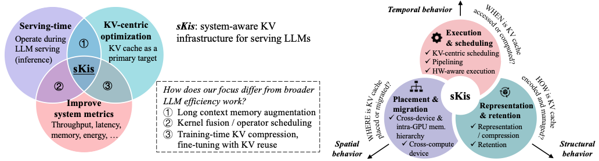
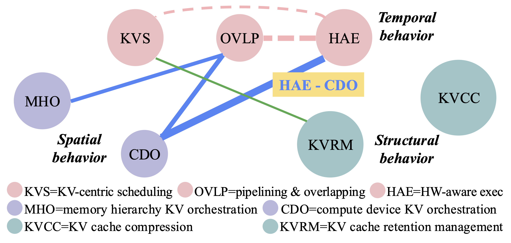
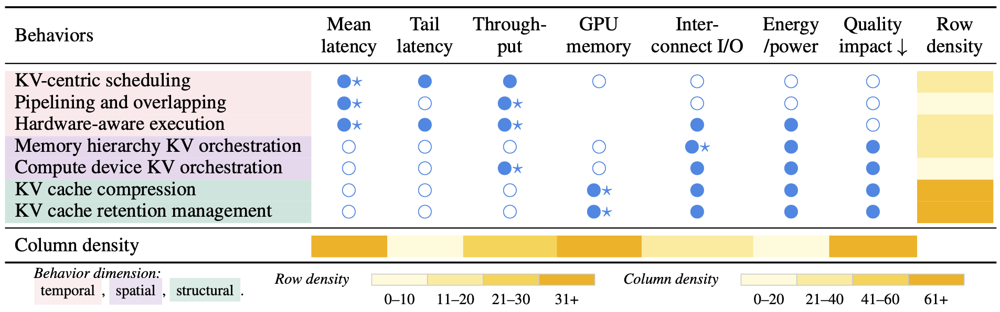

<h1 align="center">Awesome KV Cache Optimization</h1>

<div align="center">


</div>

<div align="center">

**[<a href="https://aclanthology.org/2026.findings-acl.1916/">ACL Anthology</a>]**
**[<a href="https://arxiv.org/abs/2607.08057">arXiv</a>]**
**[<a href="https://jjiantong.github.io/Awesome-KV-Cache-Optimization/">Website</a>]**
**[<a href="https://www.linkedin.com/feed/update/urn:li:activity:7384388868407529472/">LinkedIn</a>]**
**[<a href="https://mp.weixin.qq.com/s/466l3Dh4xD4LRLR8vSOc8Q">机器之心</a>]**

</div>


This repository accompanies our survey paper (**ACL 2026 Findings**):

> **[Towards Efficient Large Language Model Serving: A Survey on System-Aware KV Cache Optimization](https://aclanthology.org/2026.findings-acl.1916/)**  
> *[Jiantong Jiang](https://jjiantong.github.io/)<sup>1</sup>, [Peiyu Yang](https://ypeiyu.github.io/)<sup>1\*</sup>, [Rui Zhang](https://www.ruizhang.info/)<sup>2</sup>, [Feng Liu](https://fengliu90.github.io/)<sup>1</sup>  
> <sup>1</sup>The University of Melbourne, <sup>2</sup>Huazhong University of Science and Technology

---

This repository maintains a continuously updated collection of **system-aware, serving-time, KV-centric** optimization methods that improve system metrics without retraining or architecture modification, a scope we call ***sKis***. We organize the literature using the **system behavior-oriented taxonomy** introduced in our survey:\
🔷 **Temporal** — when is KV cache accessed or computed?\
🔷 **Spatial** — where is KV cache placed and migrated?\
🔷 **Structural** — how is KV cache represented and managed?

📚 The taxonomy serves as a stable organizing framework, while the paper collection below is continuously updated as new work appears.\
🧠 Grounded in this taxonomy, we analyze **cross-behavior co-design affinity** and **behavior–objective effects**, revealing overlooked regions and concrete open challenges. 

<p align="center">
    
</p>


### News

- 2026-10: 🔥 63 new papers were added.
- 2026-09: 🧰 Added a new **Tools, Simulators & Benchmarking Resources** section. Many thanks to @Naloam for the contribution!
- 2026-08: 🌐 Launched our new website with an interactive paper explorer. Huge thanks to @ryan-utopia for making this possible!
- 2026-06: 🔥 51 new papers were added.
- 2026-04: 🎉 Our survey was accepted to ACL 2026.
- 2026-01: 📰 Our survey was featured by 机器之心.
- 2025-11: ⭐ 100-star milestone! Thanks to the amazing support from the community!
- 2025-10: 📝 The survey was available on TechRxiv.


### Contributing

The repository is **still under active development** and will be updated regularly. 

🙋 If you would like to include your paper in this survey and repository, please feel free to submit a pull request. You can generate the markdown row for each paper by filling in the first part of ```generate.py``` and running ```python generate.py```. Alternatively, you can open an issue with the paper's title and a brief summary highlighting its key techniques. You can also contact us via email. 

🙋🏻‍♀️ Please let us know if you find any metadata, venue, classification, or link errors, or have suggestions for the repository. We greatly appreciate your feedback!

🌟 If you find this resource helpful for your work, please consider giving us a star and citing our [research](#citation).

---

<a name="readme-index"></a>

## Quick Index

- [Temporal — Execution \& Scheduling](#temporal--execution--scheduling)
  - [KV-Centric Scheduling (KVS)](#kv-centric-scheduling)
  - [Pipelining \& Overlapping (OVLP)](#pipelining--overlapping)
  - [Hardware-Aware Execution (HAE)](#hardware-aware-execution) 
- [Spatial — Placement \& Migration](#spatial--placement--migration)
  - [Memory Hierarchy KV Orchestration (MHO)](#memory-hierarchy-kv-orchestration)
  - [Compute Device KV Orchestration (CDO)](#compute-device-kv-orchestration)
- [Structural — Representation \& Retention](#structural--representation--retention)
  - [KV Cache Compression (KVCC)](#kv-cache-compression) 
  - [KV Cache Retention Management (KVRM)](#kv-cache-retention-management) 
- [Insights from the ACL 2026 Survey](#insights-from-the-acl-2026-survey)
  - [Cross-behavior Co-design Affinity](#cross-behavior-co-design-affinity)
  - [Behavior-objective Effects](#behavior-objective-effects)
- [Tools, Simulators \& Benchmarking Resources](#tools-simulators--benchmarking-resources)


---

## Temporal — Execution & Scheduling

These methods act on **when** KV data is executed, computed, or scheduled to improve latency and throughput. We divide these methods into three categories: KV-centric scheduling, pipelining & overlapping, and hardware-aware execution.

### KV-Centric Scheduling

KV-centric scheduling methods explicitly integrate KV characteristics into runtime scheduling decisions.

|Paper|Type|Code|
| -- | -- | -- |
|  <br> Does Execution Require Target KV Fidelity? A Mixed-Fidelity KV Runtime for LLM Serving [[Link](https://arxiv.org/abs/2609.33536)] <br> *Jiantong Jiang, Yue Yang, Peiyu Yang, Feng Liu* | Mixed-fidelity KV execution and runtime scheduling | |
|  <br> CacheRoute: Planned Prefix-Affinity Routing for Large-Scale LLM Serving [[Link](https://arxiv.org/abs/2608.19677)] <br> *Huang Cheng* | Prefix-affinity request routing with load-aware cache locality | |
|  []() <br> Dustin: Draft-Augmented Sparse Verification for Efficient Long-Context Generation with Speculative Decoding [[Link](https://proceedings.mlr.press/v306/lee26d.html)] <br> *WenHung Lee, Jian-Jia Chen, Xiaolin Lin, Pei-Shuo Wang, Chi-Chih Chang, Chun-Che Yang, Wei-Chen Wang, Hanrui Wang, Ning-Chi Huang, Grace Li Zhang, Kai-Chiang Wu* | Draft- and target-guided token-level KV selection for sparse speculative verification |  |
|  []() <br> RaBitQCache: Rotated Binary Quantization for KVCache in Long Context LLM Inference [[Link](https://proceedings.mlr.press/v306/li26al.html)] <br> *Wenhao Li, Jinhao Dong, Hailin Zhang, Wenhang Shi, Wei Lu, Xiaoyong Du* | Binary-quantized proxy scoring for adaptive Top-p KV retrieval in sparse attention | [](https://github.com/Sakuraaa0/RaBitQCache) <br>  <br> [RaBitQCache](https://github.com/Sakuraaa0/RaBitQCache) |
|  []() <br> Zipage: Maintain High Request Concurrency for LLM Reasoning through Compressed PagedAttention [[Link](https://aclanthology.org/2026.findings-acl.381/)] <br> *Mengqi Liao, Lu Wang, Chaoyun Zhang, Bo Qiao, Si Qin, Qingwei Lin, Saravan Rajmohan, Dongmei Zhang, Huaiyu Wan* | KV block- and compression-state-aware hybrid request scheduling; Also belongs to KV cache retention management (structural) | [](https://github.com/microsoft/Zipage) <br>  <br> [Zipage](https://github.com/microsoft/Zipage) |
|  []() <br> Simple Is Better: Multiplication May Be All You Need for LLM Request Scheduling [[Link](https://www.usenix.org/conference/osdi26/presentation/zhang-dingyan)] <br> *Dingyan Zhang, Jinbo Han, Kaixi Zhang, Xingda Wei, Sijie Shen, Chenguang Fang, Wenyuan Yu, Jingren Zhou, Rong Chen* | KV reuse- and load-aware request scheduling via multiplicative routing score | |
|  []() <br> Strata: Hierarchical Context Caching for Long Context Language Model Serving [[Link](https://www.usenix.org/conference/osdi26/presentation/xie-zhiqiang)] <br> *Zhiqiang Xie, Ziyi Xu, Mark Zhao, Yuwei An, Vikram Sharma Mailthody, Scott Mahlke, Michael Garland, Christos Kozyrakis* | Cache-loading-aware request scheduling; Also belongs to Memory Hierarchy KV Orchestration (spatial) | |
| []() <br> AlignedServe: Orchestrating Prefix-aware Batching to Build a High-throughput and Computing-efficient LLM Serving System [[Link](https://dl.acm.org/doi/10.1145/3802009)] <br> *Fengyao Bai, Hongbin Zhang, Zhitao Chen, Jiangsu Du, Zhiguang Chen, Yutong Lu* | KV-length-aware request batching and batch-level scheduling | |
| []() <br> CoDec: Prefix-Shared Decoding Kernel for LLMs [[Link](https://dl.acm.org/doi/10.1145/3802028)] <br> *Zhibin Wang, Rui Ning, Chao Fang, Zhonghui Zhang, Xi Lin, Shaobo Ma, Mo Zhou, Xue Li, Zhongfeng Wang, Chengying Huan, Rong Gu, Kun Yang, Guihai Chen, Sheng Zhong, Chen Tian* | Shared KV access scheduling across requests | [](https://github.com/wzbxpy/codec) <br>  <br> [codec](https://github.com/wzbxpy/codec) |
| []() <br> HotPrefix: Hotness-Aware KV Cache Scheduling for Efficient Prefix Sharing in LLM Inference Systems [[Link](https://dl.acm.org/doi/10.1145/3749168)] <br> *Yuhang Li, Rong Gu, Chengying Huan, Zhibin Wang, Renjie Yao, Chen Tian, Guihai Chen* | Hotness-aware KV cache scheduling for prefix sharing; Also belongs to KV cache retention management | |
| PRISM: Fast Online LLM Serving via Scheduling-Memory Co-design [[Link](https://arxiv.org/abs/2605.08581)] <br> *Xingyu Qu, Tianhao Lin, Yiqi Li, Zhiyu Chen, Sheng Wang* | KV reuse-aware request scheduling; Also belongs to KV cache retention management (structural) | |
| Fathom: Per-Query Read Depth for Sparse Decoding over Offloaded KV Caches [[Link](https://arxiv.org/abs/2609.17652)] <br> *Vivek Kalyanarangan* | Token-level attention compute scheduling; per-query, per-channel read depth over a bit-plane K store; Also belongs to KV cache compression, quantization (structural) |  <br>  <br> [fathom](https://github.com/vivekkalyanarangan30/fathom) |
|  []() <br> Bidaw: Enhancing Key-Value Caching for Interactive LLM Serving via Bidirectional Computation–Storage Awareness [[Link](https://www.usenix.org/conference/fast26/presentation/hu-shipeng)] <br> *Shipeng Hu, Guangyan Zhang, Yuqi Zhou, Yaya Wei, Ziyan Zhong, Jike Chen* | KV-loading-aware request scheduling; Also belongs to Memory hierarchy KV orchestration (spatial) | |
| []() <br> Fast Inference for Augmented Large Language Models [[Link](https://proceedings.neurips.cc/paper_files/paper/2025/hash/679b0e02978404ee569ce2abfb8455cf-Abstract-Conference.html)] <br> *Rana Shahout, Cong Liang, Shiji Xin, Qianru Lao, Yong Cui, Minlan Yu, Michael Mitzenmacher*| KV usage-aware request-level scheduling | |
| []() <br> TokenSelect: Efficient Long-Context Inference and Length Extrapolation for LLMs via Dynamic Token-Level KV Cache Selection [[Link](https://aclanthology.org/2025.emnlp-main.1079/)] <br> *Wei Wu, Zhuoshi Pan, Kun Fu, Chao Wang, Liyi Chen, Yunchu Bai, Tianfu Wang, Zheng Wang, Hui Xiong* | Token-level attention compute scheduling |[](https://github.com/pzs19/TokenSelect) <br>  <br> [TokenSelect](https://github.com/pzs19/TokenSelect)|
| []()  <br> TinyServe: Query-Aware Cache Selection for Efficient LLM Serving [[Link](https://dl.acm.org/doi/10.1145/3746027.3758181)] <br> *Dong Liu, Yanxuan Yu* | Query-aware page-level KV selection for sparse attention computation | |
| TokenCake: A KV-Cache-centric Serving Framework for LLM-based Multi-Agent Applications [[Link](https://arxiv.org/abs/2510.18586)] <br> *Zhuohang Bian, Feiyang Wu, Zhuoran Li, Teng Ma, Youwei Zhuo* | Agent-aware KV scheduling under tool-call stalls; Also belongs to memory hierarchy KV orchestration | |
| []() <br> RefreshKV: Updating Small KV Cache During Long-form Generation [[Link](https://aclanthology.org/2025.acl-long.1211/)] <br> *Fangyuan Xu, Tanya Goyal,  Eunsol Choi*| Token-level attention compute scheduling |[](https://github.com/carriex/refreshkv) <br>  <br> [RefreshKV](https://github.com/carriex/refreshkv)|
| []() <br> RocketKV: Accelerating Long-Context LLM Inference via Two-Stage KV Cache Compression [[Link](https://proceedings.mlr.press/v267/behnam25a.html)] <br> *Payman Behnam, Yaosheng Fu, Ritchie Zhao, Po-An Tsai, Zhiding Yu, Alexey Tumanov*| Token-level attention compute scheduling |[](https://github.com/NVlabs/RocketKV) <br>  <br> [RocketKV](https://github.com/NVlabs/RocketKV)|
| []()  <br> FlashInfer: Efficient and Customizable Attention Engine for LLM Inference Serving [[Link](https://proceedings.mlsys.org/paper_files/paper/2025/hash/dbf02b21d77409a2db30e56866a8ab3a-Abstract-Conference.html)] <br> *Zihao Ye, Lequn Chen, Ruihang Lai, Wuwei Lin, Yineng Zhang, Stephanie Wang, Tianqi Chen, Baris Kasikci, Vinod Grover, Arvind Krishnamurthy, Luis Ceze* | Kernel-level workload scheduling across CUDA thread blocks; Also belongs to allocation & reuse (structural) | [](https://github.com/flashinfer-ai/flashinfer) <br>  <br> [FlashInfer](https://github.com/flashinfer-ai/flashinfer) 🌟 |
| []()  <br> Mooncake: Trading More Storage for Less Computation — A KVCache-centric Architecture for Serving LLM Chatbot [[Link](https://www.usenix.org/conference/fast25/presentation/qin)] <br> *Ruoyu Qin, Zheming Li, Weiran He, Jialei Cui, Feng Ren, Mingxing Zhang, Yongwei Wu, Weimin Zheng, Xinran Xu* | KV reuse-aware request-level scheduling; Also belongs to HW-aware execution | [](https://github.com/kvcache-ai/Mooncake) <br>  <br>[Mooncake](https://github.com/kvcache-ai/Mooncake) 🌟 |
| []() <br> Loki: Low-rank Keys for Efficient Sparse Attention [[Link](https://proceedings.neurips.cc/paper_files/paper/2024/hash/1e027da6bec9ceb2ec37951ceeccae93-Abstract-Conference.html)] <br> *Prajwal Singhania, Siddharth Singh, Shwai He, Soheil Feizi, Abhinav Bhatele* | Token-level attention compute scheduling |[](https://github.com/hpcgroup/loki) <br>  <br> [Loki](https://github.com/hpcgroup/loki)  |
| []() <br> SGLang: Efficient Execution of Structured Language Model Programs [[Link](https://proceedings.neurips.cc/paper_files/paper/2024/hash/724be4472168f31ba1c9ac630f15dec8-Abstract-Conference.html)] <br> *Lianmin Zheng, Liangsheng Yin, Zhiqiang Xie, Chuyue Sun, Jeff Huang, Cody Hao Yu, Shiyi Cao, Christos Kozyrakis, Ion Stoica, Joseph E. Gonzalez, Clark Barrett, Ying Sheng* | KV reuse-aware request-level scheduling; Also belongs to allocation & reuse (structural) |[](https://github.com/sgl-project/sglang) <br>  <br> [SGLang](https://github.com/sgl-project/sglang) 🌟 |
| []() <br> LoongServe: Efficiently Serving Long-Context Large Language Models with Elastic Sequence Parallelism [[Link](https://dl.acm.org/doi/10.1145/3694715.3695948)] <br> *Bingyang Wu, Shengyu Liu, Yinmin Zhong, Peng Sun, Xuanzhe Liu, Xin Jin* | KV usage-aware request-level scheduling |[](https://github.com/LoongServe/LoongServe) <br>  <br> [LoongServe](https://github.com/LoongServe/LoongServe) |
| LayerKV: Optimizing Large Language Model Serving with Layer-wise KV Cache Management [[Link](https://arxiv.org/abs/2410.00428)] <br> *Yi Xiong, Hao Wu, Changxu Shao, Ziqing Wang, Rui Zhang, Yuhong Guo, Junping Zhao, Ke Zhang, Zhenxuan Pan*| KV usage-aware request-level scheduling; Also belongs to memory hierarchy KV orchestration (spatial) | |
|  []() <br> InferCept: Efficient Intercept Support for Augmented Large Language Model Inference [[Link](https://proceedings.mlr.press/v235/abhyankar24a.html)] <br> *Reyna Abhyankar, Zijian He, Vikranth Srivatsa, Hao Zhang, Yiying Zhang* | KV-state-aware request scheduling over preserve, swap, and recompute decisions; Also belongs to memory hierarchy KV orchestration (spatial) | [](https://github.com/WukLab/InferCept) <br>  <br> [InferCept](https://github.com/WukLab/InferCept) |
| []() <br> SparQ Attention: Bandwidth-Efficient LLM Inference [[Link](https://proceedings.mlr.press/v235/ribar24a.html)] <br> *Luka Ribar, Ivan Chelombiev, Luke Hudlass-Galley, Charlie Blake, Carlo Luschi, Douglas Orr* | Token-level attention compute scheduling | [](https://github.com/graphcore-research/llm-inference-research/tree/2024-05-sparq) <br>  <br> [SparQ Attention](https://github.com/graphcore-research/llm-inference-research/tree/2024-05-sparq)  |
| []() <br> QUEST: Query-Aware Sparsity for Efficient Long-Context LLM Inference [[Link](https://proceedings.mlr.press/v235/tang24l.html)] <br> *Jiaming Tang, Yilong Zhao, Kan Zhu, Guangxuan Xiao, Baris Kasikci, Song Han*| Token-level attention compute scheduling |[](https://github.com/mit-han-lab/quest) <br>  <br> [Quest](https://github.com/mit-han-lab/quest)  |
| []() <br> MuxServe: Flexible Spatial-Temporal Multiplexing for Multiple LLM Serving [[Link](https://proceedings.mlr.press/v235/duan24a.html)] <br> *Jiangfei Duan, Runyu Lu, Haojie Duanmu, Xiuhong Li, Xingcheng Zhang, Dahua Lin, Ion Stoica, Hao Zhang* | KV usage-aware request-level scheduling; Also belongs to HW-aware execution |[](https://github.com/hao-ai-lab/MuxServe) <br>  <br> [MuxServe](https://github.com/hao-ai-lab/MuxServe)  |
| []() <br> Preble: Efficient Distributed Prompt Scheduling for LLM Serving [[Link](https://openreview.net/forum?id=meKEKDhdnx)] <br> *Vikranth Srivatsa, Zijian He, Reyna Abhyankar, Dongming Li, Yiying Zhang* | KV reuse-aware request-level scheduling |[](https://github.com/WukLab/preble) <br>  <br> [Preble](https://github.com/WukLab/preble) |
| Inference without interference: Disaggregate LLM inference for mixed downstream workloads [[Link](https://arxiv.org/abs/2401.11181)] <br> *Cunchen Hu, Heyang Huang, Liangliang Xu, Xusheng Chen, Jiang Xu, Shuang Chen, Hao Feng, Chenxi Wang, Sa Wang, Yungang Bao, Ninghui Sun, Yizhou Shan* | KV usage-aware request-level scheduling; Also belongs to HW-aware execution | |


<p align="right" style="font-size: 14px; color: #555; margin-top: 20px;">
    <a href="#readme-index" style="text-decoration: none; color: #007bff; font-weight: bold;">
        ↑ Back to Index ↑
    </a>
</p>

### Pipelining & Overlapping

Pipelining and overlapping methods hide latency by concurrently executing KV-related compute, communication, and I/O. Though often embedded in the broader systems, we highlight the following methods where pipelining and overlapping forms the core technical contribution.

|Paper|Type|Code|
| -- | -- | -- |
|  <br> DualDecoder: Accelerate Long Context LLM Inference by Predictive Prefetch [[Link](https://arxiv.org/abs/2607.26475)] <br> *Zuning Liang, Zhiyi Yao, Qi Chen, Yuedong Xu, Hao Dai, Zhiqiang Ding, Tongkai Yang, Jinlong Hou, Yuan Cheng* | KV prefetch (CPU→GPU) ↔ GPU decode compute; Also belongs to memory hierarchy KV orchestration (spatial) | |
|  []() <br> RaBitQCache: Rotated Binary Quantization for KVCache in Long Context LLM Inference [[Link](https://proceedings.mlr.press/v306/li26al.html)] <br> *Wenhao Li, Jinhao Dong, Hailin Zhang, Wenhang Shi, Wei Lu, Xiaoyong Du* | Asynchronous proxy-index construction and attention execution with lazy updates; Also belongs to KV-centric scheduling (temporal) | [](https://github.com/Sakuraaa0/RaBitQCache) <br>  <br> [RaBitQCache](https://github.com/Sakuraaa0/RaBitQCache) |
|  []() <br> ECHO: Efficient KV Cache Offloading with Lossless Prefetching for Serving Native Sparse Attention LLMs [[Link](https://www.usenix.org/conference/osdi26/presentation/liu-guangda)] <br> *Guangda Liu, Wenhao Chen, Chengwei Li, Zhenyu Ning, Jing Lin, Yiwu Yao, Quan Chen, Shixuan Sun, Jieru Zhao, Minyi Guo* | KV prefetch ↔ sparse-attention indexer computation; Also belongs to memory hierarchy KV orchestration (spatial) | [](https://github.com/sjtu-zhao-lab/ECHO) <br>  <br> [ECHO](https://github.com/sjtu-zhao-lab/ECHO) |
|  []() <br> DroidSpeak: KV Cache Sharing Across Fine-tuned Model Variants [[Link](https://www.usenix.org/conference/nsdi26/presentation/liu-yuhan)] <br> *Yuhan Liu, Yuyang Huang, Jiayi Yao, Shaoting Feng, Zhuohan Gu, Kuntai Du, Hanchen Li, Yihua Cheng, Junchen Jiang, Shan Lu, Madan Musuvathi, Esha Choukse* | Critical-layer KV recomputation ↔ remote reused-KV loading; Also belongs to compute device KV orchestration (spatial) | |
| ObjectCache: Layerwise Object-Storage Retrieval for KV Cache Reuse [[Link](https://arxiv.org/abs/2605.22850)] <br> *Yu Zhu, Aditya Dhakal, Yunming Xiao, Dejan Milojicic, Gustavo Alonso* | Object-storage KV retrieval ↔ GPU layerwise consumption; Also belongs to memory hierarchy KV orchestration (spatial) | |
|  []() <br> High Throughput and Low Latency LLM Serving via Adaptive KV Caching [[Link](https://dl.acm.org/doi/10.1145/3767295.3803570)] <br> *Wenyan Chen, Chengzhi Lu, Huanle Xu, Kejiang Ye, ChengZhong Xu* | Uncached-token KV recomputation ↔ decoding/communication via fine-grained adaptive caching; Also belongs to KV cache retention management (structural) | |
| []() <br> ScoutAttention: Efficient KV Cache Offloading via Layer-Ahead CPU Pre-computation for LLM Inference [[Link](https://arxiv.org/abs/2603.27138)] <br> *Qiuyang Zhang, Kai Zhou, Ding Tang, Kai Lu, Cheng Li, Zhenyu Yang, Peng Xu, Jiguang Wan* | Layer-ahead CPU attention precompute ↔ GPU decode; Also belongs to HW-aware execution | |
| []() <br> CXL-SpecKV: A Disaggregated FPGA Speculative KV-Cache for Datacenter LLM Serving [[Link](https://dl.acm.org/doi/10.1145/3748173.3779188)] <br> *Dong Liu, Yanxuan Yu* | GPU compute ↔ GPU KV prefetch (CXL memory→L2); Also belongs to memory hierarchy KV orchestration (spatial) |[](https://github.com/FastLM/CXL-SpecKV) <br>  <br> [CXL-SpecKV](https://github.com/FastLM/CXL-SpecKV) |
| []() <br> SlimInfer: Accelerating Long-Context LLM Inference via Dynamic Token Pruning [[Link](https://ojs.aaai.org/index.php/AAAI/article/view/40502)] <br> *Lingkun Long, Rubing Yang, Yushi Huang, Desheng Hui, Ao Zhou, Jianlei Yang*| KV prefetch/offload (CPU↔GPU) ↔ FFN & QKV generation; Also belongs to memory hierarchy KV orchestration (spatial) | |
| []() <br> Accelerating LLM Inference Throughput via Asynchronous KV Cache Prefetching [[Link](https://ojs.aaai.org/index.php/AAAI/article/view/39224)] <br> *Yanhao Dong, Yubo Miao, Weinan Li, Xiao Zheng, Chao Wang, Jiesheng Wu, Feng Lyu* | GPU KV prefetch (HBM→L2) ↔ GPU attention compute; Also belongs to memory hierarchy KV orchestration (spatial) ||
| []() <br> KVPR: Efficient LLM inference with i/o-aware KV cache partial recomputation [[Link](https://aclanthology.org/2025.findings-acl.997/)] <br> *Chaoyi Jiang, Lei Gao, Hossein Entezari Zarch, Murali Annavaram* | GPU KV recompute ↔ KV transfer (CPU↔GPU) |[](https://github.com/chaoyij/KVPR) <br>  <br> [KVPR](https://github.com/chaoyij/KVPR)  |
| PRESERVE: Prefetching Model Weights and KV-Cache in Distributed LLM Serving [[Link](https://arxiv.org/abs/2501.08192)] <br> *Ahmet Caner Yüzügüler, Jiawei Zhuang, Lukas Cavigelli* | GPU KV prefetch (HBM→L2) ↔ GPU collective communication; Also belongs to memory hierarchy KV orchestration (spatial) ||
| []() <br> NEO: Saving GPU Memory Crisis with CPU Offloading for Online LLM Inference [[Link](https://proceedings.mlsys.org/paper_files/paper/2025/hash/66a026c0d17040889b50f0dfa650e5e0-Abstract-Conference.html)] <br> *Xuanlin Jiang, Yang Zhou, Shiyi Cao, Ion Stoica, Minlan Yu* | CPU attention compute ↔ GPU linear ops; Also belongs to HW-aware execution |[](https://github.com/NEO-MLSys25/NEO) <br>  <br> [NEO](https://github.com/NEO-MLSys25/NEO) |
|  []()  <br> CacheBlend: Fast Large Language Model Serving for RAG with Cached Knowledge Fusion [[Link](https://dl.acm.org/doi/10.1145/3689031.3696098)] <br> *Jiayi Yao, Hanchen Li, Yuhan Liu, Siddhant Ray, Yihua Cheng, Qizheng Zhang, Kuntai Du, Shan Lu, Junchen Jiang* | Selective KV recomputation ↔ cached-KV retrieval for non-prefix RAG chunks; Also belongs to KV cache retention management (structural) | [](https://github.com/YaoJiayi/CacheBlend) <br>  <br> [CacheBlend](https://github.com/YaoJiayi/CacheBlend) |
|  []() <br> Fast State Restoration in LLM Serving with HCache [[Link](https://dl.acm.org/doi/10.1145/3689031.3696072)] <br> *Shiwei Gao, Youmin Chen, Jiwu Shu* | KV state restoration compute ↔ host-storage I/O via bubble-free scheduling | |
| []() <br> Cost-Efficient Large Language Model Serving for Multi-turn Conversations with CachedAttention [[Link](https://www.usenix.org/conference/atc24/presentation/gao-bin-cost)] <br> *Bin Gao, Zhuomin He, Puru Sharma, Qingxuan Kang, Djordje Jevdjic, Junbo Deng, Xingkun Yang, Zhou Yu, Pengfei Zuo* | KV load/store (CPU↔GPU) ↔ GPU compute; Also belongs to memory hierarchy KV orchestration (spatial) ||
| FastDecode: High-Throughput GPU-Efficient LLM Serving using Heterogeneous Pipelines [[Link](https://arxiv.org/abs/2403.11421)] <br> *Jiaao He, Jidong Zhai* | CPU R-part compute ↔ GPU S-part compute; Also belongs to HW-aware execution ||
| []() <br> Improving Throughput-Oriented LLM Inference with CPU Computations [[Link](https://dl.acm.org/doi/10.1145/3656019.3676949)] <br> *Daon Park, Bernhard Egger* | CPU MHSA compute ↔ FFN data transfer (CPU→GPU); Also belongs to HW-aware execution |[](https://gitlab.csap.snu.ac.kr/research/heterogen) <br> [Heterogen](https://gitlab.csap.snu.ac.kr/research/heterogen)|


<p align="right" style="font-size: 14px; color: #555; margin-top: 20px;">
    <a href="#readme-index" style="text-decoration: none; color: #007bff; font-weight: bold;">
        ↑ Back to Index ↑
    </a>
</p>

### Hardware-aware Execution

Hardware-aware execution methods adapt KV cache-related operations to the underlying heterogeneous hardware.


#### Disaggregated Inference

Disaggregated inference separates heterogeneous computation in LLM inference and maps them to distinct hardware resources to reduce interference and improve utilization. 

|Paper|Type|Code|
| -- | -- | -- |
| []() <br> ScoutAttention: Efficient KV Cache Offloading via Layer-Ahead CPU Pre-computation for LLM Inference [[Link](https://arxiv.org/abs/2603.27138)] <br> *Qiuyang Zhang, Kai Zhou, Ding Tang, Kai Lu, Cheng Li, Zhenyu Yang, Peng Xu, Jiguang Wan* | CPU/GPU collaborative attention; Also belongs to pipelining & overlapping | |
| HillInfer: Efficient Long-Context LLM Inference on the Edge with Hierarchical KV Eviction using SmartSSD [[Link](https://arxiv.org/abs/2602.18750)] <br> *He Sun, Shinan Liu, Li Li, Mingjun Xiao* | SmartSSD-assisted KV offloading; Also belongs to memory hierarchy KV orchestration (spatial) | |
| []()  <br> Mooncake: Trading More Storage for Less Computation — A KVCache-centric Architecture for Serving LLM Chatbot [[Link](https://www.usenix.org/conference/fast25/presentation/qin)] <br> *Ruoyu Qin, Zheming Li, Weiran He, Jialei Cui, Feng Ren, Mingxing Zhang, Yongwei Wu, Weimin Zheng, Xinran Xu* | PD disaggregation; Also belongs to KV-centric scheduling | [](https://github.com/kvcache-ai/Mooncake) <br>  <br> [Mooncake](https://github.com/kvcache-ai/Mooncake) 🌟 |
| []() <br> DéjàVu: KV-cache Streaming for Fast, Fault-tolerant Generative LLM Serving [[Link](https://proceedings.mlr.press/v235/strati24a.html)] <br> *Foteini Strati, Sara Mcallister, Amar Phanishayee, Jakub Tarnawski, Ana Klimovic* | Decoupling prefill and decode to different GPUs; Also belongs to memory hierarchy KV orchestration (spatial) |[](https://github.com/msr-fiddle/dejavu) <br>  <br> [DéjàVu](https://github.com/msr-fiddle/dejavu) |
| []() <br> MuxServe: Flexible Spatial-Temporal Multiplexing for Multiple LLM Serving [[Link](https://proceedings.mlr.press/v235/duan24a.html)] <br> *Jiangfei Duan, Runyu Lu, Haojie Duanmu, Xiuhong Li, Xingcheng Zhang, Dahua Lin, Ion Stoica, Hao Zhang* | Colocating PD jobs of multiple LLMs within each GPU via SM partitioning; Also belongs to KV-centric scheduling |[](https://github.com/hao-ai-lab/MuxServe) <br>  <br> [MuxServe](https://github.com/hao-ai-lab/MuxServe)  |
| []() <br> DistServe: Disaggregating Prefill and Decoding for Goodput-optimized Large Language Model Serving [[Link](https://www.usenix.org/conference/osdi24/presentation/zhong-yinmin)] <br> *Yinmin Zhong, Shengyu Liu, Junda Chen, Jianbo Hu, Yibo Zhu, Xuanzhe Liu, Xin Jin, Hao Zhang* | Decoupling prefill and decode to different GPUs; Also belongs to compute device KV orchestration (spatial) |[](https://github.com/LLMServe/DistServe) <br>  <br> [DistServe](https://github.com/LLMServe/DistServe) |
| Infinite-LLM: Efficient LLM Service for Long Context with DistAttention and Distributed KVCache [[Link](https://arxiv.org/abs/2401.02669)] <br> *Bin Lin, Chen Zhang, Tao Peng, Hanyu Zhao, Wencong Xiao, Minmin Sun, Anmin Liu, Zhipeng Zhang, Lanbo Li, Xiafei Qiu, Shen Li, Zhigang Ji, Tao Xie, Yong Li, Wei Lin* | Disaggregating at the operator level; Also belongs to compute device KV orchestration (spatial) ||
| []() <br> Splitwise: Efficient generative LLM inference using phase splitting [[Link](https://ieeexplore.ieee.org/document/10609649/)] <br> *Pratyush Patel, Esha Choukse, Chaojie Zhang, Aashaka Shah, Íñigo Goiri, Saeed Maleki, Ricardo Bianchini* | Decoupling prefill and decode to different GPUs; Also belongs to compute device KV orchestration (spatial) |[Splitwise](https://github.com/vllm-project/vllm/pull/2809) (integrated into vLLM) |
| Inference without interference: Disaggregate LLM inference for mixed downstream workloads [[Link](https://arxiv.org/abs/2401.11181)] <br> *Cunchen Hu, Heyang Huang, Liangliang Xu, Xusheng Chen, Jiang Xu, Shuang Chen, Hao Feng, Chenxi Wang, Sa Wang, Yungang Bao, Ninghui Sun, Yizhou Shan* | Decoupling prefill and decode to different GPUs; Also belongs to KV-centric scheduling | |


#### Compute Offloading

Compute offloading relocates partial compute to auxiliary devices to reduce GPU bottlenecks, utilizing hardware heterogeneity and workload features. 


|Paper|Type|Code|
| -- | -- | -- |
|  []() <br> Turbo: Efficiently Serving Long-Context Large Language Models with In-Network Aggregation [[Link](https://dl.acm.org/doi/10.1145/3789240.3829140)] <br> *Ying Wan, Yuchen Xu, Chuwen Zhang, Yingsheng Huang, Yong Feng, Wenquan Xu, Jialin Li, Mingwei Xu, Wenfei Wu, Congcong Miao* | In-network query broadcast and attention aggregation offloaded to programmable switches/NICs; Also belongs to compute device KV orchestration (spatial) | [](https://github.com/xxds-hys/turbo) <br>  <br> [Turbo](https://github.com/xxds-hys/turbo) |
|  []() <br> A Cost-Effective Near-Storage Processing Solution for Offline Inference of Long-Context LLMs [[Link](https://dl.acm.org/doi/10.1145/3779212.3790119)] <br> *Hongsun Jang, Jaeyong Song, Changmin Shin, Si Ung Noh, Jaewon Jung, Jisung Park, Jinho Lee* | Near-storage attention offloading to SmartSSD accelerators; Also belongs to compute device KV orchestration (spatial) | [](https://github.com/hongsunjang/HILOS) <br>  <br> [HILOS](https://github.com/hongsunjang/HILOS) |
| []() <br> NEO: Saving GPU Memory Crisis with CPU Offloading for Online LLM Inference [[Link](https://proceedings.mlsys.org/paper_files/paper/2025/hash/66a026c0d17040889b50f0dfa650e5e0-Abstract-Conference.html)] <br> *Xuanlin Jiang, Yang Zhou, Shiyi Cao, Ion Stoica, Minlan Yu* | CPU offloading (attention and KV caches); Also belongs to pipelining & overlapping |[](https://github.com/NEO-MLSys25/NEO) <br>  <br> [NEO](https://github.com/NEO-MLSys25/NEO) |
| []()  <br> MagicPIG: LSH Sampling for Efficient LLM Generation [[Link](https://openreview.net/forum?id=ALzTQUgW8a)] <br> *Zhuoming Chen, Ranajoy Sadhukhan, Zihao Ye, Yang Zhou, Jianyu Zhang, Niklas Nolte, Yuandong Tian, Matthijs Douze, Leon Bottou, Zhihao Jia, Beidi Chen* | CPU offloading (attention and retrieval) |[](https://github.com/Infini-AI-Lab/MagicPIG) <br>  <br> [MagicPIG](https://github.com/Infini-AI-Lab/MagicPIG)|
| []() <br> PAPI: Exploiting Dynamic Parallelism in Large Language Model Decoding with a Processing-In-Memory-Enabled Computing System [[Link](https://dl.acm.org/doi/10.1145/3676641.3716009)] <br> *Yintao He, Haiyu Mao, Christina Giannoula, Mohammad Sadrosadati, Juan Gómez-Luna, Huawei Li, Xiaowei Li, Ying Wang, Onur Mutlu* | PIM-based offloading | |
| []() <br> TwinPilots: A New Computing Paradigm for GPU-CPU Parallel LLM Inference [[Link](https://dl.acm.org/doi/10.1145/3688351.3689164)] <br> *Chengye Yu, Tianyu Wang, Zili Shao, Linjie Zhu, Xu Zhou, Song Jiang* | CPU offloading | |
| InstInfer: In-Storage Attention Offloading for Cost-Effective Long-Context LLM Inference [[Link](https://arxiv.org/abs/2409.04992)] <br> *Xiurui Pan, Endian Li, Qiao Li, Shengwen Liang, Yizhou Shan, Ke Zhou, Yingwei Luo, Xiaolin Wang, Jie Zhang*| CSD Offloading; Also belongs to compute device KV orchestration (spatial) | |
| []() <br> AttAcc! Unleashing the power of PIM for batched transformer-based generative model inference [[Link](https://dl.acm.org/doi/10.1145/3620665.3640422)] <br> *Jaehyun Park, Jaewan Choi, Kwanhee Kyung, Michael Jaemin Kim, Yongsuk Kwon, Nam Sung Kim, Jung Ho Ahn* | PIM-based offloading; Also belongs to compute device KV orchestration (spatial) |[](https://github.com/scale-snu/attacc_simulator) <br>  <br> [AttAcc](https://github.com/scale-snu/attacc_simulator) |
| FastDecode: High-Throughput GPU-Efficient LLM Serving using Heterogeneous Pipelines [[Link](https://arxiv.org/abs/2403.11421)] <br> *Jiaao He, Jidong Zhai* | CPU offloading (attention and KV caches); Also belongs to pipelining & overlapping ||
| []() <br> Improving Throughput-Oriented LLM Inference with CPU Computations [[Link](https://dl.acm.org/doi/10.1145/3656019.3676949)] <br> *Daon Park, Bernhard Egger* | CPU offloading with dynamic GPU-CPU division; Also belongs to pipelining & overlapping |[](https://gitlab.csap.snu.ac.kr/research/heterogen) <br> [Heterogen](https://gitlab.csap.snu.ac.kr/research/heterogen)|


#### Hardware-Specialized Execution

[Newly added] These methods specialize KV-related kernels, data layouts, or dedicated execution engines to exploit hardware-native compute primitives and access patterns.

|Paper|Type|Code|
| -- | -- | -- |
|  []() <br> PAT: Accelerating LLM Decoding via Prefix-Aware Attention with Resource Efficient Multi-Tile Kernel [[Link](https://dl.acm.org/doi/10.1145/3779212.3790200)] <br> *Jinjun Yi, Zhixin Zhao, Yitao Hu, Ke Yan, Weiwei Sun, Hao Wang, Laiping Zhao, Yuhao Zhang, Wenxin Li, Keqiu Li* | Prefix-aware multi-tile attention kernel that co-schedules shared-prefix queries to reduce redundant KV reads | [](https://github.com/flashserve/PAT) <br>  <br> [PAT](https://github.com/flashserve/PAT) |
|  []() <br> V-Rex: Real-Time Streaming Video LLM Acceleration via Dynamic KV Cache Retrieval [[Link](https://ieeexplore.ieee.org/document/11408603/)] <br> *Donghyuk Kim, Sejeong Yang, Wonjin Shin, Joo-Young Kim* | SW-HW co-designed dynamic KV retrieval engine for streaming video LLM inference; Also belongs to memory hierarchy KV orchestration |  |
|  []() <br> BitDecoding: Unlocking Tensor Cores for Long-Context LLMs with Low-Bit KV Cache [[Link](https://ieeexplore.ieee.org/document/11408481/)] <br> *Dayou Du, Shijie Cao, Jianyi Cheng, Luo Mai, Ting Cao, Mao Yang* | CUDA/Tensor-Core cooperative execution for efficient low-bit KV cache decoding | [](https://github.com/OpenBitSys/BitDecoding) <br>  <br> [BitDecoding](https://github.com/OpenBitSys/BitDecoding) |


<p align="right" style="font-size: 14px; color: #555; margin-top: 20px;">
    <a href="#readme-index" style="text-decoration: none; color: #007bff; font-weight: bold;">
        ↑ Back to Index ↑
    </a>
</p>

---

## Spatial — Placement & Migration

These works optimize **where** KV data is stored or transferred to balance memory and I/O pressure. We divide these methods into two categories: memory hierarchy KV orchestration, and compute device KV orchestration.


### Memory Hierarchy KV Orchestration

Memory hierarchy KV orchestration methods distribute KV caches across memory hierarchies.


#### Cross-device Memory Hierarchy

These methods manage KV caches across fast but limited GPU HBM, and larger but slower alternatives like CPU DRAM or SSD. 


|Paper|Type|Code|
| -- | -- | -- |
|  []() <br> ORBITFLOW: SLO-Aware Long-Context LLM Serving with Fine-Grained KV Cache Reconfiguration [[Link](https://dl.acm.org/doi/10.14778/3796195.3796214)] <br> *Xinyue Ma, Heelim Hong, Taegeon Um, Jongseop Lee, Seoyeong Choy, Woo-Yeon Lee, Myeongjae Jeon* | Fine-grained adaptive GPU–CPU KV placement reconfiguration under latency SLOs | |
|  []() <br> DualPath: Accelerating Agentic LLM Inference by Harvesting Disaggregated KV-Cache Storage I/O [[Link](https://dl.acm.org/doi/10.1145/3789240.3829159)] <br> *Yongtong Wu, Shaoyuan Chen, Rilin Huang, Yixuan Tan, Yinmin Zhong, Mingxing Zhang, Xin Jin, Panpan Huang* | Dual-path KV loading from external storage; Also belongs to compute device KV orchestration | |
|  <br> A CXL Memory Rack for Multi-Turn LLM Serving [[Link](https://arxiv.org/abs/2607.18141)] <br> *Hakbeom Jang, Inho Song, Hoshik Kim, Sam H. Noh, Jongryool Kim* | CXL-hybrid-memory KV tiering with request-level prefix prefetching | |
|  <br> DualDecoder: Accelerate Long Context LLM Inference by Predictive Prefetch [[Link](https://arxiv.org/abs/2607.26475)] <br> *Zuning Liang, Zhiyi Yao, Qi Chen, Yuedong Xu, Hao Dai, Zhiqiang Ding, Tongkai Yang, Jinlong Hou, Yuan Cheng* | Predictive host-to-GPU KV prefetching; Also belongs to pipelining & overlapping (temporal) | |
|  []() <br> ECHO: Efficient KV Cache Offloading with Lossless Prefetching for Serving Native Sparse Attention LLMs [[Link](https://www.usenix.org/conference/osdi26/presentation/liu-guangda)] <br> *Guangda Liu, Wenhao Chen, Chengwei Li, Zhenyu Ning, Jing Lin, Yiwu Yao, Quan Chen, Shixuan Sun, Jieru Zhao, Minyi Guo* | Dynamic host–GPU KV offloading with lossless prefetching; Also belongs to pipelining & overlapping (temporal) | [](https://github.com/sjtu-zhao-lab/ECHO) <br>  <br> [ECHO](https://github.com/sjtu-zhao-lab/ECHO) |
|  []() <br> No Buffer, No Bottleneck: Efficient Zero-Copy KV Cache Offloading for Long-Context LLMs [[Link](https://www.usenix.org/conference/osdi26/presentation/luo)] <br> *Shutian Luo, Haiying Shen* | Zero-copy CPU-resident KV offloading over NVLink-C2C | [](https://github.com/shutianluo/DirectKV) <br>  <br> [DirectKV](https://github.com/shutianluo/DirectKV) |
|  []() <br> Strata: Hierarchical Context Caching for Long Context Language Model Serving [[Link](https://www.usenix.org/conference/osdi26/presentation/xie-zhiqiang)] <br> *Zhiqiang Xie, Ziyi Xu, Mark Zhao, Yuwei An, Vikram Sharma Mailthody, Scott Mahlke, Michael Garland, Christos Kozyrakis* | Hierarchical KV caching across GPU, CPU, and SSD with cache-aware request scheduling; Also belongs to KV-centric scheduling (temporal) | |
| []() <br> DUAL-BLADE: Dual-Path NVMe-Direct KV-Cache Offloading for Edge LLM Inference [[Link](https://ieeexplore.ieee.org/document/11619055/)] <br> *Bodon Jeong, Hongsu Byun, Youngjae Kim, Weikuan Yu, Kyungkeun Lee, Jihoon Yang, Sungyong Park* | NVMe-direct KV offloading on memory-constrained edge devices | |
| ObjectCache: Layerwise Object-Storage Retrieval for KV Cache Reuse [[Link](https://arxiv.org/abs/2605.22850)] <br> *Yu Zhu, Aditya Dhakal, Yunming Xiao, Dejan Milojicic, Gustavo Alonso* | Layerwise KV placement and retrieval from object storage; Also belongs to pipelining & overlapping (temporal) | |
| []() <br> KVDrive: A Holistic Multi-Tier KV Cache Management System for Long-Context LLM Inference [[Link](https://dl.acm.org/doi/10.1145/3802077)] <br> *Jian Lin, Jiazhi Mi, Zicong Hong, Haodong Wang, Qianli Liu, Haoyue Zhang, Peng Li, Song Guo* | CPU/DRAM/SSD multi-tier KV placement and migration | |
|  []() <br> FlexiCache: Leveraging Temporal Stability of Attention Heads for Efficient KV Cache Management [[Link](https://proceedings.mlsys.org/paper_files/paper/2026/hash/94bcb01789fccf15afe2764d8fe0f40e-Abstract-Conference.html)] <br> *Nazmul Takbir, HamidReza Alikhani Koshkak, Nikil Dutt, Sangeetha Abdu Jyothi* | Head-stability-aware GPU–CPU KV placement with periodic top-page promotion | [](https://github.com/NazmulTakbir/FlexiCache) <br>  <br> [FlexiCache](https://github.com/NazmulTakbir/FlexiCache) |
| Tutti: Making SSD-Backed KV Cache Practical for Long-Context LLM Serving [[Link](https://arxiv.org/abs/2605.03375)] <br> *Shi Qiu, Yifan Hu, Xintao Wang, Wenhao Zhu, Jianqin Yan, Hao Chen, Kaiqiang Xu, Kai Chen, Yiming Zhang* | SSD-backed KV placement with GPU-friendly retrieval layout | |
|  []() <br> SYMPHONY: Enabling Compute-Memory Disaggregation in LLM Serving Systems [[Link](https://www.usenix.org/conference/nsdi26/presentation/agarwal)] <br> *Saurabh Agarwal, Bodun Hu, Anyong Mao, Aditya Akella, Shivaram Venkataraman* | Disaggregated KV cache storage with advisory prefetching and cooperative GPU-memory management | |
|  []() <br> FastServe: Iteration-Level Preemptive Scheduling for Large Language Model Inference [[Link](https://www.usenix.org/conference/nsdi26/presentation/wu-bingyang)] <br> *Bingyang Wu, Yinmin Zhong, Zili Zhang, Shengyu Liu, Fangyue Liu, Yuanhang Sun, Gang Huang, Xuanzhe Liu, Xin Jin*| System cost-driven decision; Also belongs to compute device KV orchestration |[](https://github.com/LLMServe/FastServe) <br>  <br> [FastServe](https://github.com/LLMServe/FastServe) |
| []() <br> AtlasKV: Augmenting LLMs with Billion-Scale Knowledge Graphs in 20GB VRAM [[Link](https://openreview.net/forum?id=6i1jVAYbHs)] <br> *Haoyu Huang, Hong Ting Tsang, Jiaxin Bai, Xi Peng, Gong Zhang, Yangqiu Song*| Importance-aware methods | [](https://github.com/HKUST-KnowComp/AtlasKV) <br>  <br> [AtlasKV](https://github.com/HKUST-KnowComp/AtlasKV) |
| TTKV: Temporal-Tiered KV Cache for Long-Context LLM Inference [[Link](https://arxiv.org/abs/2604.19769)] <br> *Gradwell Dzikanyanga, Weihao Yang, Hao Huang, Donglei Wu, Shihao Wang, Wen Xia, Sanjeeb K C* | Temporal-tiered KV placement with heterogeneous precision/retention | |
| HillInfer: Efficient Long-Context LLM Inference on the Edge with Hierarchical KV Eviction using SmartSSD [[Link](https://arxiv.org/abs/2602.18750)] <br> *He Sun, Shinan Liu, Li Li, Mingjun Xiao* | SmartSSD-backed hierarchical KV offloading; Also belongs to HW-aware execution (temporal) | |
| ParisKV: Fast and Drift-Robust KV-Cache Retrieval for Long-Context LLMs [[Link](https://proceedings.mlr.press/v306/qi26b.html)] <br> *Yanlin Qi, Xinhang Chen, Huiqiang Jiang, Qitong Wang, Botao Peng, Themis Palpanas* | GPU-native top-`k` KV retrieval from CPU-offloaded caches | [](https://github.com/amy-77/ParisKV) <br>  <br> [ParisKV](https://github.com/amy-77/ParisKV) |
| HeteroCache: A Dynamic Retrieval Approach to Heterogeneous KV Cache Compression for Long-Context LLM Inference [[Link](https://aclanthology.org/2026.acl-long.1999/)] <br> *Zhiyuan Shi, Qibo Qiu, Feng Xue, Zhonglin Jiang, Li Yu, Jian Jiang, Xiaofei He, Wenxiao Wang* | Asynchronous hierarchical KV retrieval with head heterogeneity | |
|  []() <br> Bidaw: Enhancing Key-Value Caching for Interactive LLM Serving via Bidirectional Computation–Storage Awareness [[Link](https://www.usenix.org/conference/fast26/presentation/hu-shipeng)] <br> *Shipeng Hu, Guangyan Zhang, Yuqi Zhou, Yaya Wei, Ziyan Zhong, Jike Chen* | Host-memory/SSD KV caching; Also belongs to KV-centric scheduling (temporal) | |
|  []() <br> SolidAttention: Low-Latency SSD-based Serving on Memory-Constrained PCs [[Link](https://www.usenix.org/conference/fast26/presentation/zheng)] <br> *Xinrui Zheng, Dongliang Wei, Jianxiang Gao, Yixin Song, Zeyu Mi, Haibo Chen* | SSD-resident KV management with sparse selective access and speculative prefetching | |
|  []() <br> V-Rex: Real-Time Streaming Video LLM Acceleration via Dynamic KV Cache Retrieval [[Link](https://ieeexplore.ieee.org/document/11408603/)] <br> *Donghyuk Kim, Sejeong Yang, Wonjin Shin, Joo-Young Kim* | Hierarchical KV cache management with selective retrieval for streaming video contexts; Also belongs to HW-aware execution |  |
| []() <br> HiFC: High-efficiency Flash-based KV Cache Swapping for Scaling LLM Inference [[Link](https://proceedings.neurips.cc/paper_files/paper/2025/hash/4431224d3762aa655f0aee4eaf04ff16-Abstract-Conference.html)] <br> *Inho Jeong, Sunghyeon Woo, Sol Namkung, Dongsuk Jeon* | Flash-based KV cache swapping between GPU memory and SSD-resident storage | |
| []() <br> TARDIS: A GPU-Centric KV Cache Service for Efficient LLM Inference [[Link](https://dl.acm.org/doi/10.1145/3725783.3764393)] <br> *Yifan Hu, Shi Qiu, Jianqin Yan, Hao Chen, Xintao Wang, Tang Lu, Guangtao Xue, Yiming Zhang* | GPU-centric KV service with host-memory spillover | |
| []() <br> TailorKV: A Hybrid Framework for Long-Context Inference via Tailored KV Cache Optimization [[Link](https://aclanthology.org/2025.findings-acl.1043/)] <br> *Dingyu Yao, Bowen Shen, Zheng Lin, Wei Liu, Jian Luan, Bin Wang, Weiping Wang* | Dominant-token loading; Also belongs to KV cache compression (structural) | [](https://github.com/ydyhello/TailorKV) <br>  <br> [TailorKV](https://github.com/ydyhello/TailorKV) |
| TokenCake: A KV-Cache-centric Serving Framework for LLM-based Multi-Agent Applications [[Link](https://arxiv.org/abs/2510.18586)] <br> *Zhuohang Bian, Feiyang Wu, Zhuoran Li, Teng Ma, Youwei Zhuo* | Proactive KV offload/upload for tool-call stalls; Also belongs to KV-centric scheduling (temporal) | |
| AdaptCache: KV Cache Native Storage Hierarchy for Low-Delay and High-Quality Language Model Serving [[Link](https://arxiv.org/abs/2509.00105)] <br> *Shaoting Feng, Hanchen Li, Kuntai Du, Zhuohan Gu, Yuhan Liu, Jiayi Yao, Siddhant Ray, Samuel Shen, Yihua Cheng, Ganesh Ananthanarayanan, Junchen Jiang* | KV-native DRAM/SSD placement; Also belongs to KV cache compression (structural) | |
| FreeKV: Boosting KV Cache Retrieval for Efficient LLM Inference [[Link](https://openreview.net/forum?id=wXAn7orB1H)] <br> *Guangda Liu, Chengwei Li, Zhenyu Ning, Jing Lin, Yiwu Yao, Danning Ke, Minyi Guo, Jieru Zhao* | Speculative top-`k` KV retrieval | [](https://github.com/sjtu-zhao-lab/FreeKV) <br>  <br> [FreeKV](https://github.com/sjtu-zhao-lab/FreeKV) |
| []() <br> Beluga: A CXL-Based Memory Architecture for Scalable and Efficient LLM KVCache Management [[Link](https://dl.acm.org/doi/10.1145/3786627)] <br> *Xinjun Yang, Qingda Hu, Junru Li, Feifei Li, Yicong Zhu, Yuqi Zhou, Qiuru Lin, Jian Dai, Yang Kong, Jiayu Zhang, Guoqiang Xu, Qiang Liu*| System cost-driven decision | |
| []() <br> CXL-SpecKV: A Disaggregated FPGA Speculative KV-Cache for Datacenter LLM Serving [[Link](https://dl.acm.org/doi/10.1145/3748173.3779188)] <br> *Dong Liu, Yanxuan Yu* | System cost-driven decision; Also belongs to pipelining & overlapping (temporal) |[](https://github.com/FastLM/CXL-SpecKV) <br>  <br> [CXL-SpecKV](https://github.com/FastLM/CXL-SpecKV) |
| []() <br> SlimInfer: Accelerating Long-Context LLM Inference via Dynamic Token Pruning [[Link](https://ojs.aaai.org/index.php/AAAI/article/view/40502)] <br> *Lingkun Long, Rubing Yang, Yushi Huang, Desheng Hui, Ao Zhou, Jianlei Yang*| Importance-aware methods; Also belongs to pipelining & overlapping (temporal) | |
| TraCT: Disaggregated LLM Serving with CXL Shared Memory KV Cache at Rack-Scale [[Link](https://arxiv.org/abs/2512.18194)] <br> *Dongha Yoon, Younghoon Min, Hoshik Kim, Sam H. Noh, Jongryool Kim*| System cost-driven decision; Also belongs to compute device KV orchestration |  |
| []() <br> KVFlow: Efficient Prefix Caching for Accelerating LLM-Based Multi-Agent Workflows [[Link](https://proceedings.neurips.cc/paper_files/paper/2025/hash/b7971d31a7d5eb0f1eed2f8f6f368195-Abstract-Conference.html)] <br> *Zaifeng Pan, Ajjkumar Patel, Yipeng Shen, Zhengding Hu, Yue Guan, Wan-Lu Li, Lianhui Qin, Yida Wang, Yufei Ding*| Importance-aware methods | [](https://github.com/PanZaifeng/KVFlow) <br>  <br> [KVFlow](https://github.com/PanZaifeng/KVFlow) |
| []() <br> RetrievalAttention: Accelerating Long-Context LLM Inference via Vector Retrieval [[Link](https://proceedings.neurips.cc/paper_files/paper/2025/hash/4e36d4049fb0fea195a8267c8dcd0824-Abstract-Conference.html)] <br> *Di Liu, Meng Chen, Baotong Lu, Huiqiang Jiang, Zhenhua Han, Qianxi Zhang, Qi Chen, Chengruidong Zhang, Bailu Ding, Kai Zhang, Chen Chen, Fan Yang, Yuqing Yang, Lili Qiu*| Importance-aware methods |[](https://github.com/microsoft/RetrievalAttention) <br>  <br> [RetrievalAttention](https://github.com/microsoft/RetrievalAttention) |
| LMCache: An Efficient KV Cache Layer for Enterprise-Scale LLM Inference [[Link](https://arxiv.org/abs/2510.09665)] <br> *Yihua Cheng, Yuhan Liu, Jiayi Yao, Yuwei An, Xiaokun Chen, Shaoting Feng, Yuyang Huang, Samuel Shen, Kuntai Du, Junchen Jiang* | System cost-driven decision; Also belongs to compute device KV orchestration | [](https://github.com/LMCache/LMCache) <br>  <br> [LMCache](https://github.com/LMCache/LMCache) 🌟 |
| []() <br> RAGCache: Efficient Knowledge Caching for Retrieval-Augmented Generation [[Link](https://dl.acm.org/doi/10.1145/3768628)] <br> *Chao Jin, Zili Zhang, Xuanlin Jiang, Fangyue Liu, Xin Liu, Xuanzhe Liu, Xin Jin*| System cost-driven decision | |
| []() <br> SpeCache: Speculative Key-Value Caching for Efficient Generation of LLMs [[Link](https://proceedings.mlr.press/v267/jie25a.html)] <br> *Shibo Jie, Yehui Tang, Kai Han, Zhi-Hong Deng, Jing Han* | Importance-aware methods | |
| []()  <br> ShadowKV: KV Cache in Shadows for High-Throughput Long-Context LLM Inference [[Link](https://proceedings.mlr.press/v267/sun25b.html)] <br> *Hanshi Sun, Li-Wen Chang, Wenlei Bao, Size Zheng, Ningxin Zheng, Xin Liu, Harry Dong, Yuejie Chi, Beidi Chen* | Importance-aware methods; Also belongs to KV cache compression (structural) | [](https://github.com/ByteDance-Seed/ShadowKV) <br>  <br> [ShadowKV](https://github.com/ByteDance-Seed/ShadowKV) |
| []() <br> PQCache: Product Quantization-based KVCache for Long Context LLM Inference [[Link](https://dl.acm.org/doi/10.1145/3725338)] <br> *Hailin Zhang, Xiaodong Ji, Yilin Chen, Fangcheng Fu, Xupeng Miao, Xiaonan Nie, Weipeng Chen, Bin Cui*| Importance-aware methods |[](https://github.com/HugoZHL/PQCache) <br>  <br> [PQCache](https://github.com/HugoZHL/PQCache) |
| []() <br> ClusterKV: Manipulating LLM KV Cache in Semantic Space for Recallable Compression [[Link](https://ieeexplore.ieee.org/document/11132479/)] <br> *Guangda Liu, Chengwei Li, Jieru Zhao, Chenqi Zhang, Minyi Guo* | Importance-aware methods |[](https://github.com/sjtu-zhao-lab/ClusterKV) <br>  <br> [ClusterKV](https://github.com/sjtu-zhao-lab/ClusterKV) |
| []() <br> Stateful Large Language Model Serving with Pensieve [[Link](https://dl.acm.org/doi/10.1145/3689031.3696086)] <br> *Lingfan Yu, Jinkun Lin, Jinyang Li* | Importance-aware methods | |
| []() <br> OmniKV: Dynamic Context Selection for Efficient Long-Context LLMs [[Link](https://openreview.net/forum?id=ulCAPXYXfa)] <br> *Jitai Hao, Yuke Zhu, Tian Wang, Jun Yu, Xin Xin, Bo Zheng, Zhaochun Ren, Sheng Guo* | Importance-aware methods; Also belongs KV-Centric Scheduling |  <br>  <br> [OmniKV](https://github.com/antgroup/OmniKV) |
| []() <br> IMPRESS: An Importance-Informed Multi-Tier Prefix KV Storage System for Large Language Model Inference [[Link](https://www.usenix.org/conference/fast25/presentation/chen-weijian-impress)] <br> *Weijian Chen, Shuibing He, Haoyang Qu, Ruidong Zhang, Siling Yang, Ping Chen, Yi Zheng, Baoxing Huai, Gang Chen* | Importance-aware methods | |
| []() <br> ArkVale: Efficient Generative LLM Inference with Recallable Key-Value Eviction [[Link](https://proceedings.neurips.cc/paper_files/paper/2024/hash/cd4b49379efac6e84186a3ffce108c37-Abstract-Conference.html)] <br> *Renze Chen, Zhuofeng Wang, Beiquan Cao, Tong Wu, Size Zheng, Xiuhong Li, Xuechao Wei, Shengen Yan, Meng Li, Yun Liang* | Importance-aware methods |[](https://github.com/pku-liang/ArkVale) <br>  <br> [ArkVale](https://github.com/pku-liang/ArkVale) |
| []() <br> InfLLM: Training-Free Long-Context Extrapolation for LLMs with an Efficient Context Memory [[Link](https://proceedings.neurips.cc/paper_files/paper/2024/hash/d842425e4bf79ba039352da0f658a906-Abstract-Conference.html)] <br> *Chaojun Xiao, Pengle Zhang, Xu Han, Guangxuan Xiao, Yankai Lin, Zhengyan Zhang, Zhiyuan Liu, Maosong Sun* | Importance-aware methods |[](https://github.com/thunlp/InfLLM) <br>  <br> [InfLLM](https://github.com/thunlp/InfLLM) |
| FastSwitch: Optimizing Context Switching Efficiency in Fairness-aware Large Language Model Serving [[Link](https://arxiv.org/abs/2411.18424)] <br> *Ao Shen, Zhiyao Li, Mingyu Gao* | System cost-driven decision; Also belongs to allocation & reuse (structural) || 
| LayerKV: Optimizing Large Language Model Serving with Layer-wise KV Cache Management [[Link](https://arxiv.org/abs/2410.00428)] <br> *Yi Xiong, Hao Wu, Changxu Shao, Ziqing Wang, Rui Zhang, Yuhong Guo, Junping Zhao, Ke Zhang, Zhenxuan Pan* | System cost-driven decision; Also belongs to KV-centric scheduling (temporal) | |
|  []() <br> InferCept: Efficient Intercept Support for Augmented Large Language Model Inference [[Link](https://proceedings.mlr.press/v235/abhyankar24a.html)] <br> *Reyna Abhyankar, Zijian He, Vikranth Srivatsa, Hao Zhang, Yiying Zhang* | GPU–CPU KV cache swapping for intercepted requests with cost-aware preservation/recomputation; Also belongs to KV-centric scheduling (temporal) | [](https://github.com/WukLab/InferCept) <br>  <br> [InferCept](https://github.com/WukLab/InferCept) |
| []() <br> DéjàVu: KV-cache Streaming for Fast, Fault-tolerant Generative LLM Serving [[Link](https://proceedings.mlr.press/v235/strati24a.html)] <br> *Foteini Strati, Sara Mcallister, Amar Phanishayee, Jakub Tarnawski, Ana Klimovic* | System cost-driven decision; Also belongs to HW-aware execution (temporal) |[](https://github.com/msr-fiddle/dejavu) <br>  <br> [DéjàVu](https://github.com/msr-fiddle/dejavu) |
| []() <br> Cost-Efficient Large Language Model Serving for Multi-turn Conversations with CachedAttention [[Link](https://www.usenix.org/conference/atc24/presentation/gao-bin-cost)] <br> *Bin Gao, Zhuomin He, Puru Sharma, Qingxuan Kang, Djordje Jevdjic, Junbo Deng, Xingkun Yang, Zhou Yu, Pengfei Zuo* | System cost-driven decision; Also belongs to pipelining & overlapping (temporal) ||
| []() <br> InfiniGen: Efficient Generative Inference of Large Language Models with Dynamic KV Cache Management [[Link](https://www.usenix.org/conference/osdi24/presentation/lee)] *Wonbeom Lee, Jungi Lee, Junghwan Seo, Jaewoong Sim* | Importance-aware methods |[](https://github.com/snu-comparch/InfiniGen) <br>  <br> [InfiniGen](https://github.com/snu-comparch/InfiniGen) |
| []() <br> ALISA: Accelerating Large Language Model Inference via Sparsity-Aware KV Caching [[Link](https://ieeexplore.ieee.org/document/10609626/)] <br> *Youpeng Zhao, Di Wu, Jun Wang* | Importance-aware methods | |
| []() <br> FlexGen: High-Throughput Generative Inference of Large Language Models with a Single GPU [[Link](https://proceedings.mlr.press/v202/sheng23a.html)] <br> *Ying Sheng, Lianmin Zheng, Binhang Yuan, Zhuohan Li, Max Ryabinin, Daniel Y. Fu, Zhiqiang Xie, Beidi Chen, Clark Barrett, Joseph E. Gonzalez, Percy Liang, Christopher Ré, Ion Stoica, Ce Zhang* | System cost-driven decision; Also belongs to KV cache compression (structural) |[](https://github.com/FMInference/FlexLLMGen) <br>  <br> [FlexLLMGen](https://github.com/FMInference/FlexLLMGen) 🌟 |


#### Intra-GPU Memory Hierarchy

These methods migrates KV entries between on-chip L1/L2 caches and off-chip HBM to hide latency. 

|Paper|Type|Code|
| -- | -- | -- |
| []() <br> Accelerating LLM Inference Throughput via Asynchronous KV Cache Prefetching [[Link](https://ojs.aaai.org/index.php/AAAI/article/view/39224)] <br> *Yanhao Dong, Yubo Miao, Weinan Li, Xiao Zheng, Chao Wang, Jiesheng Wu, Feng Lyu* | Prefetching KV caches from HBM to the L2 cache; Also belongs to pipelining & overlapping (temporal) ||
| PRESERVE: Prefetching Model Weights and KV-Cache in Distributed LLM Serving [[Link](https://arxiv.org/abs/2501.08192)] <br> *Ahmet Caner Yüzügüler, Jiawei Zhuang, Lukas Cavigelli* | Prefetching KV caches from HBM to the L2 cache; Also belongs to pipelining & overlapping (temporal) ||

<p align="right" style="font-size: 14px; color: #555; margin-top: 20px;">
    <a href="#readme-index" style="text-decoration: none; color: #007bff; font-weight: bold;">
        ↑ Back to Index ↑
    </a>
</p>


### Compute Device KV Orchestration

Compute device KV orchestration methods place and move KV caches across compute-capable devices like GPUs, CPUs, and storage-attached processors, to enable distributed or heterogeneous serving.

|Paper|Type|Code|
| -- | -- | -- |
|  []() <br> Turbo: Efficiently Serving Long-Context Large Language Models with In-Network Aggregation [[Link](https://dl.acm.org/doi/10.1145/3789240.3829140)] <br> *Ying Wan, Yuchen Xu, Chuwen Zhang, Yingsheng Huang, Yong Feng, Wenquan Xu, Jialin Li, Mingwei Xu, Wenfei Wu, Congcong Miao* | Distributed KV placement across GPUs with in-network query broadcast and attention aggregation; Also belongs to HW-aware execution (temporal) | [](https://github.com/xxds-hys/turbo) <br>  <br> [Turbo](https://github.com/xxds-hys/turbo) |
|  []() <br> DualPath: Accelerating Agentic LLM Inference by Harvesting Disaggregated KV-Cache Storage I/O [[Link](https://dl.acm.org/doi/10.1145/3789240.3829159)] <br> *Yongtong Wu, Shaoyuan Chen, Rilin Huang, Yixuan Tan, Yinmin Zhong, Mingxing Zhang, Xin Jin, Panpan Huang* | KV transfer from decode to prefill workers via RDMA; Also belongs to memory hierarchy KV orchestration | |
|  []() <br> Efficient Remote KV Cache Reuse with GPU-native Video Codec [[Link](https://dl.acm.org/doi/10.1145/3789240.3829120)] <br> *Liang Mi, Weijun Wang, Jinghan Chen, Ting Cao, Haipeng Dai, Yunxin Liu* | Compressed remote KV cache transfer; Also belongs to KV cache compression (structural) | |
| SwiftCache: Efficient LLM Serving for Multi-turn Conversations with Heterogeneous KV Cache Sharing [[Link](https://arxiv.org/abs/2606.16135)] <br> *Jianmin Hu, Minxian Xu, Sa Wang, Chong Ma, Min Shen, Kejiang Ye, Lin Qu, Chengzhong Xu* | Prefix sharing over heterogeneous serving devices. Also belongs to KV cache retention management (structural) | |
| KVServe: Service-Aware KV Cache Compression for Communication-Efficient Disaggregated LLM Serving [[Link](https://dl.acm.org/doi/10.1145/3789240.3829139)] <br> *Zedong Liu, Xinyang Ma, Dejun Luo, Hairui Zhao, Bing Lu, Wenjing Huang, Yida Gu, Xingchen Liu, Zheng Wei, Jinyang Liu, Dingwen Tao, Guangming Tan* | Service-aware cross-worker KV transfer; Also belongs to KV cache compression (structural) | [](https://github.com/hpdps-group/KVServe) <br>  <br> [KVServe](https://github.com/hpdps-group/KVServe) |
| SplitZip: Ultra Fast Lossless KV Compression for Disaggregated LLM Serving [[Link](https://arxiv.org/abs/2605.01708)] <br> *Yipin Guo, Siddharth Joshi* | Cross-worker KV transfer; Also belongs to KV cache compression (structural) | |
|  []() <br> DroidSpeak: KV Cache Sharing Across Fine-tuned Model Variants [[Link](https://www.usenix.org/conference/nsdi26/presentation/liu-yuhan)] <br> *Yuhan Liu, Yuyang Huang, Jiayi Yao, Shaoting Feng, Zhuohan Gu, Kuntai Du, Hanchen Li, Yihua Cheng, Junchen Jiang, Shan Lu, Madan Musuvathi, Esha Choukse* | Cross-node KV cache reuse across fine-tuned model variants; Also belongs to pipelining & overlapping (temporal) | |
| []() <br> FastServe: Iteration-Level Preemptive Scheduling for Large Language Model Inference [[Link](https://www.usenix.org/conference/nsdi26/presentation/wu-bingyang)] <br> *Bingyang Wu, Yinmin Zhong, Zili Zhang, Shengyu Liu, Fangyue Liu, Yuanhang Sun, Gang Huang, Xuanzhe Liu, Xin Jin*| KV cache placement & migration across GPUs; Also belongs to memory hierarchy KV orchestration |[](https://github.com/LLMServe/FastServe) <br>  <br> [FastServe](https://github.com/LLMServe/FastServe) |
|  []() <br> A Cost-Effective Near-Storage Processing Solution for Offline Inference of Long-Context LLMs [[Link](https://dl.acm.org/doi/10.1145/3779212.3790119)] <br> *Hongsun Jang, Jaeyong Song, Changmin Shin, Si Ung Noh, Jaewon Jung, Jisung Park, Jinho Lee* | KV cache placement and attention processing on storage-attached SmartSSD accelerators; Also belongs to HW-aware execution (temporal) | [](https://github.com/hongsunjang/HILOS) <br>  <br> [HILOS](https://github.com/hongsunjang/HILOS) |
| []() <br> HACK: Homomorphic Acceleration via Compression of the Key-Value Cache for Disaggregated LLM Inference [[Link](https://dl.acm.org/doi/10.1145/3718958.3750481)] <br> *Zeyu Zhang, Haiying Shen, Shay Vargaftik, Ran Ben Basat, Michael Mitzenmacher, Minlan Yu* | KV transfer for disaggregated inference; Also belongs to KV cache compression (structural) | [](https://github.com/pcl-projects/HACK) <br>  <br> [HACK](https://github.com/pcl-projects/HACK) |
| TraCT: Disaggregated LLM Serving with CXL Shared Memory KV Cache at Rack-Scale [[Link](https://arxiv.org/abs/2512.18194)] <br> *Dongha Yoon, Younghoon Min, Hoshik Kim, Sam H. Noh, Jongryool Kim*| KV cache migration across GPUs via CXL; Also belongs to memory hierarchy KV orchestration |  |
| LMCache: An Efficient KV Cache Layer for Enterprise-Scale LLM Inference [[Link](https://arxiv.org/abs/2510.09665)] <br> *Yihua Cheng, Yuhan Liu, Jiayi Yao, Yuwei An, Xiaokun Chen, Shaoting Feng, Yuyang Huang, Samuel Shen, Kuntai Du, Junchen Jiang* | KV cache placement & migration across GPUs; Also belongs to memory hierarchy KV orchestration | [](https://github.com/LMCache/LMCache) <br>  <br> [LMCache](https://github.com/LMCache/LMCache) 🌟 |
| InstInfer: In-Storage Attention Offloading for Cost-Effective Long-Context LLM Inference [[Link](https://arxiv.org/abs/2409.04992)] <br> *Xiurui Pan, Endian Li, Qiao Li, Shengwen Liang, Yizhou Shan, Ke Zhou, Yingwei Luo, Xiaolin Wang, Jie Zhang* | KV cache placement & migration across GPUs and CSDs; Also belongs to HW-aware execution (temporal) | |
| []() <br> CacheGen: KV Cache Compression and Streaming for Fast Large Language Model Serving [[Link](https://dl.acm.org/doi/10.1145/3651890.3672274)]  <br> *Yuhan Liu, Hanchen Li, Yihua Cheng, Siddhant Ray, Yuyang Huang, Qizheng Zhang, Kuntai Du, Jiayi Yao, Shan Lu, Ganesh Ananthanarayanan, Michael Maire, Henry Hoffmann, Ari Holtzman, Junchen Jiang* | Remote KV cache transmission in distributed networked setups; Also belongs to KV cache compression (structural) |[](https://github.com/UChi-JCL/CacheGen) <br>  <br> [CacheGen](https://github.com/UChi-JCL/CacheGen) |
| []() <br> DistServe: Disaggregating Prefill and Decoding for Goodput-optimized Large Language Model Serving [[Link](https://www.usenix.org/conference/osdi24/presentation/zhong-yinmin)] <br> *Yinmin Zhong, Shengyu Liu, Junda Chen, Jianbo Hu, Yibo Zhu, Xuanzhe Liu, Xin Jin, Hao Zhang* | KV cache placement & migration across GPUs; Also belongs to HW-aware execution (temporal) |[](https://github.com/LLMServe/DistServe) <br>  <br> [DistServe](https://github.com/LLMServe/DistServe) |
| Infinite-LLM: Efficient LLM Service for Long Context with DistAttention and Distributed KVCache [[Link](https://arxiv.org/abs/2401.02669)] <br> *Bin Lin, Chen Zhang, Tao Peng, Hanyu Zhao, Wencong Xiao, Minmin Sun, Anmin Liu, Zhipeng Zhang, Lanbo Li, Xiafei Qiu, Shen Li, Zhigang Ji, Tao Xie, Yong Li, Wei Lin* | KV cache placement & migration across GPUs; Also belongs to HW-aware execution (temporal) ||
| []() <br> Splitwise: Efficient generative LLM inference using phase splitting [[Link](https://ieeexplore.ieee.org/document/10609649/)] <br> *Pratyush Patel, Esha Choukse, Chaojie Zhang, Aashaka Shah, Íñigo Goiri, Saeed Maleki, Ricardo Bianchini* | KV cache placement & migration across GPUs; Also belongs to HW-aware execution (temporal) |[Splitwise](https://github.com/vllm-project/vllm/pull/2809) (integrated into vLLM) |
| []() <br> AttAcc! Unleashing the power of PIM for batched transformer-based generative model inference [[Link](https://dl.acm.org/doi/10.1145/3620665.3640422)] <br> *Jaehyun Park, Jaewan Choi, Kwanhee Kyung, Michael Jaemin Kim, Yongsuk Kwon, Nam Sung Kim, Jung Ho Ahn* | KV cache placement & migration across GPUs and PIM devices; Also belongs to HW-aware execution (temporal) |[](https://github.com/scale-snu/attacc_simulator) <br>  <br> [AttAcc](https://github.com/scale-snu/attacc_simulator) |


<p align="right" style="font-size: 14px; color: #555; margin-top: 20px;">
    <a href="#readme-index" style="text-decoration: none; color: #007bff; font-weight: bold;">
        ↑ Back to Index ↑
    </a>
</p>

---

## Structural — Representation & Retention

These methods target **how** KV data is represented and maintained for memory efficiency. We divide these methods into two categories: KV cache compression, and KV cache retention management.

### KV Cache Compression

KV cache compression methods directly compress the size of KV caches.


#### Quantization

Quantization compresses floating-point KV tensors into lower-precision formats. One recurring insight is asymmetric KV quantization: keys and values exhibit distinct outlier patterns and quantization sensitivities. A second insight is that outliers play a crucial role in low-bit quantization.

|Paper|Type|Code|
| -- | -- | -- |
|  []() <br> KV-COBRA: KV Cache Compression via Co-Optimized Bit-Rank Allocation [[Link](https://arxiv.org/abs/2609.24298)] <br> *Sihyeon Ha, Jaeho Lee, Yo-Seb Jeon* | Per-head adaptive-bit KV quantization co-optimized with low-rank projection; Also belongs to low-rank approximation |  |
|  []() <br> GSRQ: Gain-Shape Residual Quantization for Sub-1-bit KV Cache [[Link](https://proceedings.mlr.press/v306/kim26bf.html)] <br> *Soosung Kim, Minjae Park, Eui-Young Chung, Jaeyong Chung* | Gain-shape residual vector quantization for sub-1-bit KV cache |  |
|  []() <br> HqeKV: Towards Hybrid Quantization and Eviction for KV Cache in Long-Context LLM Inference [[Link](https://aclanthology.org/2026.findings-acl.201/)] <br> *He Wang, Yu Gu, Fangfang Li, Zhigang Wang, Zhenghao Liu, Ning Wang, Xiaohua Li, Ge Yu* | Hybrid multi-precision KV quantization; Also belongs to KV cache retention management | [](https://github.com/skywclouds/HqeKV) <br>  <br> [HqeKV](https://github.com/skywclouds/HqeKV) |
|  []() <br> Quantize What Counts: More for Keys, Less for Values [[Link](https://aclanthology.org/2026.findings-acl.1314/)] <br> *Mohsen Hariri, Alan Luo, Weicong Chen, Tianyi Zhang, Qifan Wang, Xiaotian Han, Vipin Chaudhary* | Key-favored mixed-precision KV quantization | [](https://github.com/mohsenhariri/spectral-kv) <br>  <br> [spectral-kv](https://github.com/mohsenhariri/spectral-kv) |
| []() <br> MixKVQ: Query-Aware Mixed-Precision KV Cache Quantization for Long-Context Reasoning [[Link](https://aclanthology.org/2026.acl-long.326/)] <br> *Tao Zhang, Ziqian Zeng, Hao Peng, Huiping Zhuang, Cen Chen* | Query-aware mixed-precision KV cache quantization | [](https://github.com/ZeroNLP/MixKVQ) <br>  <br> [MixKVQ](https://github.com/ZeroNLP/MixKVQ) |
| []() <br> VecInfer: Efficient LLM Inference with Low-Bit KV Cache via Outlier-Suppressed Vector Quantization [[Link](https://aclanthology.org/2026.acl-long.1454/)] <br> *Dingyu Yao, Chenxu Yang, Zhengyang Tong, Zheng Lin, Wei Liu, Jian Luan, Weiping Wang* | Outlier-suppressed vector quantization | [](https://github.com/ydyhello/VecInfer) <br>  <br> [VecInfer](https://github.com/ydyhello/VecInfer) |
| []() <br> PM-KVQ: Progressive Mixed-precision KV Cache Quantization for Long-CoT LLMs [[Link](https://openreview.net/forum?id=Vem6FQvRvq)] <br> *Tengxuan Liu, Shiyao Li, Jiayi Yang, Tianchen Zhao, Feng Zhou, Xiaohui Song, Guohao Dai, Shengen Yan, Huazhong Yang, Yu Wang* | Mixed-precision asymmetric KV quantization | [](https://github.com/thu-nics/PM-KVQ) <br>  <br> [PM-KVQ](https://github.com/thu-nics/PM-KVQ) |
| []() <br> Channel-Aware Mixed-Precision Quantization for Efficient Long-Context Inference [[Link](https://openreview.net/forum?id=yjr2jX41qO)] <br> *Chengxi Liao, Zeyi Wen* | Mixed-precision asymmetric KV quantization | <br>  <br> [ChanMix](https://github.com/cxiliao/ChanMix) |
| []() <br> NSNQuant: A Double Normalization Approach for Calibration-Free Low-Bit Vector Quantization of KV Cache [[Link](https://proceedings.neurips.cc/paper_files/paper/2025/hash/3d8ee933c215fbb7b4d1948ff4906299-Abstract-Conference.html)] <br> *Donghyun Son, Euntae Choi, Sungjoo Yoo* | VQ-based method | |
| []() <br> QAQ: Quality Adaptive Quantization for LLM KV Cache [[Link](https://openaccess.thecvf.com/content/ICCV2025W/U&ME/html/Cheng_QAQ_Quality_Adaptive_Quantization_for_LLM_KV_Cache_ICCVW_2025_paper.html)] <br> *Wen Cheng, Shichen Dong, Jiayu Qin, Wei Wang*| Mixed-precision quantization | <br>  <br> [QAQ](https://github.com/ClubieDong/QAQ-KVCacheQuantization) |
| []() <br> KVTuner: Sensitivity-Aware Layer-Wise Mixed-Precision KV Cache Quantization for Efficient and Nearly Lossless LLM Inference [[Link](https://proceedings.mlr.press/v267/li25dd.html)] <br> *Xing Li, Zeyu XING, Yiming Li, Linping Qu, Hui-Ling Zhen, Yiwu Yao, Wulong Liu, Sinno Jialin Pan, Mingxuan Yuan* | Layer-wise mixed-precision KV quantization | [](https://github.com/cmd2001/KVTuner) <br>  <br> [KVTuner](https://github.com/cmd2001/KVTuner) |
| []() <br> TailorKV: A Hybrid Framework for Long-Context Inference via Tailored KV Cache Optimization [[Link](https://aclanthology.org/2025.findings-acl.1043/)] <br> *Dingyu Yao, Bowen Shen, Zheng Lin, Wei Liu, Jian Luan, Bin Wang, Weiping Wang* | Load-aware mixed-precision KV quantization; Also belongs to memory hierarchy KV orchestration (spatial) | [](https://github.com/ydyhello/TailorKV) <br>  <br> [TailorKV](https://github.com/ydyhello/TailorKV) |
| []() <br> Accurate KV Cache Quantization with Outlier Tokens Tracing [[Link](https://aclanthology.org/2025.acl-long.631/)] <br> *Yi Su, Yuechi Zhou, Quantong Qiu, Juntao Li, Qingrong Xia, Ping Li, Xinyu Duan, Zhefeng Wang, Min Zhang* | Mixed-precision asymmetric KV quantization | <br>  <br> [OTT](https://github.com/yisunlp/OTT) |
| []() <br> CommVQ: Commutative Vector Quantization for KV Cache Compression [[Link](https://proceedings.mlr.press/v267/li25du.html)] <br> *Junyan Li, Yang Zhang, Muhammad Yusuf Hassan, Talha Chafekar, Tianle Cai, Zhile Ren, Pengsheng Guo, Foroozan Karimzadeh, Colorado Reed, Chong Wang, Chuang Gan* | VQ-based method | <br>  <br> [CommVQ](https://github.com/UMass-Embodied-AGI/CommVQ) |
| PolarQuant: Quantizing KV Caches with Polar Transformation [[Link](https://arxiv.org/abs/2502.02617)] <br> *Insu Han, Praneeth Kacham, Amin Karbasi, Vahab Mirrokni, Amir Zandieh* | Polar-transform mixed-precision KV quantization | |
| []() <br> QServe: W4A8KV4 quantization and system co-design for efficient LLM serving [[Link](https://proceedings.mlsys.org/paper_files/paper/2025/hash/fbe2b2f74a2ece8070d8fb073717bda6-Abstract-Conference.html)] <br> *Yujun Lin, Haotian Tang, Shang Yang, Zhekai Zhang, Guangxuan Xiao, Chuang Gan, Song Han* | Fixed-precision quantization | <br>  <br> [OmniServe](https://github.com/mit-han-lab/omniserve) |
| SQuat: Subspace-orthogonal KV cache quantization [[Link](https://openreview.net/forum?id=gKdhzBiHay)] <br> *Hao Wang, Ligong Han, Kai Xu, Akash Srivastava* | Fixed-precision asymmetric KV quantization | <br>  <br> [SQuat](https://github.com/Red-Hat-AI-Innovation-Team/SQuat) |
| []() <br> VQ-LLM: High-performance Code Generation for Vector Quantization Augmented LLM Inference [[Link](https://ieeexplore.ieee.org/document/10946800/)] <br> *Zihan Liu, Xinhao Luo, Junxian Guo, Wentao Ni, Yangjie Zhou, Yue Guan, Cong Guo, Weihao Cui, Yu Feng, Minyi Guo, Yuhao Zhu, Minjia Zhang, Jingwen Leng, Chen Jin* | VQ-based method | |
| MiniKV: Pushing the Limits of LLM Inference via 2-Bit Layer-Discriminative KV Cache [[Link](https://arxiv.org/abs/2411.18077)] <br> *Akshat Sharma, Hangliang Ding, Jianping Li, Neel Dani, Minjia Zhang* | Layer-discriminative ultra-low-bit KV quantization | |
| []() <br> QJL: 1-Bit Quantized JL Transform for KV Cache Quantization with Zero Overhead [[Link](https://ojs.aaai.org/index.php/AAAI/article/view/34773)] <br> *Amir Zandieh, Majid Daliri, Insu Han*| Fixed-precision quantization | <br>  <br> [QJL](https://github.com/amirzandieh/QJL) |
| []() <br> ZipCache: Accurate and Efficient KV Cache Quantization with Salient Token Identification [[Link](https://proceedings.neurips.cc/paper_files/paper/2024/hash/7e57131fdeb815764434b65162c88895-Abstract-Conference.html)] <br> *Yefei He, Luoming Zhang, Weijia Wu, Jing Liu, Hong Zhou, Bohan Zhuang* | Mixed-precision asymmetric KV quantization | <br>  <br> [ZipCache](https://github.com/ThisisBillhe/ZipCache) |
| []() <br> KV Cache is 1 Bit Per Channel: Efficient Large Language Model Inference with Coupled Quantization [[Link](https://proceedings.neurips.cc/paper_files/paper/2024/hash/05d6b5b6901fb57d2c287e1d3ce6d63c-Abstract-Conference.html)] <br> *Tianyi Zhang, Jonah Yi, Zhaozhuo Xu, Anshumali Shrivastava*| VQ-based method | |
| []() <br> KVQuant: Towards 10 Million Context Length LLM Inference with KV Cache Quantization [[Link](https://proceedings.neurips.cc/paper_files/paper/2024/hash/028fcbcf85435d39a40c4d61b42c99a4-Abstract-Conference.html)] <br> *Coleman Hooper, Sehoon Kim, Hiva Mohammadzadeh, Michael W. Mahoney, Yakun Sophia Shao, Kurt Keutzer, Amir Gholami*| Mixed-precision quantization | <br>  <br> [KVQuant](https://github.com/SqueezeAILab/KVQuant) |
| []() <br> SKVQ: Sliding-window Key and Value Cache Quantization for Large Language Models [[Link](https://openreview.net/forum?id=nI6JyFSnyV)] <br> *Haojie Duanmu, Zhihang Yuan, Xiuhong Li, Jiangfei Duan, Xingcheng Zhang, Dahua Lin* | Mixed-precision quantization | <br>  <br> [SKVQ](https://github.com/cat538/SKVQ) |
| GEAR: An Efficient KV Cache Compression Recipe for Near-Lossless Generative Inference of LLM [[Link](https://arxiv.org/abs/2403.05527)] <br> *Hao Kang, Qingru Zhang, Souvik Kundu, Geonhwa Jeong, Zaoxing Liu, Tushar Krishna, Tuo Zhao*| Fixed-precision asymmetric KV quantization |[](https://github.com/opengear-project/GEAR) <br>  <br> [GEAR](https://github.com/opengear-project/GEAR) |
| []() <br> Unlocking Data-free Low-bit Quantization with Matrix Decomposition for KV Cache Compression [[Link](https://aclanthology.org/2024.acl-long.133/)] <br> *Peiyu Liu, Ze-Feng Gao, Wayne Xin Zhao, Yipeng Ma, Tao Wang, Ji-Rong Wen* | Mixed-precision quantization | <br>  <br> [DecoQuant](https://github.com/lpyhdzx/DecoQuant_code) |
| []() <br> CacheGen: KV Cache Compression and Streaming for Fast Large Language Model Serving [[Link](https://dl.acm.org/doi/10.1145/3651890.3672274)]  <br> *Yuhan Liu, Hanchen Li, Yihua Cheng, Siddhant Ray, Yuyang Huang, Qizheng Zhang, Kuntai Du, Jiayi Yao, Shan Lu, Ganesh Ananthanarayanan, Michael Maire, Henry Hoffmann, Ari Holtzman, Junchen Jiang* | Mixed-precision quantization; Also belongs to compute device KV orchestration (spatial) | <br>  <br> [CacheGen](https://github.com/UChi-JCL/CacheGen) |
| []() <br> KIVI: A Tuning-Free Asymmetric 2bit Quantization for KV Cache [[Link](https://proceedings.mlr.press/v235/liu24bz.html)] <br> *Zirui Liu, Jiayi Yuan, Hongye Jin, Shaochen Zhong, Zhaozhuo Xu, Vladimir Braverman, Beidi Chen, Xia Hu* | Mixed-precision asymmetric KV quantization | <br>  <br> [KIVI](https://github.com/jy-yuan/KIVI) |
| []() <br> Atom: Low-Bit Quantization for Efficient and Accurate LLM Serving [[Link](https://proceedings.mlsys.org/paper_files/paper/2024/hash/5edb57c05c81d04beb716ef1d542fe9e-Abstract-Conference.html)] <br> *Yilong Zhao, Chien-Yu Lin, Kan Zhu, Zihao Ye, Lequn Chen, Size Zheng, Luis Ceze, Arvind Krishnamurthy, Tianqi Chen, Baris Kasikci* | Mixed-precision quantization | <br>  <br> [Atom](https://github.com/efeslab/Atom) |
| No Token Left Behind: Reliable KV Cache Compression via Importance-Aware Mixed Precision Quantization [[Link](https://arxiv.org/abs/2402.18096)] <br> *June Yong Yang, Byeongwook Kim, Jeongin Bae, Beomseok Kwon, Gunho Park, Eunho Yang, Se Jung Kwon, Dongsoo Lee* | Mixed-precision quantization ||
| WKVQuant: Quantizing Weight and Key/Value Cache for Large Language Models Gains More [[Link](https://arxiv.org/abs/2402.12065)] <br> *Yuxuan Yue, Zhihang Yuan, Haojie Duanmu, Sifan Zhou, Jianlong Wu, Liqiang Nie* | Mixed-precision quantization ||
| []() <br> FlexGen: High-Throughput Generative Inference of Large Language Models with a Single GPU [[Link](https://proceedings.mlr.press/v202/sheng23a.html)] <br> *Ying Sheng, Lianmin Zheng, Binhang Yuan, Zhuohan Li, Max Ryabinin, Daniel Y. Fu, Zhiqiang Xie, Beidi Chen, Clark Barrett, Joseph E. Gonzalez, Percy Liang, Christopher Ré, Ion Stoica, Ce Zhang* | Fixed-precision quantization; Also belongs to memory hierarchy KV orchestration (spatial) | <br>  <br> [FlexLLMGen](https://github.com/FMInference/FlexLLMGen) 🌟 |
| []() <br> SmoothQuant: Accurate and Efficient Post-Training Quantization for Large Language Models [[Link](https://proceedings.mlr.press/v202/xiao23c.html)] <br> *Guangxuan Xiao, Ji Lin, Mickael Seznec, Hao Wu, Julien Demouth, Song Han* | Fixed-precision quantization | <br>  <br> [SmoothQuant](https://github.com/mit-han-lab/smoothquant) 🌟 |


#### Low-rank Approximation

Low-rank compression exploits hidden-dimension redundancy by factorizing KV tensors into compact components. Methods differ in the approximation target, granularity, and rank setting.

|Paper|Type|Code|
| -- | -- | -- |
|  []() <br> KV-COBRA: KV Cache Compression via Co-Optimized Bit-Rank Allocation [[Link](https://arxiv.org/abs/2609.24298)] <br> *Sihyeon Ha, Jaeho Lee, Yo-Seb Jeon* | Per-head low-rank KV compression co-optimized with adaptive bit-width allocation; Also belongs to quantization |  |
| []() <br> xKV: Cross-Layer SVD for KV-Cache Compression [[Link](https://proceedings.mlr.press/v306/chang26d.html)] <br> *Chi-Chih Chang, Wei-Cheng Lin, Chien-Yu Lin, Hung-Yueh Chiang, Yash Akhauri, Xilai Dai, Huiqiang Jiang, Yucheng Li, Luis Ceze, Kai-Chiang Wu, Mohamed Abdelfattah* | Target KV tensors, layer-group-wise, fixed rank | <br>  <br> [xKV](https://github.com/abdelfattah-lab/xKV) |
| []() <br> OjaKV: Context-Aware Online Low-Rank KV Cache Compression [[Link](https://aclanthology.org/2026.findings-acl.494/)] <br> *Yuxuan Zhu, David H. Yang, Mohammad Mohammadi Amiri, Keerthiram Murugesan, Tejaswini Pedapati, Pin-Yu Chen* | Context-aware online low-rank KV cache compression | |
| []()  <br> ShadowKV: KV Cache in Shadows for High-Throughput Long-Context LLM Inference [[Link](https://proceedings.mlr.press/v267/sun25b.html)] <br> *Hanshi Sun, Li-Wen Chang, Wenlei Bao, Size Zheng, Ningxin Zheng, Xin Liu, Harry Dong, Yuejie Chi, Beidi Chen* | Target cached K tensors, layer-wise, fixed rank; Also belongs memory hierarchy KV orchestration (spatial) |  <br>  <br> [ShadowKV](https://github.com/ByteDance-Seed/ShadowKV) |
| ReCalKV: Low-Rank KV Cache Compression via Head Reordering and Offline Calibration [[Link](https://arxiv.org/abs/2505.24357)] <br> *Xianglong Yan, Zhiteng Li, Tianao Zhang, Haotong Qin, Linghe Kong, Yulun Zhang, Xiaokang Yang* | Target cached KV tensors, head-group-wise for keys and layer-wise for values, budgeted-driven rank | <br>  <br> [ReCalKV](https://github.com/XIANGLONGYAN/ReCalKV) |
| []() <br> Palu: KV-Cache Compression with Low-Rank Projection [[Link](https://openreview.net/forum?id=LWMS4pk2vK)] <br> *Chi-Chih Chang, Wei-Cheng Lin, Chien-Yu Lin, Chong-Yan Chen, Yu-Fang Hu, Pei-Shuo Wang, Ning-Chi Huang, Luis Ceze, Mohamed S. Abdelfattah, Kai-Chiang Wu* | Target KV projection weights, head-group-wise, searched rank | <br>  <br> [Palu](https://github.com/shadowpa0327/Palu) |
| Eigen Attention: Attention in Low-Rank Space for KV Cache Compression [[Link](https://aclanthology.org/2024.findings-emnlp.899/)] <br> *Utkarsh Saxena, Gobinda Saha, Sakshi Choudhary, Kaushik Roy* | Target QKV attention subspace, layer-wise, budget-driven rank | <br>  <br> [EigenAttn](https://github.com/UtkarshSaxena1/EigenAttn) |
| LoRC: Low-Rank Compression for LLMs KV Cache with a Progressive Compression Strategy [[Link](https://arxiv.org/abs/2410.03111)] <br> *Rongzhi Zhang, Kuang Wang, Liyuan Liu, Shuohang Wang, Hao Cheng, Chao Zhang, Yelong Shen* | Target KV projection weights, layer-wise, progressive rank | |


#### Structural Compression

Unlike value-level compression (e.g., quantization and low-rank approximation), structural compression reduces KV memory by modifying cache organization (e.g., layer, head, channel, token).

|Paper|Type|Code|
| -- | -- | -- |
|  []() <br> VisCache: Visual KV Cache Pruning for Efficient Vision Large Language Model Inference [[Link](https://arxiv.org/abs/2608.24063)] <br> *Lyuke Wang, Zhuo Li, Guangxu Zhu* | Asymmetric visual-KV value fusion under layer-wise pruning; Also belongs to eviction | [](https://github.com/Wlklk/VisCache) <br>  <br> [VisCache](https://github.com/Wlklk/VisCache) |
| []() <br> CentroidKV: Efficient Long-Context LLM Inference via KV Cache Clustering [[Link](https://openreview.net/forum?id=T3EeupQhGj)] <br> *Jie Hu, Shengnan Wang, Yutong He, Ping Gong, Jiawei Yi, Juncheng Zhang, Youhui Bai, Renhai Chen, Gong Zhang, Cheng Li, Kun Yuan* | Cross-token structural clustering guided by semantic centroids | [](https://github.com/jessica-hujie/CentroidKV) <br>  <br> [CentroidKV](https://github.com/jessica-hujie/CentroidKV) |
| PolyKV: A Shared Asymmetrically-Compressed KV Cache Pool for Multi-Agent LLM Inference [[Link](https://arxiv.org/abs/2604.24971)] <br> *Ishan Patel, Ishan Joshi* | Shared compressed KV pool across agents; Also belongs to allocation & reuse | [](https://github.com/ishan1410/PolyKV) <br>  <br> [PolyKV](https://github.com/ishan1410/PolyKV) |
| []() <br> ClusterAttn: KV Cache Compression under Intrinsic Attention Clustering [[Link](https://aclanthology.org/2025.acl-long.703/)] <br> *Minwei Zhang, Haifeng Sun, Jingyu Wang, Shaolong Li, Wanyi Ning, Qi Qi, Zirui Zhuang, Jianxin Liao* | Structural pruning on prompt tokens guided by attention score ||
| []()  <br> ThinK: Thinner Key Cache by Query-Driven Pruning [[Link](https://openreview.net/forum?id=n0OtGl6VGb)] <br> *Yuhui Xu, Zhanming Jie, Hanze Dong, Lei Wang, Xudong Lu, Aojun Zhou, Amrita Saha, Caiming Xiong, Doyen Sahoo* | Structural pruning on key channels guided by query-driven signal |  <br>  <br> [ThinK](https://github.com/SalesforceAIResearch/ThinK) |
| []() <br> D2O: Dynamic Discriminative Operations for Efficient Long-Context Inference of Large Language Models [[Link](https://openreview.net/forum?id=HzBfoUdjHt)] <br> *Zhongwei Wan, Xinjian Wu, Yu Zhang, Yi Xin, Chaofan Tao, Zhihong Zhu, Xin Wang, Siqi Luo, Jing Xiong, Longyue Wang, Mi Zhang* | Intra-layer structural merging guided by similarity; Also belongs to eviction | <br>  <br> [D2O](https://github.com/AIoT-MLSys-Lab/D2O) |
| []() <br> MiniCache: KV Cache Compression in Depth Dimension for Large Language Models [[Link](https://proceedings.neurips.cc/paper_files/paper/2024/hash/fd0705710bf01b88a60a3d479ea341d9-Abstract-Conference.html)] <br> *Akide Liu, Jing Liu, Zizheng Pan, Yefei He, Gholamreza Haffari, Bohan Zhuang*| Cross-layer structural merging guided by layer similarity | |
| KVSharer: Efficient Inference via Layer-Wise Dissimilar KV Cache Sharing [[Link](https://arxiv.org/abs/2410.18517)] <br> *Yifei Yang, Zouying Cao, Qiguang Chen, Libo Qin, Dongjie Yang, Hai Zhao, Zhi Chen* | Cross-layer structural merging guided by layer dissimilarity | <br>  <br> [KVSharer](https://github.com/yangyifei729/KVSharer) |
| []() <br> CHAI: Clustered Head Attention for Efficient LLM Inference [[Link](https://proceedings.mlr.press/v235/agarwal24a.html)] <br> *Saurabh Agarwal, Bilge Acun, Basil Hosmer, Mostafa Elhoushi, Yejin Lee, Shivaram Venkataraman, Dimitris Papailiopoulos, Carole-Jean Wu* | Structural pruning on heads guided by head attention score | <br>  <br> [CHAI](https://github.com/facebookresearch/chai) |
| []() <br> CaM: Cache Merging for Memory-efficient LLMs Inference [[Link](https://proceedings.mlr.press/v235/zhang24n.html)] <br> *Yuxin Zhang, Yuxuan Du, Gen Luo, Yunshan Zhong, Zhenyu Zhang, Shiwei Liu, Rongrong Ji* | Intra-layer structural merging guided by attention score | <br>  <br> [CaM](https://github.com/zyxxmu/cam) |
| Model Tells You Where to Merge: Adaptive KV Cache Merging for LLMs on Long-Context Tasks [[Link](https://arxiv.org/abs/2407.08454)] <br> *Zheng Wang, Boxiao Jin, Zhongzhi Yu, Minjia Zhang*| Intra-layer structural merging guided by key similarity | |


#### Codec-based Compression

[Newly added] These methods compress KV states for storage or transfer using general-purpose or learned codecs, rather than only low-bit quantization or low-rank projection.

|Paper|Type|Code|
| -- | -- | -- |
|  []() <br> Efficient Remote KV Cache Reuse with GPU-native Video Codec [[Link](https://dl.acm.org/doi/10.1145/3789240.3829120)] <br> *Liang Mi, Weijun Wang, Jinghan Chen, Ting Cao, Haipeng Dai, Yunxin Liu* | GPU-native video-codec KV compression; Also belongs to compute device KV orchestration (spatial) | |
| []() <br> KV Cache Transform Coding for Compact Storage in LLM Inference [[Link](https://openreview.net/forum?id=aNVKROYpLB)] <br> *Konrad Staniszewski, Adrian Łańcucki* | Transform coding for compact KV storage | |
| KVServe: Service-Aware KV Cache Compression for Communication-Efficient Disaggregated LLM Serving [[Link](https://dl.acm.org/doi/10.1145/3789240.3829139)] <br> *Zedong Liu, Xinyang Ma, Dejun Luo, Hairui Zhao, Bing Lu, Wenjing Huang, Yida Gu, Xingchen Liu, Zheng Wei, Jinyang Liu, Dingwen Tao, Guangming Tan* | Service-aware KV communication compression; Also belongs to compute device KV orchestration (spatial) | [](https://github.com/hpdps-group/KVServe) <br>  <br> [KVServe](https://github.com/hpdps-group/KVServe) |
| SplitZip: Ultra Fast Lossless KV Compression for Disaggregated LLM Serving [[Link](https://arxiv.org/abs/2605.01708)] <br> *Yipin Guo, Siddharth Joshi* | Lossless KV communication compression; Also belongs to compute device KV orchestration (spatial) | |
| []() <br> HACK: Homomorphic Acceleration via Compression of the Key-Value Cache for Disaggregated LLM Inference [[Link](https://dl.acm.org/doi/10.1145/3718958.3750481)] <br> *Zeyu Zhang, Haiying Shen, Shay Vargaftik, Ran Ben Basat, Michael Mitzenmacher, Minlan Yu* | Homomorphic KV communication compression; Also belongs to compute device KV orchestration (spatial) | [](https://github.com/pcl-projects/HACK) <br>  <br> [HACK](https://github.com/pcl-projects/HACK) |
| AdaptCache: KV Cache Native Storage Hierarchy for Low-Delay and High-Quality Language Model Serving [[Link](https://arxiv.org/abs/2509.00105)] <br> *Shaoting Feng, Hanchen Li, Kuntai Du, Zhuohan Gu, Yuhan Liu, Jiayi Yao, Siddhant Ray, Samuel Shen, Yihua Cheng, Ganesh Ananthanarayanan, Junchen Jiang* | Adaptive KV compression rate selection; Also belongs to memory hierarchy KV orchestration (spatial) | |

<p align="right" style="font-size: 14px; color: #555; margin-top: 20px;">
    <a href="#readme-index" style="text-decoration: none; color: #007bff; font-weight: bold;">
        ↑ Back to Index ↑
    </a>
</p>

### KV Cache Retention Management

These methods manage the retention of the KV cache during serving.

#### Allocation & Reuse


|Paper|Type|Code|
| -- | -- | -- |
|  []() <br> Cross-Model KV Cache Transfer in LLM Families: A Closed-Form Linear Mapping for Prefill Reuse [[Link](https://arxiv.org/abs/2608.03893)] <br> *Taekyung Heo, Rasoul Shafipour, Ritchie Zhao, Maximilian Golub, Mohammad Mahdi Kamani, Ritika Borkar, Makesh Tarun Chandran, Pantea Zardoshti, Bita Darvish Rouhani* | Cross-model KV cache reuse via closed-form per-head mapping to skip target-model prefill |  |
|  []() <br> AgentKVShift: Efficient KV Cache Reuse for Agentic Memory Systems [[Link](https://arxiv.org/abs/2607.21604)] <br> *Nilesh Prasad Pandey, Jason Kong, Lanxiang Hu, Quanling Zhao, Yujie Zhao, Onat Gungor, Hao Zhang, Tajana Rosing* | Agentic-memory KV reuse with probe-guided residual correction and selective recomputation |  |
|  <br> Robust KV Cache Management for LLM Serving under Output Token Length Uncertainty [[Link](https://arxiv.org/abs/2607.16892)] <br> *Jiaming Cheng, Duong The Do, Duong Tung Nguyen* | Uncertainty-aware KV cache reservation | |
| []() <br> SpecCache: Speculative KV Cache Reuse for Efficient RAG Serving [[Link](https://aclanthology.org/2026.acl-long.859/)] <br> *Zijian Wen, Tao Zhang, Shuangwu Chen, Shenghao Ye, Yu Guo, Qirui Chen, Jingxian Shuai, Yunpeng Hou, Huasen He, Jian Yang* | Speculative KV cache reuse with selective recomputation for RAG serving | |
| []() <br> HotPrefix: Hotness-Aware KV Cache Scheduling for Efficient Prefix Sharing in LLM Inference Systems [[Link](https://dl.acm.org/doi/10.1145/3749168)] <br> *Yuhang Li, Rong Gu, Chengying Huan, Zhibin Wang, Renjie Yao, Chen Tian, Guihai Chen* | Prefix KV cache admission and reuse; Also belongs to KV-centric scheduling (temporal) | |
|  []() <br> ContextPilot: Fast Long-Context Inference via Context Reuse [[Link](https://proceedings.mlsys.org/paper_files/paper/2026/hash/b0131b6ee02a00b03fc3320176fec8f5-Abstract-Conference.html)] <br> *Yinsicheng Jiang, Yeqi Huang, Liang Cheng, Cheng Deng, Xuan Sun, Luo Mai* | Prefix KV cache reuse via context alignment and de-duplication | [](https://github.com/EfficientContext/ContextPilot) <br>  <br> [ContextPilot](https://github.com/EfficientContext/ContextPilot) |
|  []() <br> High Throughput and Low Latency LLM Serving via Adaptive KV Caching [[Link](https://dl.acm.org/doi/10.1145/3767295.3803570)] <br> *Wenyan Chen, Chengzhi Lu, Huanle Xu, Kejiang Ye, ChengZhong Xu* | Adaptive token-wise KV retention with runtime cache/recompute ratio control; Also belongs to pipelining & overlapping (temporal) | |
| []() <br> CacheSlide: Unlocking Cross Position-Aware KV Cache Reuse for Accelerating LLM Serving [[Link](https://www.usenix.org/conference/fast26/presentation/liu-yang)] <br> *Yang Liu, Yunfei Gu, Liqiang Zhang, Chentao Wu, Guangtao Xue, Jie Li, Minyi Guo, Junhao Hu, Jie Meng* | Cross-position-aware KV cache reuse | [](https://github.com/SJTU-Storage-Lab/CacheSlide) <br>  <br> [CacheSlide](https://github.com/SJTU-Storage-Lab/CacheSlide) |
| SwiftCache: Efficient LLM Serving for Multi-turn Conversations with Heterogeneous KV Cache Sharing [[Link](https://arxiv.org/abs/2606.16135)] <br> *Jianmin Hu, Minxian Xu, Sa Wang, Chong Ma, Min Shen, Kejiang Ye, Lin Qu, Chengzhong Xu* | Prefix sharing and reuse for multi-turn conversations; Also belongs to compute device KV orchestration (spatial) | |
| Adaptive KV Cache Reuse for Fast Long-Context LLM Serving [[Link](https://arxiv.org/abs/2605.24022)] <br> *Fei Li, Song Liu, Yan Liu, Jinhua Cui, Shiqiang Nie, Jinyu Wang, Weiguo Wu* | Non-prefix KV cache reuse with selective recomputation | |
| PRISM: Fast Online LLM Serving via Scheduling-Memory Co-design [[Link](https://arxiv.org/abs/2605.08581)] <br> *Xingyu Qu, Tianhao Lin, Yiqi Li, Zhiyu Chen, Sheng Wang* | Hot-segment KV admission and retention; Also belongs to KV-centric scheduling (temporal) | |
| PolyKV: A Shared Asymmetrically-Compressed KV Cache Pool for Multi-Agent LLM Inference [[Link](https://arxiv.org/abs/2604.24971)] <br> *Ishan Patel, Ishan Joshi* | Shared KV cache pool across agents; Also belongs to KV cache compression | [](https://github.com/ishan1410/PolyKV) <br>  <br> [PolyKV](https://github.com/ishan1410/PolyKV) |
| QCFuse: Query-Centric Cache Fusion for Efficient RAG Inference [[Link](https://arxiv.org/abs/2604.08585)] <br> *Jianxin Yan, Zeheng Qian, Wangze Ni, Zhitao Shen, Zhiping Wang, Haoyang Li, Jia Zhu, Lei Chen, Kui Ren* | Query-centric KV fusion and reuse for RAG | [](https://github.com/uYanJX/QCFuse) <br>  <br> [QCFuse-Demo](https://github.com/uYanJX/QCFuse) |
| RelayCaching: Accelerating LLM Collaboration via Decoding KV Cache Reuse [[Link](https://proceedings.mlr.press/v306/geng26a.html)] <br> *Yingsheng Geng, Yuchong Gao, Weihong Wu, Guyue Liu, Jiang Liu* | Decoding-phase KV reuse across collaborative agents | |
| ProphetKV: User-Query-Driven Selective Recomputation for Efficient KV Cache Reuse in Retrieval-Augmented Generation [[Link](https://proceedings.mlr.press/v306/wang26y.html)] <br> *Shihao Wang, Jiahao Chen, Yanqi Pan, Hao Huang, Yichen Hao, Xiangyu Zou, Wen Xia, Wentao Zhang, Chongyang Qiu, Pengfei Wang* | Query-driven selective recomputation for RAG KV reuse | |
| []()  <br> FlashInfer: Efficient and Customizable Attention Engine for LLM Inference Serving [[Link](https://proceedings.mlsys.org/paper_files/paper/2025/hash/dbf02b21d77409a2db30e56866a8ab3a-Abstract-Conference.html)] <br> *Zihao Ye, Lequn Chen, Ruihang Lai, Wuwei Lin, Yineng Zhang, Stephanie Wang, Tianqi Chen, Baris Kasikci, Vinod Grover, Arvind Krishnamurthy, Luis Ceze* | Structure-aware method; Also belongs to KV-centric scheduling (temporal) |  <br>  <br> [FlashInfer](https://github.com/flashinfer-ai/flashinfer) 🌟 |
|  []()  <br> CacheBlend: Fast Large Language Model Serving for RAG with Cached Knowledge Fusion [[Link](https://dl.acm.org/doi/10.1145/3689031.3696098)] <br> *Jiayi Yao, Hanchen Li, Yuhan Liu, Siddhant Ray, Yihua Cheng, Qizheng Zhang, Kuntai Du, Shan Lu, Junchen Jiang* | Non-prefix chunk KV reuse via selective recomputation and cache fusion; Also belongs to pipelining & overlapping (temporal) | [](https://github.com/YaoJiayi/CacheBlend) <br>  <br> [CacheBlend](https://github.com/YaoJiayi/CacheBlend) |
| []() <br> vAttention: Dynamic Memory Management for Serving LLMs without PagedAttention [[Link](https://dl.acm.org/doi/10.1145/3669940.3707256)] <br> *Ramya Prabhu, Ajay Nayak, Jayashree Mohan, Ramachandran Ramjee, Ashish Panwar*| Structure-aware method |  <br>  <br> [vAttention](https://github.com/microsoft/vattention) |
| MemServe: Context Caching for Disaggregated LLM Serving with Elastic Memory Pool [[Link](https://arxiv.org/abs/2406.17565)] <br> *Cunchen Hu, Heyang Huang, Junhao Hu, Jiang Xu, Xusheng Chen, Tao Xie, Chenxi Wang, Sa Wang, Yungang Bao, Ninghui Sun, Yizhou Shan*| Semantics-guided method |  |
| []() <br> SGLang: Efficient Execution of Structured Language Model Programs [[Link](https://proceedings.neurips.cc/paper_files/paper/2024/hash/724be4472168f31ba1c9ac630f15dec8-Abstract-Conference.html)] <br> *Lianmin Zheng, Liangsheng Yin, Zhiqiang Xie, Chuyue Sun, Jeff Huang, Cody Hao Yu, Shiyi Cao, Christos Kozyrakis, Ion Stoica, Joseph E. Gonzalez, Clark Barrett, Ying Sheng* | Structure-aware method; Also belongs to KV-centric scheduling (temporal) | <br>  <br> [SGLang](https://github.com/sgl-project/sglang) 🌟 |
| FastSwitch: Optimizing Context Switching Efficiency in Fairness-aware Large Language Model Serving [[Link](https://arxiv.org/abs/2411.18424)] <br> *Ao Shen, Zhiyao Li, Mingyu Gao* | Structure-aware method; Also belongs to memory hierarchy KV orchestration (spatial) || 
| []() <br> ChunkAttention: Efficient Self-Attention with Prefix-Aware KV Cache and Two-Phase Partition [[Link](https://aclanthology.org/2024.acl-long.623/)] <br> *Lu Ye, Ze Tao, Yong Huang, Yang Li*| Structure-aware method |  <br>  <br> [Chunk Attention](https://github.com/microsoft/chunk-attention) |
| vTensor: Flexible Virtual Tensor Management for Efficient LLM Serving [[Link](https://arxiv.org/abs/2407.15309)] <br> *Jiale Xu, Rui Zhang, Cong Guo, Weiming Hu, Zihan Liu, Feiyang Wu, Yu Feng, Shixuan Sun, Changxu Shao, Yuhong Guo, Junping Zhao, Ke Zhang, Minyi Guo, Jingwen Leng* | Structure-aware method |  |
| LazyLLM: Dynamic Token Pruning for Efficient Long Context LLM Inference [[Link](https://arxiv.org/abs/2407.14057)] <br> *Qichen Fu, Minsik Cho, Thomas Merth, Sachin Mehta, Mohammad Rastegari, Mahyar Najibi* | Semantics-guided method |  |
| []() <br> Prompt Cache: Modular Attention Reuse for Low-Latency Inference [[Link](https://proceedings.mlsys.org/paper_files/paper/2024/hash/a66caa1703fe34705a4368c3014c1966-Abstract-Conference.html)] <br> *In Gim, Guojun Chen, Seung-seob Lee, Nikhil Sarda, Anurag Khandelwal, Lin Zhong* | Structure-aware method |  <br>  <br> [Prompt Cache](https://github.com/yale-sys/prompt-cache) |
| []() <br> Efficient Memory Management for Large Language Model Serving with PagedAttention [[Link](https://dl.acm.org/doi/10.1145/3600006.3613165)] <br> *Woosuk Kwon, Zhuohan Li, Siyuan Zhuang, Ying Sheng, Lianmin Zheng, Cody Hao Yu, Joseph E. Gonzalez, Hao Zhang, Ion Stoica* | Structure-aware method |  <br>  <br> [vllm](https://github.com/vllm-project/vllm) 🌟 |


#### Eviction

KV cache eviction discards less critical KV entries (i.e., tokens) based on certain rules.

|Paper|Type|Code|
| -- | -- | -- |
|  []() <br> Adaptive Mass-Segmented KV Compression for Long-Context Reasoning [[Link](https://arxiv.org/abs/2605.23200)] <br> *Junzhe Yang, Xiaoyu Shen* | Region-aware KV cache eviction via attention-mass segmentation and adaptive quota allocation | [](https://github.com/EIT-NLP/AdaptiveMassSegment) <br>  <br> [AdaptiveMassSegment](https://github.com/EIT-NLP/AdaptiveMassSegment) |
|  []() <br> CompilerKV: Risk-Adaptive KV Compression via Offline Experience Compilation [[Link](https://arxiv.org/abs/2602.08686)] <br> *Ning Yang, Chengzhi Wang, Yibo Liu, Baoliang Tian, Haijun Zhang* | Risk-adaptive head-aware KV cache eviction via offline-compiled retention thresholds | [](https://github.com/Chengzhi-W/CompilerKV) <br>  <br> [CompilerKV](https://github.com/Chengzhi-W/CompilerKV) |
|  []() <br> VisCache: Visual KV Cache Pruning for Efficient Vision Large Language Model Inference [[Link](https://arxiv.org/abs/2608.24063)] <br> *Lyuke Wang, Zhuo Li, Guangxu Zhu* | Layer-wise visual-key eviction with parabolic retention budgets; Also belongs to structural compression | [](https://github.com/Wlklk/VisCache) <br>  <br> [VisCache](https://github.com/Wlklk/VisCache) |
|  <br> RestoreKV: Recovering Full-Cache Behavior Under Aggressive Query-Agnostic KV Cache Eviction [[Link](https://arxiv.org/abs/2608.01247)] <br> *Changwoo Baek, Seungjun Shin, Kyeongbo Kong* | Query-agnostic KV eviction with budget-matched context-conditioned restoration | [](https://github.com/cvsp-lab/RestoreKV) <br>  <br> [RestoreKV](https://github.com/cvsp-lab/RestoreKV) |
|  []()  <br> EntroKV: Entropy-Guided Dynamic Budget Allocation for KV-Cache Compression [[Link](https://proceedings.mlr.press/v306/gao26a.html)] <br> *Wenhao Gao, Haoran Cao, Yueyan Li, YongGao Xiao, Caixia Yuan, Xiaojie Wang* | Entropy-guided head- and layer-adaptive KV retention budget allocation |  |
|  []() <br> ArborKV: Structure-Aware KV Cache Management for Scaling Tree-based LLM Reasoning [[Link](https://proceedings.mlr.press/v306/chen26cd.html)] <br> *Yeqiu Chen, Ziyan Liu, Zhenxin Huang, Runquan Gui, Hong Wang, Lei Liu* | Tree-aware KV cache eviction with lazy rehydration for branch-and-backtrack reasoning | [](https://github.com/WanyeJJ/ArborKV) <br>  <br> [ArborKV](https://github.com/WanyeJJ/ArborKV) |
|  []() <br> CriticalKV: Optimizing KV Cache Eviction from an Output Perturbation Perspective [[Link](https://proceedings.mlr.press/v306/feng26j.html)] <br> *Yuan Feng, Junlin Lv, Haoyu Guo, Yukun Cao, S. Kevin Zhou, Xike Xie* | Output-perturbation-aware KV cache eviction using attention, value states, and projection weights | [](https://github.com/FFY0/DefensiveKV) <br>  <br> [CriticalKV](https://github.com/FFY0/DefensiveKV) |
|  []() <br> EpiCache: Episodic KV Cache Management for Long-Term Conversation on Resource-Constrained Environments [[Link](https://proceedings.mlr.press/v306/kim26ag.html)] <br> *Minsoo Kim, Arnav Kundu, Han-Byul Kim, Richa Dixit, Minsik Cho* | Episode-specific KV cache eviction with block-wise prefill for bounded-memory long conversations | [](https://github.com/apple-aiml-research/ml-epicache) <br>  <br> [EpiCache](https://github.com/apple-aiml-research/ml-epicache) |
|  []() <br> Predicting Future Utility: Global Combinatorial Optimization for Task-Agnostic KV Cache Eviction [[Link](https://proceedings.mlr.press/v306/tang26i.html)] <br> *Ziyao Tang, Pengkun Jiao, Xinhang Chen, Wei Liu, Shiyong Li, Jingjing Chen* | Future-utility-aware global optimization of head-wise KV eviction budgets | [](https://github.com/baidu-baige/LU-KV) <br>  <br> [LU-KV](https://github.com/baidu-baige/LU-KV) |
|  []() <br> Learning to Evict from Key-Value Cache [[Link](https://proceedings.mlr.press/v306/moschella26a.html)] <br> *Luca Moschella, Laura Manduchi, Ozan Sener* | Learned per-head KV cache eviction via future-utility RL policies | [](https://github.com/apple-aiml-research/ml-learning-to-evict) <br>  <br> [KV Policy](https://github.com/apple-aiml-research/ml-learning-to-evict) |
|  []() <br> Rethinking KV Cache Eviction via a Unified Information-Theoretic Objective [[Link](https://proceedings.mlr.press/v306/yang26bv.html)] <br> *Jiaming Yang, Chenwei Tang, Liangli Zhen, Jiancheng Lv* | Information-theoretic KV cache eviction via capacity-aware global token selection | [](https://github.com/jiamingyy/CapKV) <br>  <br> [CapKV](https://github.com/jiamingyy/CapKV) |
|  []() <br> BeaconKV: Key-Value Cache Compression Guided by Beacon Queries for Efficient Large Reasoning Model Inference [[Link](https://proceedings.mlr.press/v306/kim26af.html)] <br> *Yongqiang Chen, Yichuan Deng, Zhenyu Hou, Peng Tang, Yizhou Wang* | Beacon-query-guided KV cache eviction with fixed-budget token retention | [](https://github.com/aiha-lab/BeaconKV) <br>  <br> [BeaconKV](https://github.com/aiha-lab/BeaconKV) |
|  []() <br> HARD-KV: Head-Adaptive Regularization for Decoding-time KV Compression [[Link](https://proceedings.mlr.press/v306/yang26bj.html)] <br> *Yuxuan Yang, Feiyang Ren, Bowen Zeng, Dalin Zhang, Jinpeng Chen, Gang Chen, Huan Li* | Head-adaptive decoding-time KV eviction with Cascade Cache and system-aware index regularization | [](https://github.com/SuDIS-ZJU/HARDInfer) <br>  <br> [HARDInfer](https://github.com/SuDIS-ZJU/HARDInfer) |
|  []() <br> Zipage: Maintain High Request Concurrency for LLM Reasoning through Compressed PagedAttention [[Link](https://aclanthology.org/2026.findings-acl.381/)] <br> *Mengqi Liao, Lu Wang, Chaoyun Zhang, Bo Qiao, Si Qin, Qingwei Lin, Saravan Rajmohan, Dongmei Zhang, Huaiyu Wan* | Token-wise decoding-time KV eviction integrated with PagedAttention; Also belongs to KV-centric scheduling | [](https://github.com/microsoft/Zipage) <br>  <br> [Zipage](https://github.com/microsoft/Zipage) |
|  []() <br> Adaptive Layer Selection for Layer-Wise Token Pruning in LLM Inference [[Link](https://aclanthology.org/2026.findings-acl.48/)] <br> *Rei Taniguchi, Yuyang Dong, Makoto Onizuka, Chuan Xiao* | Adaptive prefill-time KV eviction via dynamic selection-layer choice | [](https://github.com/TANIGUCHIREI/ASL) <br>  <br> [ASL](https://github.com/TANIGUCHIREI/ASL) |
|  []() <br> HqeKV: Towards Hybrid Quantization and Eviction for KV Cache in Long-Context LLM Inference [[Link](https://aclanthology.org/2026.findings-acl.201/)] <br> *He Wang, Yu Gu, Fangfang Li, Zhigang Wang, Zhenghao Liu, Ning Wang, Xiaohua Li, Ge Yu* | Importance-aware KV eviction; Also belongs to KV cache compression | [](https://github.com/skywclouds/HqeKV) <br>  <br> [HqeKV](https://github.com/skywclouds/HqeKV) |
|  []() <br> MM-ShiftKV: Decode-Aware Prefill-Stage KV Selection for Multimodal Large Language Models [[Link](https://aclanthology.org/2026.findings-acl.1447/)] <br> *Jinsong Shu, Chenyang Wu, Zhongle Xie, Baokun Wang, Lidan Shou* | Eviction policy: decode-aware prefill selection using variance-expanded query proxies | [](https://github.com/zjuDBxAI/MM-ShiftKV) <br>  <br> [MM-ShiftKV](https://github.com/zjuDBxAI/MM-ShiftKV) |
|  []() <br> StructKV: Preserving the Structural Skeleton for Scalable Long-Context Inference [[Link](https://aclanthology.org/2026.findings-acl.621/)] <br> *Zhirui Chen, Peiyang Liu, Ling Shao* | Global-centrality KV retention | |
|  []() <br> Reducing Peak Memory Usage for Modern Multimodal Large Language Model Pipelines [[Link](https://aclanthology.org/2026.findings-acl.1422/)] <br> *Junwan Kim, Hyunkyung Bae* | Prefill-time block-wise KV eviction under fixed peak-memory budgets | |
|  []() <br> What Matters for Aggressive Decoding-Time KV Eviction? Temporal Aggregation and Ranking Preservation [[Link](https://arxiv.org/abs/2609.03515)] <br> *Bo Zeng, Yu Zhao, Yefeng Liu, Zhihong Lu, Xuanfan Ni, Xintong Wang* | EMA-aggregated decoding-time KV cache eviction | |
|  <br> TwinKV: A Composable Repair Pass for KV Cache Eviction via Pairwise Key Redundancy [[Link](https://arxiv.org/abs/2608.27128)] <br> *Hong Chen, Yudong Zeng, Yongwei Huang, Zuhao Ouyang, Junyan Zhang, Xuming Hu* | Pairwise key-redundancy repair for KV cache eviction | |
| []() <br> OBCache: Optimal Brain KV Cache Pruning for Efficient Long-Context LLM Inference [[Link](https://proceedings.mlr.press/v306/gu26h.html)] <br> *Yuzhe Gu, Xiyu Liang, Jiaojiao Zhao, Enmao Diao* | Eviction policy: Hessian-guided token saliency | [](https://github.com/DreamSoul-AI/OBCache) <br>  <br> [OBCache](https://github.com/DreamSoul-AI/OBCache) |
|  []() <br> HERMES: KV Cache as Hierarchical Memory for Efficient Streaming Video Understanding [[Link](https://aclanthology.org/2026.acl-long.381/)] <br> *Haowei Zhang, Shudong Yang, Jinlan Fu, See-Kiong Ng, Xipeng Qiu* | Layer-wise hierarchical KV retention for streaming video | [](https://github.com/haowei-freesky/HERMES) <br>  <br> [HERMES](https://github.com/haowei-freesky/HERMES) |
|  []() <br> Question Tells You Where the Answer Is: Intention-aware Long-Context KV Cache Compression [[Link](https://aclanthology.org/2026.acl-long.1250/)] <br> *Liang Zhao, Xiaocheng Feng, Weihong Zhong, Lei Huang, Kun Zhu, Baoxin Wang, Dayong Wu, Guoping Hu, Ting Liu, Bing Qin* | Intention-aware block-level KV cache eviction | [](https://github.com/linkezh/IntentKV) <br>  <br> [IntentKV](https://github.com/linkezh/IntentKV) |
|  []() <br> HybridKV: Hybrid KV Cache Compression for Efficient Multimodal Large Language Model Inference [[Link](https://aclanthology.org/2026.acl-long.594/)] <br> *Bowen Zeng, Feiyang Ren, Jun Zhang, Xiaoling Gu, Ke Chen, Lidan Shou, Huan Li* | Head-adaptive KV eviction with hierarchical budget allocation | |
|  []() <br> ReFreeKV: Towards Threshold-Free KV Cache Compression [[Link](https://aclanthology.org/2026.findings-acl.1541/)] <br> *Xuanfan Ni, Liyan Xu, Chenyang Lyu, Longyue Wang, Mo Yu, Lemao Liu, Fandong Meng, Jie Zhou, Piji Li* | Threshold-free adaptive KV cache eviction | [](https://github.com/Patrick-Ni/ReFreeKV) <br>  <br> [ReFreeKV](https://github.com/Patrick-Ni/ReFreeKV) |
|  []() <br> FastKV: Decoupling of Context Reduction and KV Cache Compression for Prefill-Decoding Acceleration [[Link](https://aclanthology.org/2026.findings-acl.1610/)] <br> *Dongwon Jo, Jiwon Song, Yulhwa Kim, Jae-Joon Kim* | Decoupled token-selective KV retention for prefill and decoding | [](https://github.com/dongwonjo/FastKV) <br>  <br> [FastKV](https://github.com/dongwonjo/FastKV) |
| []() <br> ContrastKV: Robust KV Cache Eviction via Contrastive Signal Fusion for Multi-Query Generalization [[Link](https://aclanthology.org/2026.acl-long.417/)] <br> *Xingchi Chen, Peiyuan Zong, Ziqiang Gao, Qing Li, Yong Jiang, Fa Zhu, Hui Li* | Query-agnostic KV cache eviction via contrastive signal fusion for multi-query generalization | |
|  []() <br> Revisiting Multimodal KV Cache Compression: A Frequency-Domain-Guided Outlier-KV-Aware Approach [[Link](https://openaccess.thecvf.com/content/CVPR2026/html/Yang_Revisiting_Multimodal_KV_Cache_Compression_A_Frequency-Domain-Guided_Outlier-KV-Aware_Approach_CVPR_2026_paper.html)] <br> *Yaoxin Yang, Peng Ye, Xudong Tan, Chongjun Tu, Maosen Zhao, Jia Hao, Tao Chen* | Frequency-domain outlier-aware KV eviction with adaptive layer budgets | |
| ManifoldKV: Training-Free KV Cache Compression via Euclidean Outlier Detection [[Link](https://proceedings.mlr.press/v306/datta26b.html)] <br> *Debajyoti Datta, Trishala Neeraj, Bibek Paudel, Vyom Sharma, Subhabrata Mukherjee* | Eviction policy: Euclidean outlier detection | |
|  []() <br> AccKV: Towards Efficient Audio-Video LLMs Inference via Adaptive-Focusing and Cross-Calibration KV Cache Optimization [[Link](https://ojs.aaai.org/index.php/AAAI/article/view/37467)] <br> *Zhonghua Jiang, Kui Chen, Kunxi Li, Keting Yin, Yiyun Zhou, Zhaode Wang, Chengfei Lv, Shengyu Zhang* | Cross-calibrated modality-aware KV cache eviction | [](https://github.com/hua-zi/AccKV) <br>  <br> [AccKV](https://github.com/hua-zi/AccKV) |
|  []() <br> Lethe: Layer- and Time-Adaptive KV Cache Pruning for Reasoning-Intensive LLM Serving [[Link](https://ojs.aaai.org/index.php/AAAI/article/view/40036)] <br> *Hui Zeng, Daming Zhao, Pengfei Yang, WenXuan Hou, Tianyang Zheng, Hui Li, Weiye Ji, Jidong Zhai* | Layer- and time-adaptive KV cache eviction with sparsity-aware budgets and recency-aware retention |  |
| []()  <br> KVzip: Query-Agnostic KV Cache Compression with Context Reconstruction [[Link](https://proceedings.neurips.cc/paper_files/paper/2025/hash/f4eaa4b8f2d08edb3f0af990d56134ea-Abstract-Conference.html)] <br> *Jang-Hyun Kim, Jinuk Kim, Sangwoo Kwon, Jae W. Lee, Sangdoo Yun, Hyun Oh Song* | Query-agnostic KV cache eviction with context reconstruction for reusable KV caches | [](https://github.com/snu-mllab/kvzip) <br>  <br> [KVzip](https://github.com/snu-mllab/kvzip) |
| []() <br> ChunkKV: Semantic-Preserving KV Cache Compression for Efficient Long-Context LLM Inference [[Link](https://proceedings.neurips.cc/paper_files/paper/2025/hash/2987f911151b39cd3a1761e212319e8e-Abstract-Conference.html)] <br> *Xiang Liu, Zhenheng Tang, Peijie Dong, Zeyu Li, Liuyue, Bo Li, Xuming Hu, Xiaowen Chu* | Semantic chunk-level KV cache eviction for long-context inference | [](https://github.com/NVIDIA/kvpress) <br>  <br> [kvpress](https://github.com/NVIDIA/kvpress) 🌟 |
| []() <br> R-KV: Redundancy-aware KV Cache Compression for Reasoning Models [[Link](https://proceedings.neurips.cc/paper_files/paper/2025/hash/57e0358aed314784cad14a26e1eba642-Abstract-Conference.html)] <br> *Zefan Cai, Wen Xiao, Hanshi Sun, Cheng Luo, Yikai Zhang, Ke Wan, Yucheng Li, Yeyang Zhou, Li-Wen Chang, Jiuxiang Gu, Zhen Dong, Anima Anandkumar, Abedelkadir Asi, Junjie Hu* | Redundancy-aware KV cache eviction | [](https://github.com/Zefan-Cai/R-KV) <br>  <br> [R-KV](https://github.com/Zefan-Cai/R-KV) 🌟 |
| []() <br> Accurate KV Cache Eviction via Anchor Direction Projection for Efficient LLM Inference [[Link](https://proceedings.neurips.cc/paper_files/paper/2025/hash/0f29157c7613e137834a607075c55e17-Abstract-Conference.html)] <br> *Zijie Geng, Jie Wang, Ziqi Liu, Feng Ju, Yiming Li, Xing Li, Mingxuan Yuan, Jianye HAO, Defu Lian, Enhong Chen, Feng Wu* | KV cache eviction with anchor-direction projection based token scoring | [](https://github.com/MIRALab-USTC/LLM-AnDPro) <br>  <br> [LLM-AnDPro](https://github.com/MIRALab-USTC/LLM-AnDPro) |
| []() <br> KeyDiff: Key Similarity-Based KV Cache Eviction for Long-Context LLM Inference in Resource-Constrained Environments [[Link](https://proceedings.neurips.cc/paper_files/paper/2025/hash/0907335ecf28faf15be54485dbcbe70e-Abstract-Conference.html)] <br> *Junyoung Park, Dalton Jones, Matthew J Morse, Raghavv Goel, Mingu Lee, Christopher Lott* | Eviction policy: key similarity | |
| []() <br> Ada-KV: Optimizing KV Cache Eviction by Adaptive Budget Allocation for Efficient LLM Inference [[Link](https://proceedings.neurips.cc/paper_files/paper/2025/hash/a40ff56daab9f4808b1e18350c8a11ce-Abstract-Conference.html)] <br> *Yuan Feng, Junlin Lv, Yukun Cao, Xike Xie, S. Kevin Zhou* | Eviction policy: plug-in; budget policy: adaptive (head-wise, attention sparsity) | <br>  <br> [AdaKV](https://github.com/FFY0/AdaKV) |
| []() <br> DynamicKV: Task-Aware Adaptive KV Cache Compression for Long Context LLMs [[Link](https://aclanthology.org/2025.findings-emnlp.426/)] <br> *Xiabin Zhou, Wenbin Wang, Minyan Zeng, Jiaxian Guo, Xuebo Liu, Li Shen, Min Zhang, Liang Ding* | Eviction policy: recent + attention w.r.t. instruction tokens; budget policy: adaptive (layer-wise, task-aware) | |
| []() <br> EvolKV: Evolutionary KV Cache Compression for LLM Inference [[Link](https://aclanthology.org/2025.findings-emnlp.88/)] <br> *Bohan Yu, Yekun Chai* | Eviction policy: plug-in; budget policy: adaptive (layer-wise, evolutionary search) | |
| []() <br> LAVa: Layer-wise KV Cache Eviction with Dynamic Budget Allocation [[Link](https://aclanthology.org/2025.findings-emnlp.737/)] <br> *Yiqun Shen, Song Yuan, Zhengze Zhang, Xiaoliang Wang, Daxin Jiang, Cam-Tu Nguyen* | Layer-wise KV cache eviction with dynamic head and layer budget allocation | [](https://github.com/MGDDestiny/Lava) <br>  <br> [Lava](https://github.com/MGDDestiny/Lava) |
| []() <br> DiffKV: Differentiated Memory Management for Large Language Models with Parallel KV Compaction [[Link](https://dl.acm.org/doi/10.1145/3731569.3764810)] <br> *Yanqi Zhang, Yuwei Hu, Runyuan Zhao, John C.S. Lui, Haibo Chen* | Eviction policy: recent + relative significance of attention scores; budget policy: adaptive (head-wise, sparsity pattern) | |
| KVCompose: Efficient Structured KV Cache Compression with Composite Tokens [[Link](https://arxiv.org/abs/2509.05165)] <br> *Dmitry Akulov, Mohamed Sana, Antonio De Domenico, Tareq Si Salem, Nicola Piovesan, Fadhel Ayed* | Eviction policy: aggregated attention & form composite token; budget policy: adaptive (layer-wise, composite importance) | |
| []() <br> LaCache: Ladder-Shaped KV Caching for Efficient Long-Context Modeling of Large Language Models [[Link](https://proceedings.mlr.press/v267/shi25b.html)] <br> *Dachuan Shi, Yonggan Fu, Xiangchi Yuan, Zhongzhi Yu, Haoran You, Sixu Li, Xin Dong, Jan Kautz, Pavlo Molchanov, Yingyan (Celine) Lin* | Eviction policy: ladder pattern based; budget policy: preset (layer-wise, ladder) |  <br>  <br> [LaCache](https://github.com/GATECH-EIC/LaCache) |
| []() <br> SepLLM: Accelerate Large Language Models by Compressing One Segment into One Separator [[Link](https://proceedings.mlr.press/v267/chen25bf.html)] <br> *Guoxuan Chen, Han Shi, Jiawei Li, Yihang Gao, Xiaozhe Ren, Yimeng Chen, Xin Jiang, Zhenguo Li, Weiyang Liu, Chao Huang* | Recent + sink + separator tokens |  <br>  <br> [SepLLM](https://github.com/HKUDS/SepLLM) |
| []() <br> D2O: Dynamic Discriminative Operations for Efficient Long-Context Inference of Large Language Models [[Link](https://openreview.net/forum?id=HzBfoUdjHt)] <br> *Zhongwei Wan, Xinjian Wu, Yu Zhang, Yi Xin, Chaofan Tao, Zhihong Zhu, Xin Wang, Siqi Luo, Jing Xiong, Longyue Wang, Mi Zhang* | Eviction policy: recent + sink + H2 & recall via merging; budget policy: adaptive (layer-wise, attention density); Also belongs to structural compression | <br>  <br> [D2O](https://github.com/AIoT-MLSys-Lab/D2O) |
| []() <br> CAKE: Cascading and Adaptive KV Cache Eviction with Layer Preferences [[Link](https://openreview.net/forum?id=EQgEMAD4kv)] <br> *Ziran Qin, Yuchen Cao, Mingbao Lin, Wen Hu, Shixuan Fan, Ke Cheng, Weiyao Lin, Jianguo Li* | Eviction policy: recent + mean & variance of attention scores; budget policy: adaptive (layer-wise, layer preference) | <br>  <br> [CAKE](https://github.com/antgroup/cakekv) |
| []() <br> SnapKV: LLM Knows What You are Looking for Before Generation [[Link](https://proceedings.neurips.cc/paper_files/paper/2024/hash/28ab418242603e0f7323e54185d19bde-Abstract-Conference.html)] <br> *Yuhong Li, Yingbing Huang, Bowen Yang, Bharat Venkitesh, Acyr Locatelli, Hanchen Ye, Tianle Cai, Patrick Lewis, Deming Chen* | Observation window-based identification | <br>  <br> [SnapKV](https://github.com/FasterDecoding/SnapKV) |
| []() <br> A Simple and Effective L2 Norm-Based Strategy for KV Cache Compression [[Link](https://aclanthology.org/2024.emnlp-main.1027/)] <br> *Alessio Devoto, Yu Zhao, Simone Scardapane, Pasquale Minervini* | Key L2 norm | <br>  <br> [l2compress](https://github.com/alessiodevoto/l2compress) |
| []() <br> Attention Score is not All You Need for Token Importance Indicator in KV Cache Reduction: Value Also Matters [[Link](https://aclanthology.org/2024.emnlp-main.1178/)] <br> *Zhiyu Guo, Hidetaka Kamigaito, Taro Watanabe* | Sink + attention & value L1 norm | <br>  <br> [VATP](https://github.com/guozhiyu/vatp) |
| []() <br> Transformers are Multi-State RNNs [[Link](https://aclanthology.org/2024.emnlp-main.1043/)] <br> *Matanel Oren, Michael Hassid, Nir Yarden, Yossi Adi, Roy Schwartz* | Drop lowest attention score token at each step | <br>  <br> [TOVA](https://github.com/schwartz-lab-NLP/TOVA) |
| BUZZ: Beehive-structured Sparse KV Cache with Segmented Heavy Hitters for Efficient LLM Inference [[Link](https://arxiv.org/abs/2410.23079)] <br> *Junqi Zhao, Zhijin Fang, Shu Li, Shaohui Yang, Shichao He* | Recent + sink + segmented local H2 | <br>  <br> [BUZZ](https://github.com/JunqiZhao888/buzz-llm) |
| []() <br> PyramidInfer: Pyramid KV Cache Compression for High-throughput LLM Inference [[Link](https://aclanthology.org/2024.findings-acl.195/)] <br> *Dongjie Yang, Xiaodong Han, Yan Gao, Yao Hu, Shilin Zhang, Hai Zhao* | Eviction policy: recent + PvC (via ensemble attention); budget policy: preset (layer-wise, pyramid) | <br>  <br> [PyramidInfer](https://github.com/mutonix/pyramidinfer) |
| []() <br> NACL: A General and Effective KV Cache Eviction Framework for LLM at Inference Time [[Link](https://aclanthology.org/2024.acl-long.428/)] <br> *Yilong Chen, Guoxia Wang, Junyuan Shang, Shiyao Cui, Zhenyu Zhang, Tingwen Liu, Shuohuan Wang, Yu Sun, Dianhai Yu, Hua Wu* | Attention w.r.t. proxy token & randomness |[NACL](https://github.com/PaddlePaddle/Research/tree/master/NLP/ACL2024-NACL) |
| PyramidKV: Dynamic KV Cache Compression based on Pyramidal Information Funneling [[Link](https://openreview.net/forum?id=ayi7qezU87)] <br> *Zefan Cai, Yichi Zhang, Bofei Gao, Yuliang Liu, Yucheng Li, Tianyu Liu, Keming Lu, Wayne Xiong, Yue Dong, Junjie Hu, Wen Xiao* | Eviction policy: observation window-based identification; budget policy: preset (layer-wise, pyramid) | <br>  <br> [KVCache-Factory](https://github.com/Zefan-Cai/KVCache-Factory) 🌟 |
| []() <br> Keyformer: KV Cache reduction through key tokens selection for Efficient Generative Inference [[Link](https://proceedings.mlsys.org/paper_files/paper/2024/hash/48fecef47b19fe501d27d338b6d52582-Abstract-Conference.html)] <br> *Muhammad Adnan, Akhil Arunkumar, Gaurav Jain, Prashant J. Nair, Ilya Soloveychik, Purushotham Kamath* | Recent + key (Gumbel-softmax scores) |  <br>  <br> [Keyformer](https://github.com/d-matrix-ai/keyformer-llm) |
| []() <br> Efficient Streaming Language Models with Attention Sinks [[Link](https://openreview.net/forum?id=NG7sS51zVF)] <br> *Guangxuan Xiao, Yuandong Tian, Beidi Chen, Song Han, Mike Lewis* | Recent + sink | <br>  <br> [StreamingLLM](https://github.com/mit-han-lab/streaming-llm) 🌟 |
| []()  <br> Model Tells You What to Discard: Adaptive KV Cache Compression for LLMs [[Link](https://openreview.net/forum?id=uNrFpDPMyo)] <br> *Suyu Ge, Yunan Zhang, Liyuan Liu, Minjia Zhang, Jiawei Han, Jianfeng Gao* | Hybrid (special token/punctuation/locality/H2) | <br>  <br> [FastGen](https://github.com/machilusZ/FastGen) 🌟 |
| On the Efficacy of Eviction Policy for Key-Value Constrained Generative Language Model Inference [[Link](https://arxiv.org/abs/2402.06262)] <br> *Siyu Ren, Kenny Q. Zhu* | Mean & standard deviation of attention scores | <br>  <br> [EasyKV](https://github.com/DRSY/EasyKV) |
| []() <br> Scissorhands: Exploiting the Persistence of Importance Hypothesis for LLM KV Cache Compression at Test Time [[Link](https://proceedings.neurips.cc/paper_files/paper/2023/hash/a452a7c6c463e4ae8fbdc614c6e983e6-Abstract-Conference.html)] <br> *Zichang Liu, Aditya Desai, Fangshuo Liao, Weitao Wang, Victor Xie, Zhaozhuo Xu, Anastasios Kyrillidis, Anshumali Shrivastava* | Recent + attention scores | |
| []() <br> H2O: Heavy-Hitter Oracle for Efficient Generative Inference of Large Language Models [[Link](https://proceedings.neurips.cc/paper_files/paper/2023/hash/6ceefa7b15572587b78ecfcebb2827f8-Abstract-Conference.html)] <br> *Zhenyu Zhang, Ying Sheng, Tianyi Zhou, Tianlong Chen, Lianmin Zheng, Ruisi Cai, Zhao Song, Yuandong Tian, Christopher Ré, Clark Barrett, Zhangyang Wang, Beidi Chen* | Recent + H2 |  <br>  <br> [H2O](https://github.com/FMInference/H2O) |


<p align="right" style="font-size: 14px; color: #555; margin-top: 20px;">
    <a href="#readme-index" style="text-decoration: none; color: #007bff; font-weight: bold;">
        ↑ Back to Index ↑
    </a>
</p>

---

## Insights from the ACL 2026 Survey

> **Note.** The following analyses are reproduced from our published ACL 2026 survey. They were computed from the literature corpus included in the paper and are **not automatically recomputed** as new papers are added to this repository. They should therefore be interpreted as a snapshot of the field captured by the survey.


### Cross-behavior Co-design Affinity

The behavior–behavior co-design affinity network summarizes how frequently the seven sKis behaviors co-occur **within the survey corpus**. Node size reflects research density, while edge thickness reflects normalized co-design affinity. In this snapshot, **HAE–CDO** exhibits the strongest cross-dimension co-design affinity.

For the full analysis and computation details, please see our [paper](https://aclanthology.org/2026.findings-acl.1916/) (Section 6.1 and Appendix F).

<p align="center">
    
</p>


### Behavior-objective Effects

The behavior $\times$ objective matrix summarizes how each sKis behavior relates to serving objectives **within the survey corpus**. Direct (<span style="color:#1E88E5">●</span>) and indirect (<span style="color:#1E88E5">○</span>) effects are distinguished, while stars (<span style="color:#1E88E5">★</span>) mark direct cells where $\geq70\%$ of the corresponding papers report gains. Side bars reflect research density in the survey corpus. The objectives include mean latency, tail latency, throughput, GPU memory, interconnect I/O, energy/power, and quality impact $\downarrow$.

For the full analysis, please see our [paper](https://aclanthology.org/2026.findings-acl.1916/) (Section 6.1).


<p align="center">
    
</p>


<p align="right" style="font-size: 14px; color: #555; margin-top: 20px;">
    <a href="#readme-index" style="text-decoration: none; color: #007bff; font-weight: bold;">
        ↑ Back to Index ↑
    </a>
</p>


---

## Tools, Simulators & Benchmarking Resources

Simulators, workload datasets, and benchmarking resources for evaluating KV cache management and LLM serving systems without a full GPU deployment.

|Paper|Type|Code|
| -- | -- | -- |
| []() <br> Vidur: A Large-Scale Simulation Framework for LLM Inference [[Link](https://proceedings.mlsys.org/paper_files/paper/2024/hash/b74a8de47d2b3c928360e0a011f48351-Abstract-Conference.html)] <br> *Abhinav Agrawal, Amey Agrawal, et al.* | High-fidelity LLM inference simulator with quality-of-service-aware configuration search for capacity planning and scheduling | [](https://github.com/microsoft/Vidur) <br>  <br> [Vidur](https://github.com/microsoft/Vidur) |
| BurstGPT: A Real-World Workload Dataset to Optimize LLM Serving Systems [[Link](https://arxiv.org/abs/2401.17644)] <br> *Yuxin Wang, Yuhan Chen, et al.* | Real-world request traces from Azure OpenAI GPT-3.5/GPT-4 services, including traffic bursts for serving-system stress tests | [](https://github.com/HPMLL/BurstGPT) <br>  <br> [BurstGPT](https://github.com/HPMLL/BurstGPT) |
| agent-serving-sim: A Discrete-Event Simulator for KV Cache Management in LLM Agent Serving [[Link](https://github.com/Naloam/agent-serving-sim)] <br> *Naloam* | CPU-only discrete-event simulator for agent workloads: radix-tree prefix caching with pluggable eviction and admission policies, preemption and eviction-cost modeling, and an offline Belady baseline; outputs JCT/TTFT, hit rate, and memory curves; Also relates to KV cache retention management (structural) | [](https://github.com/Naloam/agent-serving-sim) <br>  <br> [agent-serving-sim](https://github.com/Naloam/agent-serving-sim) |


<p align="right" style="font-size: 14px; color: #555; margin-top: 20px;">
    <a href="#readme-index" style="text-decoration: none; color: #007bff; font-weight: bold;">
        ↑ Back to Index ↑
    </a>
</p>


## Citation

```
@inproceedings{jiang2026towards,
    title = "Towards Efficient Large Language Model Serving: A Survey on System-Aware {KV} Cache Optimization",
    author = "Jiang, Jiantong and Yang, Peiyu and Zhang, Rui  and Liu, Feng",
    booktitle = "Findings of the {A}ssociation for {C}omputational {L}inguistics: {ACL} 2026",
    year = "2026",
    publisher = "Association for Computational Linguistics",
    url = "https://aclanthology.org/2026.findings-acl.1916/",
    pages = "38450--38476",
    ISBN = "979-8-89176-395-1",
}
```


## Contributors

<a href="https://github.com/jjiantong/Awesome-KV-Cache-Optimization/graphs/contributors">
  
</a>
